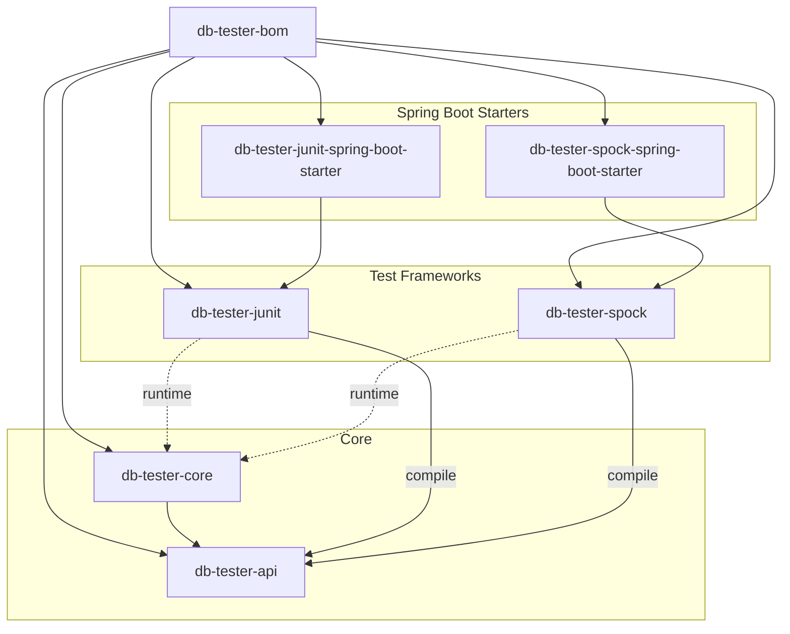
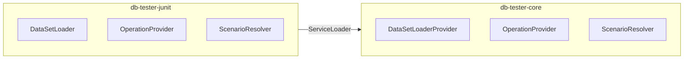

# DB Tester Specification - Architecture

This document describes the module structure, dependencies, and architectural patterns of the DB Tester framework.

## Module Structure

The framework consists of seven modules organized in a layered architecture:



### Module Responsibilities

| Module | Responsibility |
|--------|----------------|
| `db-tester-bom` | Version management and dependency alignment |
| `db-tester-api` | Public annotations, configuration, SPI interfaces |
| `db-tester-core` | JDBC operations, format parsing, SPI implementations |
| `db-tester-junit` | JUnit Jupiter BeforeEach/AfterEach callbacks |
| `db-tester-spock` | Spock annotation-driven extension and interceptors |
| `db-tester-junit-spring-boot-starter` | Spring Boot auto-configuration for JUnit |
| `db-tester-spock-spring-boot-starter` | Spring Boot auto-configuration for Spock |

## Module Dependencies

### API Module (`db-tester-api`)

The API module has no internal dependencies. External dependencies:

| Dependency | Purpose |
|------------|---------|
| `org.jspecify:jspecify` | Null safety annotations |
| `java.sql` | `DataSource` interface |

### Core Module (`db-tester-core`)

| Dependency | Scope | Purpose |
|------------|-------|---------|
| `db-tester-api` | Compile | Public API classes |
| `org.jspecify:jspecify` | Compile | Null safety annotations |
| `org.slf4j:slf4j-api` | Compile | Logging abstraction |

### Test Framework Modules

JUnit and Spock modules depend on `db-tester-api` at compile time. The `db-tester-core` module is discovered at runtime via ServiceLoader.

| Module | Compile Dependencies | Runtime Dependencies |
|--------|---------------------|----------------------|
| `db-tester-junit` | `db-tester-api`, `junit-jupiter-api` | `db-tester-core` |
| `db-tester-spock` | `db-tester-api`, `spock-core` | `db-tester-core` |

### Spring Boot Starter Modules

| Module | Dependencies |
|--------|--------------|
| `db-tester-junit-spring-boot-starter` | `db-tester-junit`, `db-tester-core`, `spring-boot-autoconfigure` |
| `db-tester-spock-spring-boot-starter` | `db-tester-spock`, `db-tester-core`, `spring-boot-autoconfigure` |

## Package Organization

### API Module Packages

```
io.github.seijikohara.dbtester.api
├── annotation/
│   ├── Preparation.java
│   ├── Expectation.java
│   └── DataSet.java
├── assertion/
│   ├── DatabaseAssertion.java
│   └── AssertionFailureHandler.java
├── config/
│   ├── Configuration.java
│   ├── ConventionSettings.java
│   ├── DataFormat.java
│   ├── DataSourceRegistry.java
│   ├── OperationDefaults.java
│   └── TableMergeStrategy.java
├── context/
│   └── TestContext.java
├── dataset/
│   ├── DataSet.java
│   ├── Table.java
│   └── Row.java
├── domain/
│   ├── CellValue.java
│   ├── ColumnName.java
│   ├── TableName.java
│   ├── DataSourceName.java
│   ├── Column.java
│   ├── Cell.java
│   ├── ColumnMetadata.java
│   └── ComparisonStrategy.java
├── exception/
│   ├── DatabaseTesterException.java
│   ├── ConfigurationException.java
│   ├── DataSetLoadException.java
│   ├── DataSourceNotFoundException.java
│   ├── DatabaseOperationException.java
│   └── ValidationException.java
├── loader/
│   └── DataSetLoader.java
├── operation/
│   ├── Operation.java
│   └── TableOrderingStrategy.java
├── scenario/
│   ├── ScenarioName.java
│   └── ScenarioNameResolver.java
└── spi/
    ├── AssertionProvider.java
    ├── DataSetLoaderProvider.java
    ├── ExpectationProvider.java
    └── OperationProvider.java
```

### Core Module Packages

```
io.github.seijikohara.dbtester.internal
├── assertion/
│   ├── ComparisonResult.java
│   ├── DataSetComparator.java
│   └── ExpectationVerifier.java
├── dataset/
│   ├── SimpleDataSet.java
│   ├── SimpleTable.java
│   ├── SimpleRow.java
│   ├── ScenarioTable.java
│   └── TableOrderingResolver.java
├── domain/
│   ├── ScenarioMarker.java
│   ├── SchemaName.java
│   ├── FileExtension.java
│   └── StringIdentifier.java
├── format/
│   ├── TableOrdering.java
│   ├── csv/CsvFormatProvider.java
│   ├── tsv/TsvFormatProvider.java
│   ├── parser/
│   │   ├── DelimitedParser.java
│   │   └── DelimiterConfig.java
│   └── spi/
│       ├── FormatProvider.java
│       └── FormatRegistry.java
├── jdbc/
│   ├── Jdbc.java
│   ├── read/
│   │   ├── TableReader.java
│   │   ├── TableOrderResolver.java
│   │   └── TypeConverter.java
│   └── write/
│       ├── OperationExecutor.java
│       ├── SqlBuilder.java
│       ├── ParameterBinder.java
│       ├── TableExecutor.java
│       ├── InsertExecutor.java
│       ├── UpdateExecutor.java
│       ├── DeleteExecutor.java
│       ├── RefreshExecutor.java
│       └── TruncateExecutor.java
├── loader/
│   ├── TestClassNameBasedDataSetLoader.java
│   ├── DefaultDataSetLoaderProvider.java
│   ├── AnnotationResolver.java
│   ├── DataSetFactory.java
│   ├── DataSetMerger.java
│   └── DirectoryResolver.java
├── scenario/
│   ├── ScenarioFilter.java
│   ├── FilteredDataSet.java
│   └── FilteredTable.java
├── spi/
│   ├── DefaultAssertionProvider.java
│   ├── DefaultExpectationProvider.java
│   ├── DefaultOperationProvider.java
│   └── ScenarioNameResolverRegistry.java
└── util/
    └── TopologicalSorter.java
```

## Architectural Patterns

### Layered Architecture

| Layer | Modules | Responsibility |
|-------|---------|----------------|
| Presentation | junit, spock, starters | Test framework integration |
| Application | api | Public interfaces and contracts |
| Domain | core (dataset, domain) | Business logic and entities |
| Infrastructure | core (jdbc, format) | Database and file system access |

### Domain-Driven Design Patterns

| Pattern | Implementation | Description |
|---------|----------------|-------------|
| Value Object | `TableName`, `ColumnName`, `CellValue` | Immutable objects with equality by value |
| Entity | `Table`, `Row` | Objects with identity within aggregate |
| Aggregate | `DataSet` | Root entity with consistency boundary |
| Factory | `DataSetFactory` | Complex object creation |
| Repository | `DataSourceRegistry` | Data source management |
| Domain Service | `DataSetComparator` | Stateless operations on entities |

### Service Provider Interface (SPI)

The framework uses SPI for loose coupling between modules:



### Strategy Pattern

Operations and comparison strategies use the strategy pattern:

| Strategy Interface | Implementations |
|-------------------|-----------------|
| `Operation` enum | NONE, INSERT, UPDATE, DELETE, REFRESH, CLEAN_INSERT, etc. |
| `ComparisonStrategy` | STRICT, IGNORE, NUMERIC, CASE_INSENSITIVE, TIMESTAMP_FLEXIBLE, NOT_NULL, REGEX |
| `TableMergeStrategy` | FIRST, LAST, UNION, UNION_ALL |
| `FormatProvider` | CsvFormatProvider, TsvFormatProvider |

## JPMS Support

### Full Module Support

The following modules provide complete `module-info.java`:

| Module | Module Name |
|--------|-------------|
| `db-tester-api` | `io.github.seijikohara.dbtester.api` |
| `db-tester-core` | `io.github.seijikohara.dbtester.core` |
| `db-tester-junit` | `io.github.seijikohara.dbtester.junit` |

### Automatic Module Names

The following modules use `Automatic-Module-Name` in `MANIFEST.MF`:

| Module | Automatic-Module-Name |
|--------|----------------------|
| `db-tester-spock` | `io.github.seijikohara.dbtester.spock` |
| `db-tester-junit-spring-boot-starter` | `io.github.seijikohara.dbtester.junit.spring.autoconfigure` |
| `db-tester-spock-spring-boot-starter` | `io.github.seijikohara.dbtester.spock.spring.autoconfigure` |

### Module Dependencies

Example `module-info.java` for the API module:

```java
module io.github.seijikohara.dbtester.api {
    requires transitive java.sql;
    requires transitive org.jspecify;

    exports io.github.seijikohara.dbtester.api.annotation;
    exports io.github.seijikohara.dbtester.api.assertion;
    exports io.github.seijikohara.dbtester.api.config;
    exports io.github.seijikohara.dbtester.api.context;
    exports io.github.seijikohara.dbtester.api.dataset;
    exports io.github.seijikohara.dbtester.api.domain;
    exports io.github.seijikohara.dbtester.api.exception;
    exports io.github.seijikohara.dbtester.api.loader;
    exports io.github.seijikohara.dbtester.api.operation;
    exports io.github.seijikohara.dbtester.api.scenario;
    exports io.github.seijikohara.dbtester.api.spi;

    uses io.github.seijikohara.dbtester.api.spi.AssertionProvider;
    uses io.github.seijikohara.dbtester.api.spi.DataSetLoaderProvider;
    uses io.github.seijikohara.dbtester.api.spi.OperationProvider;
    uses io.github.seijikohara.dbtester.api.spi.ExpectationProvider;
    uses io.github.seijikohara.dbtester.api.scenario.ScenarioNameResolver;
}
```

## Related Specifications

- [Overview](01-overview) - Framework purpose and key concepts
- [Public API](03-public-api) - Annotations and configuration classes
- [Configuration](04-configuration) - Configuration options
- [Test Frameworks](07-test-frameworks) - JUnit and Spock integration
- [SPI](08-spi) - Service Provider Interface extension points
- [Error Handling](09-error-handling) - Error messages and exception types
