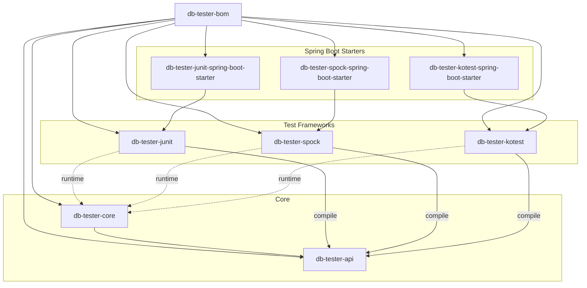
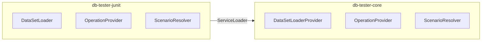

# DB Tester Specification - Architecture

This document describes the module structure, dependencies, and architectural patterns of the DB Tester framework.

## Module Structure

The framework consists of ten modules organized in a layered architecture:



### Module Responsibilities

| Module | Responsibility |
|--------|----------------|
| `db-tester-bom` | Version management and dependency alignment |
| `db-tester-api` | Public annotations, configuration, domain models, SPI interfaces |
| `db-tester-core` | JDBC operations, format parsing, SPI implementations |
| `db-tester-junit` | JUnit Jupiter BeforeEach and AfterEach callbacks |
| `db-tester-spock` | Spock annotation-driven extension and interceptors |
| `db-tester-kotest` | Kotest AnnotationSpec TestCaseExtension |
| `db-tester-junit-spring-boot-starter` | Spring Boot auto-configuration for JUnit |
| `db-tester-spock-spring-boot-starter` | Spring Boot auto-configuration for Spock |
| `db-tester-kotest-spring-boot-starter` | Spring Boot auto-configuration for Kotest |

## Module Dependencies

Dependencies are defined in each module's `build.gradle.kts`. See the source files for current dependencies:

| Module | Build Configuration |
|--------|---------------------|
| `db-tester-api` | [build.gradle.kts](https://github.com/seijikohara/db-tester/blob/main/db-tester-api/build.gradle.kts) |
| `db-tester-core` | [build.gradle.kts](https://github.com/seijikohara/db-tester/blob/main/db-tester-core/build.gradle.kts) |
| `db-tester-junit` | [build.gradle.kts](https://github.com/seijikohara/db-tester/blob/main/db-tester-junit/build.gradle.kts) |
| `db-tester-spock` | [build.gradle.kts](https://github.com/seijikohara/db-tester/blob/main/db-tester-spock/build.gradle.kts) |
| `db-tester-kotest` | [build.gradle.kts](https://github.com/seijikohara/db-tester/blob/main/db-tester-kotest/build.gradle.kts) |
| `db-tester-junit-spring-boot-starter` | [build.gradle.kts](https://github.com/seijikohara/db-tester/blob/main/db-tester-junit-spring-boot-starter/build.gradle.kts) |
| `db-tester-spock-spring-boot-starter` | [build.gradle.kts](https://github.com/seijikohara/db-tester/blob/main/db-tester-spock-spring-boot-starter/build.gradle.kts) |
| `db-tester-kotest-spring-boot-starter` | [build.gradle.kts](https://github.com/seijikohara/db-tester/blob/main/db-tester-kotest-spring-boot-starter/build.gradle.kts) |

Test framework modules depend on `db-tester-api` at compile time. The `db-tester-core` module loads at runtime via ServiceLoader.

## Package Organization

### API Module

| Package | Responsibility |
|---------|----------------|
| `annotation` | `@Preparation`, `@Expectation`, `@DataSet` annotations |
| `assertion` | Programmatic assertion API |
| `config` | Configuration classes and registries |
| `context` | Test execution context |
| `dataset` | Dataset, Table, Row interfaces |
| `domain` | Value objects (`TableName`, `ColumnName`, `CellValue`) |
| `exception` | Exception hierarchy |
| `loader` | Dataset loader interface |
| `operation` | Operation enum and strategies |
| `scenario` | Scenario filtering interfaces |
| `spi` | Service provider interfaces |

Source: [db-tester-api/src/main/java](https://github.com/seijikohara/db-tester/tree/main/db-tester-api/src/main/java/io/github/seijikohara/dbtester/api)

### Core Module

| Package | Responsibility |
|---------|----------------|
| `assertion` | Dataset comparison and verification |
| `dataset` | Dataset, Table, Row implementations |
| `domain` | Internal value objects |
| `format` | CSV/TSV parsing and format providers |
| `jdbc` | JDBC read/write operations |
| `loader` | Convention-based dataset loading |
| `scenario` | Scenario filtering implementation |
| `spi` | SPI implementations |

Source: [db-tester-core/src/main/java](https://github.com/seijikohara/db-tester/tree/main/db-tester-core/src/main/java/io/github/seijikohara/dbtester/internal)

## Architectural Patterns

### Layered Architecture

| Layer | Modules | Responsibility |
|-------|---------|----------------|
| Presentation | junit, spock, kotest, starters | Test framework integration |
| Application | api | Public interfaces and contracts |
| Domain | core (dataset, domain) | Business logic and entities |
| Infrastructure | core (jdbc, format) | Database and file system access |

### Domain-Driven Design Patterns

| Pattern | Implementation | Description |
|---------|----------------|-------------|
| Value Object | `TableName`, `ColumnName`, `CellValue` | Immutable objects with equality by value |
| Entity | `Table`, `Row` | Objects with identity within aggregate |
| Aggregate | `DataSet` | Root entity with consistency boundary |
| Factory | `DataSetFactory` | Complex object creation |
| Repository | `DataSourceRegistry` | Data source management |
| Domain Service | `DataSetComparator` | Stateless operations on entities |

### Service Provider Interface (SPI)

The framework uses SPI for loose coupling between modules:



### Strategy Pattern

Operations and comparison strategies use the strategy pattern:

| Strategy Interface | Implementations |
|-------------------|-----------------|
| `Operation` enum | NONE, INSERT, UPDATE, DELETE, DELETE_ALL, REFRESH, TRUNCATE_TABLE, CLEAN_INSERT, TRUNCATE_INSERT |
| `ComparisonStrategy` | STRICT, IGNORE, NUMERIC, CASE_INSENSITIVE, TIMESTAMP_FLEXIBLE, NOT_NULL, REGEX |
| `TableMergeStrategy` | FIRST, LAST, UNION, UNION_ALL |
| `TableOrderingStrategy` | AUTO, LOAD_ORDER_FILE, FOREIGN_KEY, ALPHABETICAL |
| `FormatProvider` | CsvFormatProvider, TsvFormatProvider |

## JPMS Support

### Full Module Support

The following modules provide complete `module-info.java`:

| Module | Module Name |
|--------|-------------|
| `db-tester-api` | `io.github.seijikohara.dbtester.api` |
| `db-tester-core` | `io.github.seijikohara.dbtester.core` |
| `db-tester-junit` | `io.github.seijikohara.dbtester.junit` |

### Automatic Module Names

The following modules use `Automatic-Module-Name` in `MANIFEST.MF`:

| Module | Automatic-Module-Name |
|--------|----------------------|
| `db-tester-spock` | `io.github.seijikohara.dbtester.spock` |
| `db-tester-kotest` | `io.github.seijikohara.dbtester.kotest` |
| `db-tester-junit-spring-boot-starter` | `io.github.seijikohara.dbtester.junit.spring.autoconfigure` |
| `db-tester-spock-spring-boot-starter` | `io.github.seijikohara.dbtester.spock.spring.autoconfigure` |
| `db-tester-kotest-spring-boot-starter` | `io.github.seijikohara.dbtester.kotest.spring.autoconfigure` |

### Module Dependencies

Example `module-info.java` for the API module:

```java
module io.github.seijikohara.dbtester.api {
    requires transitive java.sql;
    requires transitive org.jspecify;

    exports io.github.seijikohara.dbtester.api.annotation;
    exports io.github.seijikohara.dbtester.api.assertion;
    exports io.github.seijikohara.dbtester.api.config;
    exports io.github.seijikohara.dbtester.api.context;
    exports io.github.seijikohara.dbtester.api.dataset;
    exports io.github.seijikohara.dbtester.api.domain;
    exports io.github.seijikohara.dbtester.api.exception;
    exports io.github.seijikohara.dbtester.api.loader;
    exports io.github.seijikohara.dbtester.api.operation;
    exports io.github.seijikohara.dbtester.api.scenario;
    exports io.github.seijikohara.dbtester.api.spi;

    uses io.github.seijikohara.dbtester.api.spi.AssertionProvider;
    uses io.github.seijikohara.dbtester.api.spi.DataSetLoaderProvider;
    uses io.github.seijikohara.dbtester.api.spi.OperationProvider;
    uses io.github.seijikohara.dbtester.api.spi.ExpectationProvider;
    uses io.github.seijikohara.dbtester.api.scenario.ScenarioNameResolver;
}
```

## Related Specifications

- [Overview](01-overview) - Framework purpose and key concepts
- [Public API](03-public-api) - Annotations and configuration classes
- [Configuration](04-configuration) - Configuration options
- [Test Frameworks](07-test-frameworks) - JUnit, Spock, and Kotest integration
- [SPI](08-spi) - Service Provider Interface extension points
- [Error Handling](09-error-handling) - Error messages and exception types
