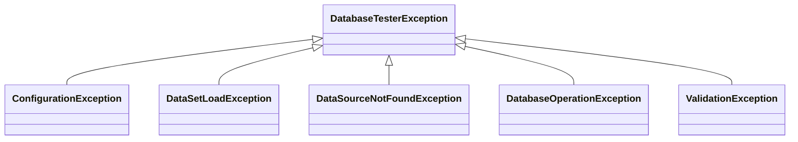

# DB Tester Specification - Public API

This document describes the public API provided by the `db-tester-api` module.

## Annotations

### @DataSet

Declares datasets to apply before a test method executes.

**Location**: `io.github.seijikohara.dbtester.api.annotation.DataSet`

**Target**: `METHOD`, `TYPE`

**Attributes**:

| Attribute | Type | Default | Description |
|-----------|------|---------|-------------|
| `sources` | `DataSetSource[]` | `{}` | Dataset sources to execute; empty triggers convention-based discovery |
| `operation` | `Operation` | `CLEAN_INSERT` | Database operation to apply |
| `tableOrdering` | `TableOrderingStrategy` | `AUTO` | Strategy for determining table processing order |

**Annotation Inheritance**:

- Class-level annotations are inherited by subclasses
- Method-level annotations override class-level declarations
- Annotated with `@Inherited`

**Example**:

```java
@DataSet
void testMethod() { }

@DataSet(operation = Operation.INSERT)
void testWithInsertOnly() { }

@DataSet(tableOrdering = TableOrderingStrategy.FOREIGN_KEY)
void testWithForeignKeyOrdering() { }

@DataSet(sources = @DataSetSource(resourceLocation = "custom/path"))
void testWithCustomPath() { }
```

### @ExpectedDataSet

Declares datasets that define the expected database state after test execution.

**Location**: `io.github.seijikohara.dbtester.api.annotation.ExpectedDataSet`

**Target**: `METHOD`, `TYPE`

**Attributes**:

| Attribute | Type | Default | Description |
|-----------|------|---------|-------------|
| `sources` | `DataSetSource[]` | `{}` | Dataset sources for verification; empty triggers convention-based discovery |
| `tableOrdering` | `TableOrderingStrategy` | `AUTO` | Strategy for determining table processing order during verification |

**Verification Behavior**:

- Read-only comparison (no data modification)
- Validates actual database state against expected datasets
- Reports assertion failures via test framework

**Example**:

```java
@DataSet
@ExpectedDataSet
void testWithVerification() { }

@ExpectedDataSet(sources = @DataSetSource(resourceLocation = "expected/custom"))
void testWithCustomExpectation() { }

@ExpectedDataSet(tableOrdering = TableOrderingStrategy.ALPHABETICAL)
void testWithAlphabeticalOrdering() { }
```

### @DataSetSource

Configures individual dataset parameters within `@DataSet` or `@ExpectedDataSet`.

**Location**: `io.github.seijikohara.dbtester.api.annotation.DataSetSource`

**Target**: None (`@Target({})`) - This annotation cannot be applied directly to classes or methods. Use it exclusively within `@DataSet#sources()` and `@ExpectedDataSet#sources()` arrays.

**Attributes**:

| Attribute | Type | Default | Description |
|-----------|------|---------|-------------|
| `resourceLocation` | `String` | `""` | Dataset directory path; empty uses convention-based discovery |
| `dataSourceName` | `String` | `""` | Named DataSource identifier; empty uses default |
| `scenarioNames` | `String[]` | `{}` | Scenario filters; empty uses test method name |
| `excludeColumns` | `String[]` | `{}` | Column names to exclude from verification (case-insensitive); only effective in `@ExpectedDataSet` |
| `columnStrategies` | `ColumnStrategy[]` | `{}` | Column-specific comparison strategies; only effective in `@ExpectedDataSet` |

**Resource Location Formats**:

| Format | Example | Resolution |
|--------|---------|------------|
| Classpath relative | `data/users` | From test classpath root |
| Classpath prefix | `classpath:data/users` | Explicit classpath resolution |
| Absolute path | `/tmp/testdata` | File system absolute path |
| Empty string | `""` | Convention-based discovery |

**Example**:

```java
@DataSet(sources = {
    @DataSetSource(dataSourceName = "primary"),
    @DataSetSource(dataSourceName = "secondary", resourceLocation = "secondary-data")
})
void testMultipleDataSources() { }

@DataSet(sources = @DataSetSource(scenarioNames = {"scenario1", "scenario2"}))
void testMultipleScenarios() { }

@ExpectedDataSet(sources = @DataSetSource(
    excludeColumns = {"CREATED_AT", "UPDATED_AT", "VERSION"}
))
void testWithExcludedColumns() { }

@ExpectedDataSet(sources = @DataSetSource(
    columnStrategies = {
        @ColumnStrategy(name = "EMAIL", strategy = Strategy.CASE_INSENSITIVE),
        @ColumnStrategy(name = "CREATED_AT", strategy = Strategy.IGNORE),
        @ColumnStrategy(name = "ID", strategy = Strategy.REGEX, pattern = "[a-f0-9-]{36}")
    }
))
void testWithColumnStrategies() { }
```

**Column Exclusion Behavior**:

- Column names are normalized to uppercase for comparison
- Per-dataset exclusions are combined with global exclusions from `ConventionSettings`
- Exclusions apply only to `@ExpectedDataSet` verification, not `@DataSet` preparation

**Column Strategy Behavior**:

- Column strategies override default strict comparison for specific columns
- Annotation-level strategies override global strategies from `ConventionSettings`
- Exclusions take precedence: excluded columns are skipped before strategies apply

### @ColumnStrategy

Configures the comparison strategy for a specific column during expectation verification.

**Location**: `io.github.seijikohara.dbtester.api.annotation.ColumnStrategy`

**Target**: None (`@Target({})`) - Use exclusively within `@DataSetSource#columnStrategies()`.

**Attributes**:

| Attribute | Type | Default | Description |
|-----------|------|---------|-------------|
| `name` | `String` | (required) | Column name (case-insensitive) |
| `strategy` | `Strategy` | `STRICT` | Comparison strategy to use |
| `pattern` | `String` | `""` | Regex pattern for `REGEX` strategy |

### Strategy

Enum defining comparison strategy types for use in `@ColumnStrategy` annotations.

**Location**: `io.github.seijikohara.dbtester.api.annotation.Strategy`

**Values**:

| Value | Description |
|-------|-------------|
| `STRICT` | Exact match using `equals()` (default) |
| `IGNORE` | Skip comparison entirely |
| `NUMERIC` | Type-aware numeric comparison |
| `CASE_INSENSITIVE` | Case-insensitive string comparison |
| `TIMESTAMP_FLEXIBLE` | Converts to UTC and ignores sub-second precision |
| `NOT_NULL` | Verifies value is not null |
| `REGEX` | Pattern matching (requires `pattern` attribute) |

## TableSet Interfaces

### TableSet

Represents a logical collection of database tables.

**Location**: `io.github.seijikohara.dbtester.api.dataset.TableSet`

**Factory Methods**:

| Method | Return Type | Description |
|--------|-------------|-------------|
| `of(List<Table>)` | `TableSet` | Creates a table set with the specified tables |
| `of(Table...)` | `TableSet` | Creates a table set with the specified tables (varargs) |

**Instance Methods**:

| Method | Return Type | Description |
|--------|-------------|-------------|
| `getTables()` | `List<Table>` | Returns immutable list of tables in declaration order |
| `getTable(TableName)` | `Optional<Table>` | Finds table by name |
| `getDataSource()` | `Optional<DataSource>` | Returns bound DataSource if specified |

**Guarantees**:

- Table order is preserved (insertion order)
- All returned collections are immutable
- Table names are unique within a table set

### Table

Represents the structure and data of a database table.

**Location**: `io.github.seijikohara.dbtester.api.dataset.Table`

**Factory Methods**:

| Method | Return Type | Description |
|--------|-------------|-------------|
| `of(TableName, List<ColumnName>, List<Row>)` | `Table` | Creates a table with type-safe names |
| `of(String, List<String>, List<Row>)` | `Table` | Creates a table with string names (convenience) |

**Instance Methods**:

| Method | Return Type | Description |
|--------|-------------|-------------|
| `getName()` | `TableName` | Returns table identifier |
| `getColumns()` | `List<ColumnName>` | Returns column names in definition order |
| `getRows()` | `List<Row>` | Returns all rows (may be empty) |
| `getRowCount()` | `int` | Returns number of rows |

**Guarantees**:

- Column order is consistent across all rows
- All returned collections are immutable
- Row count equals `getRows().size()`

### Row

Represents a single database record.

**Location**: `io.github.seijikohara.dbtester.api.dataset.Row`

**Factory Methods**:

| Method | Return Type | Description |
|--------|-------------|-------------|
| `of(Map<ColumnName, CellValue>)` | `Row` | Creates a row with the specified column-value pairs |

**Instance Methods**:

| Method | Return Type | Description |
|--------|-------------|-------------|
| `getValues()` | `Map<ColumnName, CellValue>` | Returns immutable column-value mapping |
| `getValue(ColumnName)` | `CellValue` | Returns value for column; `CellValue.NULL` if absent |

## Domain Value Objects

### CellValue

Wraps a cell value with explicit null handling.

**Location**: `io.github.seijikohara.dbtester.api.domain.CellValue`

**Type**: `record`

**Fields**:

| Field | Type | Description |
|-------|------|-------------|
| `value` | `@Nullable Object` | The wrapped value |

**Constants**:

| Constant | Description |
|----------|-------------|
| `CellValue.NULL` | Singleton representing SQL NULL |

**Methods**:

| Method | Return Type | Description |
|--------|-------------|-------------|
| `isNull()` | `boolean` | Returns `true` if value is null |

### TableName

Immutable identifier for a database table.

**Location**: `io.github.seijikohara.dbtester.api.domain.TableName`

**Type**: `record`

**Fields**:

| Field | Type | Description |
|-------|------|-------------|
| `value` | `String` | Table name string |

### ColumnName

Immutable identifier for a table column.

**Location**: `io.github.seijikohara.dbtester.api.domain.ColumnName`

**Type**: `record`

**Fields**:

| Field | Type | Description |
|-------|------|-------------|
| `value` | `String` | Column name string |

### DataSourceName

Immutable identifier for a registered DataSource.

**Location**: `io.github.seijikohara.dbtester.api.domain.DataSourceName`

**Type**: `record`

**Fields**:

| Field | Type | Description |
|-------|------|-------------|
| `value` | `String` | DataSource name string |

### Column

Represents a column with its name and comparison strategy.

**Location**: `io.github.seijikohara.dbtester.api.domain.Column`

**Type**: `record`

**Fields**:

| Field | Type | Description |
|-------|------|-------------|
| `name` | `ColumnName` | Column identifier |
| `comparisonStrategy` | `ComparisonStrategy` | Comparison strategy for this column |

### Cell

Represents a cell containing column metadata and value.

**Location**: `io.github.seijikohara.dbtester.api.domain.Cell`

**Type**: `record`

**Fields**:

| Field | Type | Description |
|-------|------|-------------|
| `column` | `Column` | Column definition |
| `value` | `CellValue` | Cell value |

### ColumnMetadata

Represents database column metadata retrieved from JDBC.

**Location**: `io.github.seijikohara.dbtester.api.domain.ColumnMetadata`

**Type**: `record`

**Fields**:

| Field | Type | Description |
|-------|------|-------------|
| `name` | `ColumnName` | Column name |
| `jdbcType` | `int` | JDBC type code from `java.sql.Types` |
| `typeName` | `String` | Database-specific type name |
| `nullable` | `boolean` | Whether column allows null values |

### ColumnStrategyMapping

Represents programmatic column comparison strategy configuration.

**Location**: `io.github.seijikohara.dbtester.api.config.ColumnStrategyMapping`

**Type**: `record`

**Fields**:

| Field | Type | Description |
|-------|------|-------------|
| `columnName` | `String` | Column name normalized to uppercase |
| `strategy` | `ComparisonStrategy` | Comparison strategy for this column |

**Factory Methods**:

| Method | Description |
|--------|-------------|
| `of(String, ComparisonStrategy)` | Creates mapping with specified strategy |
| `strict(String)` | Creates mapping with STRICT strategy |
| `ignore(String)` | Creates mapping with IGNORE strategy |
| `caseInsensitive(String)` | Creates mapping with CASE_INSENSITIVE strategy |
| `numeric(String)` | Creates mapping with NUMERIC strategy |
| `timestampFlexible(String)` | Creates mapping with TIMESTAMP_FLEXIBLE strategy |
| `notNull(String)` | Creates mapping with NOT_NULL strategy |
| `regex(String, String)` | Creates mapping with REGEX strategy and pattern |

**Example**:

```java
// Programmatic column strategy configuration
var strategies = List.of(
    ColumnStrategyMapping.ignore("CREATED_AT"),
    ColumnStrategyMapping.caseInsensitive("EMAIL"),
    ColumnStrategyMapping.regex("TOKEN", "[a-f0-9-]{36}")
);

DatabaseAssertion.assertEqualsWithStrategies(expectedTable, actualTable, strategies);
```

### ComparisonStrategy

Defines value comparison behavior during assertion.

**Location**: `io.github.seijikohara.dbtester.api.domain.ComparisonStrategy`

**Predefined Strategies**:

| Strategy | Description |
|----------|-------------|
| `STRICT` | Exact match using `equals()` (default) |
| `IGNORE` | Skip comparison entirely |
| `NUMERIC` | Type-aware numeric comparison using BigDecimal |
| `CASE_INSENSITIVE` | Case-insensitive string comparison |
| `TIMESTAMP_FLEXIBLE` | Converts to UTC and ignores sub-second precision |
| `NOT_NULL` | Verifies value is not null |
| `REGEX` | Pattern matching using regular expressions |

**Factory Methods**:

| Method | Description |
|--------|-------------|
| `regex(String)` | Creates regex pattern matcher with the specified pattern |

**Comparison Behavior**:

| Strategy | null/null | null/value | value/null | value/value |
|----------|-----------|------------|------------|-------------|
| `STRICT` | true | false | false | equals() |
| `IGNORE` | true | true | true | true |
| `NUMERIC` | true | false | false | BigDecimal comparison |
| `CASE_INSENSITIVE` | true | false | false | equalsIgnoreCase() |
| `TIMESTAMP_FLEXIBLE` | true | false | false | UTC epoch comparison |
| `NOT_NULL` | false | false | false | true |
| `REGEX` | false | false | false | Pattern.matches() |

## Assertion API

### DatabaseAssertion

Static facade for programmatic database assertions. This utility class delegates to the underlying assertion provider loaded via SPI.

**Location**: `io.github.seijikohara.dbtester.api.assertion.DatabaseAssertion`

**Type**: Utility class (non-instantiable, static methods only)

**Static Methods**:

| Method | Description |
|--------|-------------|
| `assertEquals(TableSet, TableSet)` | Asserts two table sets are equal |
| `assertEquals(TableSet, TableSet, AssertionFailureHandler)` | Asserts with custom failure handler |
| `assertEquals(Table, Table)` | Asserts two tables are equal |
| `assertEquals(Table, Table, Collection<String>)` | Asserts tables with additional columns to include |
| `assertEquals(Table, Table, AssertionFailureHandler)` | Asserts tables with custom failure handler |
| `assertEqualsIgnoreColumns(TableSet, TableSet, String, Collection<String>)` | Asserts table in table sets, ignoring specified columns |
| `assertEqualsIgnoreColumns(Table, Table, Collection<String>)` | Asserts tables, ignoring specified columns |
| `assertEqualsWithStrategies(Table, Table, Collection<ColumnStrategyMapping>)` | Asserts tables with column-specific comparison strategies |
| `assertEqualsByQuery(TableSet, DataSource, String, String, Collection<String>)` | Asserts SQL query results against expected table set |
| `assertEqualsByQuery(Table, DataSource, String, String, Collection<String>)` | Asserts SQL query results against expected table |

**Varargs Overloads**: Methods accepting `Collection<String>` for column names also have `String...` varargs overloads for convenience.

**Example**:

```java
// Basic table set comparison
DatabaseAssertion.assertEquals(expectedTableSet, actualTableSet);

// With custom failure handler
DatabaseAssertion.assertEquals(expectedTableSet, actualTableSet, (message, expected, actual) -> {
    // Custom failure handling
});

// Ignoring specific columns
DatabaseAssertion.assertEqualsIgnoreColumns(expectedTableSet, actualTableSet, "USERS", "CREATED_AT", "UPDATED_AT");

// Comparing SQL query results
DatabaseAssertion.assertEqualsByQuery(expectedTableSet, dataSource, "USERS", "SELECT * FROM USERS WHERE status = 'ACTIVE'");

// Using column-specific comparison strategies
DatabaseAssertion.assertEqualsWithStrategies(expectedTable, actualTable,
    ColumnStrategyMapping.ignore("CREATED_AT"),
    ColumnStrategyMapping.caseInsensitive("EMAIL"),
    ColumnStrategyMapping.regex("TOKEN", "[a-f0-9-]{36}"));
```

### AssertionFailureHandler

Strategy interface for reacting to assertion mismatches. Implementations can translate individual failures into domain-specific actions such as raising custom exceptions, logging diagnostics, or aggregating differences.

**Location**: `io.github.seijikohara.dbtester.api.assertion.AssertionFailureHandler`

**Type**: `@FunctionalInterface`

**Methods**:

| Method | Description |
|--------|-------------|
| `handleFailure(String, @Nullable Object, @Nullable Object)` | Handles a comparison failure between expected and actual values |

**Parameters**:

| Parameter | Type | Description |
|-----------|------|-------------|
| `message` | `String` | Descriptive failure message including context (table name, row number, column name) |
| `expected` | `@Nullable Object` | Expected value; may be null |
| `actual` | `@Nullable Object` | Actual value found in database; may be null |

**Example**:

```java
// Fail-fast strategy (default behavior)
AssertionFailureHandler failFast = (message, expected, actual) -> {
    throw new AssertionError(message);
};

// Collect all failures
List<String> failures = new ArrayList<>();
AssertionFailureHandler collector = (message, expected, actual) -> {
    failures.add(String.format("%s: expected=%s, actual=%s", message, expected, actual));
};

DatabaseAssertion.assertEquals(expectedTableSet, actualTableSet, collector);
if (!failures.isEmpty()) {
    throw new AssertionError("Multiple failures:\n" + String.join("\n", failures));
}
```

## Exceptions

All exceptions extend `DatabaseTesterException`.

### Exception Hierarchy



### DatabaseTesterException

Base exception for all framework errors.

**Location**: `io.github.seijikohara.dbtester.api.exception.DatabaseTesterException`

**Constructors**:

| Constructor | Description |
|-------------|-------------|
| `DatabaseTesterException(String)` | Message only |
| `DatabaseTesterException(String, Throwable)` | Message with cause |
| `DatabaseTesterException(Throwable)` | Cause only |

### ConfigurationException

Indicates invalid framework configuration.

**Typical Causes**:

- Missing required configuration values
- Invalid file paths
- Incompatible settings combination

### DataSetLoadException

Indicates failure to load dataset files.

**Typical Causes**:

- File not found
- Invalid file format
- Parse errors in CSV or TSV content

### DataSourceNotFoundException

Indicates requested DataSource is not registered.

**Typical Causes**:

- Named DataSource not registered in `DataSourceRegistry`
- Default DataSource not set when required

### DatabaseOperationException

Indicates database operation failure.

**Typical Causes**:

- SQL execution errors
- Constraint violations
- Connection failures

### ValidationException

Indicates assertion or validation failure.

**Typical Causes**:

- Expected and actual data mismatch
- Row count differences
- Column value mismatches

**Output Format**: Validation errors output a human-readable summary followed by YAML details. See [Error Handling - Validation Errors](09-error-handling#validation-errors) for format details.

## Related Specifications

- [Overview](01-overview) - Framework introduction
- [Configuration](04-configuration) - Configuration classes
- [Database Operations](06-database-operations) - Operation enum details
- [SPI](08-spi) - Service Provider Interface extension points
- [Error Handling](09-error-handling) - Error messages and exception types
