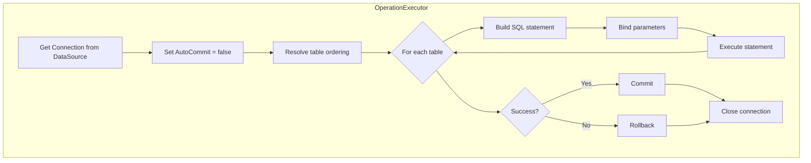

# DB Tester Specification - Database Operations

This document describes the database operations supported by the DB Tester framework.

## Operation Enum

**Location**: `io.github.seijikohara.dbtester.api.operation.Operation`

### Available Operations

| Operation | Description | Use Case |
|-----------|-------------|----------|
| `NONE` | No database operation | Read-only verification |
| `INSERT` | Insert new rows | Empty tables or append |
| `UPDATE` | Update existing rows by primary key | Modify existing data |
| `REFRESH` | Upsert (insert or update) | Mixed insert and update |
| `DELETE` | Delete specific rows by primary key | Selective removal |
| `DELETE_ALL` | Delete all rows from tables | Clear without sequence reset |
| `TRUNCATE_TABLE` | Truncate tables | Clear with sequence reset |
| `CLEAN_INSERT` | Delete all then insert (default) | Fresh test data |
| `TRUNCATE_INSERT` | Truncate then insert | Fresh data with sequence reset |

## Operation Descriptions

### NONE

Performs no database operation.

**Behavior**:
- Skips all dataset tables
- Does not modify database state

**Use Case**:
- Expectation-only tests where preparation data exists from previous tests
- Manual setup scenarios

### INSERT

Inserts new rows without modifying existing data.

**SQL Generated**: `INSERT INTO table (columns) VALUES (?)`

**Behavior**:
- Inserts each row from the dataset
- Fails on duplicate primary key violations
- Does not affect existing rows

**Use Case**:
- Appending to tables with existing data
- Tests requiring specific row additions

**Constraints**:
- Requires empty target rows or unique keys

### UPDATE

Updates existing rows identified by primary key.

**SQL Generated**: `UPDATE table SET columns = ? WHERE pk_columns = ?`

**Behavior**:
- Matches rows by primary key
- Updates non-key columns
- Ignores rows not found in database

**Use Case**:
- Modifying existing test data
- State transitions within tests

**Requirements**:
- Tables must have primary keys defined
- Dataset must include primary key columns

### REFRESH

Performs upsert operations (insert or update).

**Behavior**:
- Checks if row exists by primary key
- Updates existing rows
- Inserts new rows

**Use Case**:
- Mixed scenarios with partial existing data
- Incremental data setup

**Requirements**:
- Tables must have primary keys defined

### DELETE

Deletes specific rows identified by primary key.

**SQL Generated**: `DELETE FROM table WHERE pk_columns = ?`

**Behavior**:
- Matches rows by primary key from dataset
- Deletes only matching rows
- Other rows remain unchanged

**Use Case**:
- Removing specific test records
- Cleanup of individual rows

**Requirements**:
- Dataset must include primary key columns

### DELETE_ALL

Deletes all rows from referenced tables.

**SQL Generated**: `DELETE FROM table`

**Behavior**:
- Deletes all rows from each table in dataset
- Does not reset identity or sequence columns
- Respects foreign key constraints (may fail)

**Use Case**:
- Clearing tables while preserving sequences
- Setup for insert-only operations

**Table Processing Order**:
- Tables processed in reverse foreign key order

### TRUNCATE_TABLE

Truncates tables, resetting identity columns where supported.

**SQL Generated**: `TRUNCATE TABLE table`

**Behavior**:
- Removes all rows from tables
- Resets identity and auto-increment columns
- Database-dependent behavior for foreign keys

**Use Case**:
- Complete table reset including sequences
- Performance-critical cleanup

**Database Support**:

| Database | Identity Reset | FK Handling |
|----------|---------------|-------------|
| H2 | Yes | Requires CASCADE |
| MySQL | Yes | Requires disable FK checks |
| PostgreSQL | Yes | Requires CASCADE |
| SQL Server | Yes | Requires no FK references |
| Oracle | Yes | Requires CASCADE |

### CLEAN_INSERT

Deletes all rows then inserts dataset rows.

**Equivalent To**: `DELETE_ALL` followed by `INSERT`

**Behavior**:
1. Delete all rows from each table (reverse FK order)
2. Insert all rows from dataset (FK order)

**Use Case**:
- Standard test preparation (default operation)
- Deterministic starting state

**Execution Order**:
- DELETE phase: Child tables first
- INSERT phase: Parent tables first

### TRUNCATE_INSERT

Truncates tables then inserts dataset rows.

**Equivalent To**: `TRUNCATE_TABLE` followed by `INSERT`

**Behavior**:
1. Truncate each table (may require CASCADE)
2. Insert all rows from dataset

**Use Case**:
- Test preparation with sequence reset
- Performance-optimized setup

## Execution Flow

### Preparation Phase

1. Load dataset files from configured location
2. Filter rows by scenario marker
3. Resolve table ordering based on configured strategy
4. Execute configured operation
5. Commit transaction

### Expectation Phase

1. Load expected dataset files
2. Filter rows by scenario marker
3. Read actual data from database
4. Compare expected vs actual data
5. Report mismatches as test failures

### Operation Execution



## Table Ordering Strategy

### TableOrderingStrategy Enum

**Location**: `io.github.seijikohara.dbtester.api.operation.TableOrderingStrategy`

The `TableOrderingStrategy` enum controls how the framework determines the order in which tables are processed during database operations.

### Available Strategies

| Strategy | Description |
|----------|-------------|
| `AUTO` | Automatically determine best ordering (default) |
| `LOAD_ORDER_FILE` | Use `load-order.txt` file (error if not found) |
| `FOREIGN_KEY` | Use JDBC metadata for FK-based ordering |
| `ALPHABETICAL` | Sort tables alphabetically by name |

### Strategy Details

#### AUTO (Default)

The framework attempts strategies in the following order:

1. **LOAD_ORDER_FILE** - If `load-order.txt` exists in the dataset directory, use it
2. **FOREIGN_KEY** - Query JDBC metadata to resolve foreign key dependencies
3. **ALPHABETICAL** - Fall back to case-insensitive alphabetical ordering

This strategy provides the most flexible behavior and is suitable for most use cases.

#### LOAD_ORDER_FILE

Requires a `load-order.txt` file in the dataset directory. If the file does not exist, a `DataSetLoadException` is thrown.

**Use Case**: When you need explicit control over table ordering and want to guarantee the order is always specified.

```java
@Preparation(tableOrdering = TableOrderingStrategy.LOAD_ORDER_FILE)
void testWithExplicitOrder() { }
```

#### FOREIGN_KEY

Uses JDBC database metadata (`DatabaseMetaData.getExportedKeys()`) to analyze foreign key dependencies and performs a topological sort.

**Behavior**:
- Parent tables (those referenced by foreign keys) are processed before child tables
- If foreign key metadata cannot be retrieved, falls back to original table order
- If circular dependencies are detected, logs a warning and uses declaration order

**Use Case**: Databases with well-defined foreign key constraints where automatic ordering is desired.

```java
@Preparation(tableOrdering = TableOrderingStrategy.FOREIGN_KEY)
void testWithFkOrdering() { }
```

#### ALPHABETICAL

Tables are sorted in ascending alphabetical order (case-insensitive).

**Use Case**: When table ordering does not matter (no FK constraints) or for deterministic ordering in simple scenarios.

```java
@Preparation(tableOrdering = TableOrderingStrategy.ALPHABETICAL)
void testWithAlphabeticalOrder() { }
```

### Usage in Annotations

```java
// Default AUTO strategy
@Preparation
void testDefault() { }

// Explicit strategy on @Preparation
@Preparation(tableOrdering = TableOrderingStrategy.FOREIGN_KEY)
void testWithFkOrder() { }

// Strategy on @Expectation (affects verification order)
@Expectation(tableOrdering = TableOrderingStrategy.ALPHABETICAL)
void testExpectationOrder() { }

// Combined usage
@Preparation(operation = Operation.CLEAN_INSERT, tableOrdering = TableOrderingStrategy.LOAD_ORDER_FILE)
@Expectation(tableOrdering = TableOrderingStrategy.ALPHABETICAL)
void testBothPhases() { }
```

## Table Ordering

### Manual Ordering with load-order.txt

The preferred method for controlling table processing order is the `load-order.txt` file. This file specifies the exact order in which tables should be processed.

For detailed information about the file format and usage, see [Data Formats - Load Order](05-data-formats#load-order).

### Foreign Key Awareness

When no `load-order.txt` file exists, the framework can resolve table dependencies using database metadata:

1. Query `DatabaseMetaData.getExportedKeys()` for each table
2. Build dependency graph
3. Topologically sort tables

### Ordering Rules

| Operation | Order |
|-----------|-------|
| INSERT, REFRESH | Parent tables first (FK order) |
| DELETE, DELETE_ALL | Child tables first (reverse FK order) |
| TRUNCATE_TABLE | Child tables first |
| CLEAN_INSERT | Delete reverse, Insert forward |
| TRUNCATE_INSERT | Truncate reverse, Insert forward |

### Order Resolution Priority

The table order is determined by the `TableOrderingStrategy`. When using `AUTO` (the default), the priority is:

1. **Manual ordering**: `load-order.txt` file in dataset directory
2. **FK-based ordering**: Automatic resolution using database metadata
3. **Alphabetical ordering**: Fallback when no other ordering is available

### Circular Dependencies

For tables with circular foreign key references:

1. Detect cycles in dependency graph
2. Log warning
3. Process in dataset declaration order

## Transaction Handling

### Default Behavior

- AutoCommit disabled during operation
- Single transaction per dataset
- Commit on success, rollback on failure

### Transaction Boundaries

| Phase | Transaction Scope |
|-------|-------------------|
| Preparation | All tables in single transaction |
| Expectation | Read-only (no transaction) |

### Connection Management

1. Obtain connection from `DataSource`
2. Save current AutoCommit setting
3. Set AutoCommit = false
4. Execute operations
5. Commit or rollback
6. Restore AutoCommit setting
7. Close connection

### Error Recovery

On exception:

1. Rollback transaction
2. Close connection
3. Wrap exception in `DatabaseOperationException`
4. Propagate to test framework

## Type Conversion

### String to SQL Type

The framework converts string values from CSV or TSV to appropriate SQL types:

| Target SQL Type | Conversion Method |
|-----------------|-------------------|
| `VARCHAR`, `CHAR`, `TEXT` | Direct string |
| `INTEGER`, `SMALLINT` | `Integer.parseInt()` |
| `BIGINT` | `Long.parseLong()` |
| `DECIMAL`, `NUMERIC` | `new BigDecimal()` |
| `REAL`, `FLOAT` | `Float.parseFloat()` |
| `DOUBLE` | `Double.parseDouble()` |
| `BOOLEAN`, `BIT` | `Boolean.parseBoolean()` |
| `DATE` | `LocalDate.parse()` |
| `TIME` | `LocalTime.parse()` |
| `TIMESTAMP` | `LocalDateTime.parse()` |
| `BLOB`, `BINARY` | Base64 decode |
| `CLOB` | Direct string |

### NULL Handling

- Empty CSV field = SQL NULL
- `PreparedStatement.setNull()` with appropriate SQL type

### Date and Time Formats

| Type | Accepted Formats |
|------|------------------|
| DATE | `yyyy-MM-dd` |
| TIME | `HH:mm:ss`, `HH:mm:ss.SSS` |
| TIMESTAMP | `yyyy-MM-dd HH:mm:ss`, `yyyy-MM-dd HH:mm:ss.SSS` |

### LOB Handling

| Type | Conversion |
|------|------------|
| BLOB | Base64 string → byte[] |
| CLOB | String → Reader |

## Related Specifications

- [Overview](01-overview) - Framework purpose and key concepts
- [Public API](03-public-api) - Operation enum reference
- [Data Formats](05-data-formats) - Source file structure
- [Configuration](04-configuration) - OperationDefaults
- [Error Handling](09-error-handling) - Database operation errors
