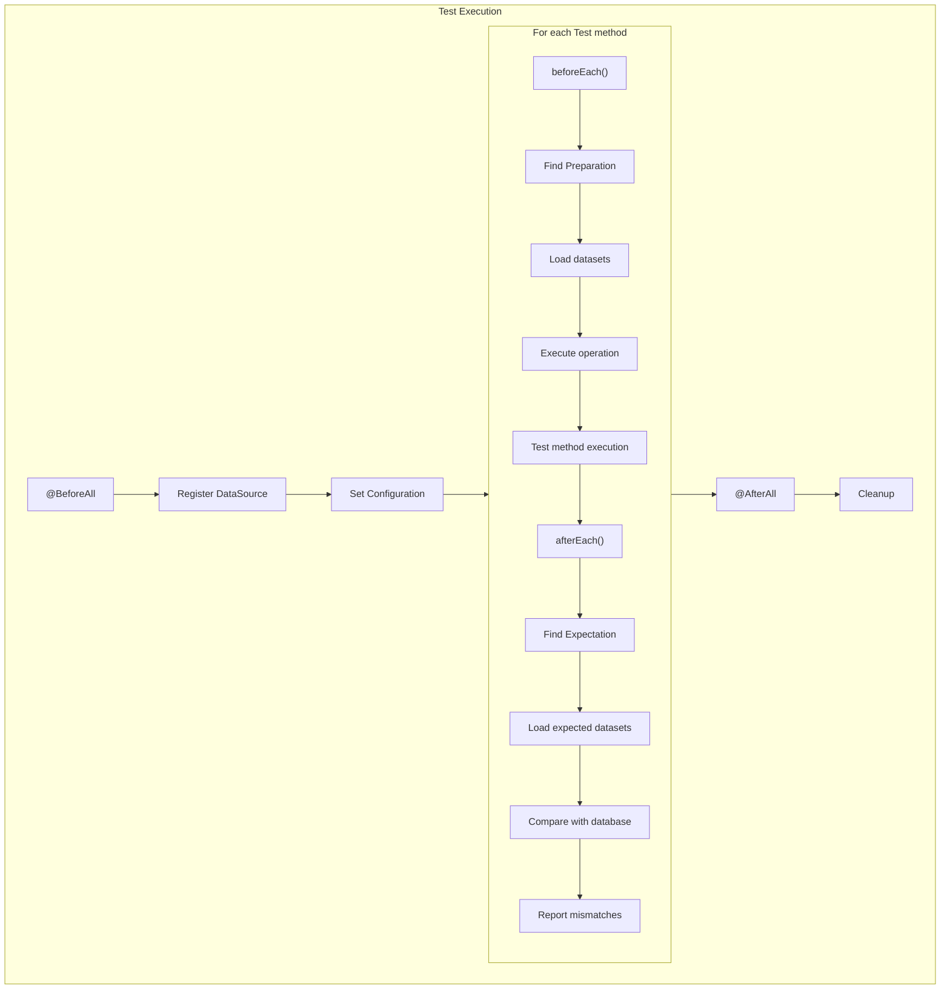
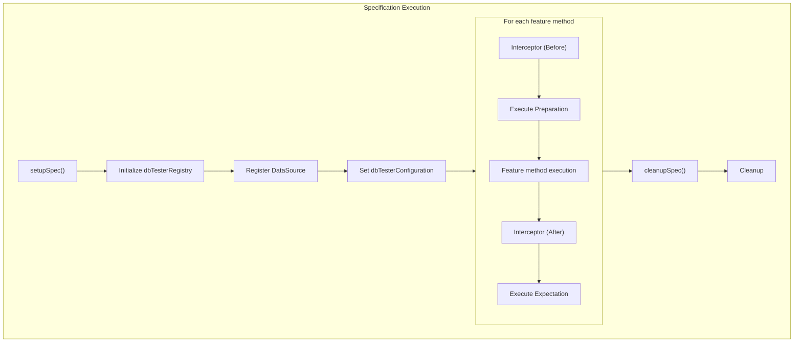
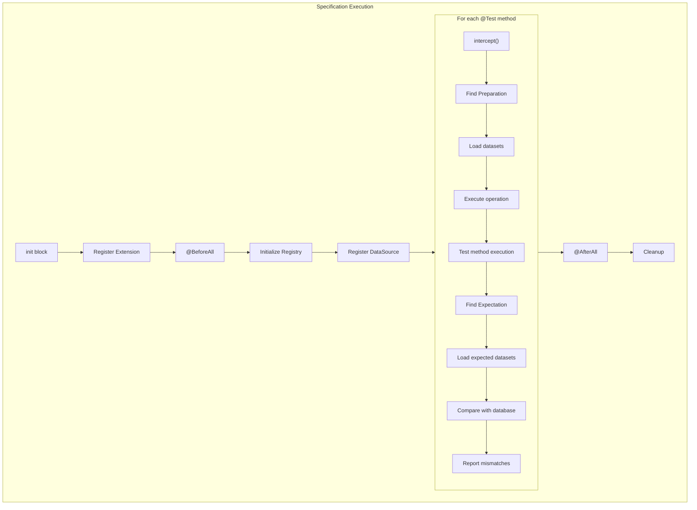

# DB Tester Specification - Test Framework Integration

This document describes the integration with JUnit, Spock, and Kotest test frameworks.

## JUnit Integration

### Module

`db-tester-junit`

### Extension Class

**Location**: `io.github.seijikohara.dbtester.junit.jupiter.extension.DatabaseTestExtension`

**Implemented Interfaces**:
- `BeforeEachCallback` - Preparation phase execution
- `AfterEachCallback` - Expectation phase verification
- `ParameterResolver` - `ExtensionContext` injection

### Registration

```java
@ExtendWith(DatabaseTestExtension.class)
class UserRepositoryTest {
    // ...
}
```

### DataSource Registration

Register data sources in `@BeforeAll`:

```java
@ExtendWith(DatabaseTestExtension.class)
class UserRepositoryTest {

    @BeforeAll
    static void setup(ExtensionContext context) {
        var registry = DatabaseTestExtension.getRegistry(context);
        registry.registerDefault(dataSource);
    }

    @Test
    @Preparation
    @Expectation
    void testCreateUser() {
        // Test implementation
    }
}
```

### Configuration Customization

```java
@BeforeAll
static void setup(ExtensionContext context) {
    var registry = DatabaseTestExtension.getRegistry(context);
    registry.registerDefault(dataSource);

    var conventions = ConventionSettings.standard()
        .withDataFormat(DataFormat.TSV);
    var config = Configuration.withConventions(conventions);
    DatabaseTestExtension.setConfiguration(context, config);
}
```

### Static Methods

| Method | Description |
|--------|-------------|
| `getRegistry(ExtensionContext)` | Returns or creates DataSourceRegistry |
| `setConfiguration(ExtensionContext, Configuration)` | Sets custom configuration |

### Nested Test Classes

The extension shares state across nested test classes:

```java
@ExtendWith(DatabaseTestExtension.class)
class UserRepositoryTest {

    @BeforeAll
    static void setup(ExtensionContext context) {
        var registry = DatabaseTestExtension.getRegistry(context);
        registry.registerDefault(dataSource);
    }

    @Nested
    class CreateTests {
        @Test
        @Preparation
        @Expectation
        void testCreateUser() { }  // Uses parent's registry
    }

    @Nested
    class UpdateTests {
        @Test
        @Preparation
        @Expectation
        void testUpdateUser() { }  // Uses parent's registry
    }
}
```

### Annotation Precedence

Method-level annotations override class-level:

```java
@Preparation(operation = Operation.CLEAN_INSERT)  // Class default
class UserRepositoryTest {

    @Test
    @Preparation(operation = Operation.INSERT)  // Overrides class
    void testWithInsert() { }

    @Test
    @Preparation  // Uses class default
    void testWithDefault() { }
}
```

## Spock Integration

### Module

`db-tester-spock`

### Extension Class

**Location**: `io.github.seijikohara.dbtester.spock.extension.DatabaseTestExtension`

**Type**: Annotation-driven extension (`IAnnotationDrivenExtension<DatabaseTest>`)

### Registration

The extension is activated by adding `@DatabaseTest` to the specification class:

```groovy
@DatabaseTest
class UserRepositorySpec extends Specification {

    @Shared
    DataSourceRegistry dbTesterRegistry

    def setupSpec() {
        dbTesterRegistry = new DataSourceRegistry()
        dbTesterRegistry.registerDefault(dataSource)
    }

    @Preparation
    @Expectation
    def 'should create user'() {
        // Test implementation
    }
}
```

### Configuration Customization

Use a `@Shared` field named `dbTesterConfiguration`:

```groovy
@DatabaseTest
class UserRepositorySpec extends Specification {

    @Shared
    DataSourceRegistry dbTesterRegistry

    @Shared
    Configuration dbTesterConfiguration

    def setupSpec() {
        dbTesterRegistry = new DataSourceRegistry()
        dbTesterRegistry.registerDefault(dataSource)

        def conventions = ConventionSettings.standard()
            .withDataFormat(DataFormat.TSV)
        dbTesterConfiguration = Configuration.withConventions(conventions)
    }

    @Preparation
    @Expectation
    def 'should create user'() { }
}
```

### Reserved Field Names

| Field Name | Type | Purpose |
|------------|------|---------|
| `dbTesterRegistry` | `DataSourceRegistry` | Data source registration |
| `dbTesterConfiguration` | `Configuration` | Custom configuration |

### Feature Method Naming

The scenario name is derived from the feature method:

```groovy
@Preparation
def 'should create user with email'() {
    // Scenario name: "should create user with email"
}
```

### Data-Driven Tests

For parameterized tests with `where:` blocks, the iteration name is used:

```groovy
@Preparation
def 'should process #status order'() {
    expect:
    // Test implementation

    where:
    status << ['PENDING', 'COMPLETED']
}
```

Scenario names: `"should process PENDING order"`, `"should process COMPLETED order"`

## Kotest Integration

### Module

`db-tester-kotest`

### Extension Class

**Location**: `io.github.seijikohara.dbtester.kotest.extension.DatabaseTestExtension`

**Type**: `TestCaseExtension` - Intercepts test case execution for preparation and expectation phases.

### Registration

Register the extension in the `init` block. In Kotest 6, the `extensions()` method is final and cannot be overridden:

```kotlin
class UserRepositorySpec : AnnotationSpec() {

    private val registry = DataSourceRegistry()

    init {
        extensions(DatabaseTestExtension(registryProvider = { registry }))
    }

    @BeforeAll
    fun setupSpec() {
        registry.registerDefault(dataSource)
    }

    @Test
    @Preparation
    @Expectation
    fun `should create user`() {
        // Test implementation
    }
}
```

### DataSource Registration

The extension accepts a `registryProvider` lambda for late-bound DataSource registration:

```kotlin
class UserRepositorySpec : AnnotationSpec() {

    companion object {
        private var sharedRegistry: DataSourceRegistry? = null
        private var sharedDataSource: DataSource? = null

        private fun initializeSharedResources() {
            sharedDataSource = createDataSource()
            sharedRegistry = DataSourceRegistry().apply {
                registerDefault(sharedDataSource!!)
            }
        }

        fun getDbTesterRegistry(): DataSourceRegistry {
            if (sharedRegistry == null) {
                initializeSharedResources()
            }
            return sharedRegistry!!
        }
    }

    init {
        extensions(DatabaseTestExtension(registryProvider = { getDbTesterRegistry() }))
    }

    @BeforeAll
    fun setupSpec() {
        if (sharedDataSource == null) {
            initializeSharedResources()
        }
    }
}
```

### Configuration Customization

Pass a custom `Configuration` to the extension:

```kotlin
class UserRepositorySpec : AnnotationSpec() {

    init {
        val conventions = ConventionSettings.standard()
            .withDataFormat(DataFormat.TSV)
        val config = Configuration.withConventions(conventions)

        extensions(DatabaseTestExtension(
            registryProvider = { registry },
            configuration = config
        ))
    }
}
```

### Test Method Naming

Use backtick method names for descriptive test names:

```kotlin
@Test
@Preparation
fun `should create user with email`() {
    // Scenario name: "should create user with email"
}
```

### AnnotationSpec Requirement

DB Tester requires `AnnotationSpec` style for Kotest integration because:
1. Annotations (`@Preparation`, `@Expectation`) can be applied to test methods
2. Method resolution via reflection is reliable
3. Familiar JUnit-like structure for Java developers

## Spring Boot Integration

### JUnit Spring Boot Starter

**Module**: `db-tester-junit-spring-boot-starter`

**Extension**: `SpringBootDatabaseTestExtension`

### Automatic DataSource Discovery

The Spring Boot extension automatically:
1. Detects Spring `ApplicationContext`
2. Finds `DataSource` beans
3. Registers them with `DataSourceRegistry`

```java
@SpringBootTest
@ExtendWith(SpringBootDatabaseTestExtension.class)
class UserRepositoryTest {

    @Test
    @Preparation
    @Expectation
    void testCreateUser() {
        // DataSource automatically registered from Spring context
    }
}
```

### Multiple DataSources

For multiple data sources, use `@Qualifier`:

```java
@Configuration
class DataSourceConfig {

    @Bean
    @Primary
    DataSource primaryDataSource() { }

    @Bean
    @Qualifier("secondary")
    DataSource secondaryDataSource() { }
}
```

```java
@SpringBootTest
@ExtendWith(SpringBootDatabaseTestExtension.class)
class MultiDatabaseTest {

    @Test
    @Preparation(dataSets = {
        @DataSet(dataSourceName = ""),          // Primary (default)
        @DataSet(dataSourceName = "secondary")  // Secondary
    })
    void testMultipleDatabases() { }
}
```

### Configuration Properties

Configure via `application.properties` or `application.yml`:

```properties
# Enable or disable DB Tester (default: true)
db-tester.enabled=true

# Auto-register DataSource beans (default: true)
db-tester.auto-register-data-sources=true

# Data format (CSV or TSV)
db-tester.convention.data-format=CSV

# Expectation directory suffix
db-tester.convention.expectation-suffix=/expected

# Scenario marker column name
db-tester.convention.scenario-marker=[Scenario]

# Table merge strategy (FIRST, LAST, UNION, UNION_ALL)
db-tester.convention.table-merge-strategy=UNION_ALL

# Default preparation operation
db-tester.operation.preparation=CLEAN_INSERT

# Default expectation operation (typically NONE for verification only)
db-tester.operation.expectation=NONE
```

Property names use singular form (`convention`, `operation`) not plural.

### Spock Spring Boot Starter

**Module**: `db-tester-spock-spring-boot-starter`

**Extension**: `SpringBootDatabaseTestExtension` (Groovy)

**Type**: Annotation-driven extension (`IAnnotationDrivenExtension<SpringBootDatabaseTest>`)

```groovy
@SpringBootTest
@SpringBootDatabaseTest
class UserRepositorySpec extends Specification {

    @Preparation
    @Expectation
    def 'should create user'() {
        // DataSource automatically registered from Spring context
    }
}
```

### Kotest Spring Boot Starter

**Module**: `db-tester-kotest-spring-boot-starter`

**Extension**: `SpringBootDatabaseTestExtension` (Kotlin)

**Type**: `TestCaseExtension` with automatic Spring ApplicationContext integration.

```kotlin
@SpringBootTest
class UserRepositorySpec : AnnotationSpec() {

    @Autowired
    private lateinit var userRepository: UserRepository

    init {
        extensions(SpringBootDatabaseTestExtension())
    }

    @Test
    @Preparation
    @Expectation
    fun `should create user`() {
        // DataSource automatically registered from Spring context
    }
}
```

### Auto-Configuration

Auto-configuration classes:

| Module | Auto-Configuration Class |
|--------|-------------------------|
| JUnit Starter | `DbTesterJUnitAutoConfiguration` |
| Spock Starter | `DbTesterSpockAutoConfiguration` |
| Kotest Starter | `DbTesterKotestAutoConfiguration` |

## Lifecycle Hooks

### JUnit Lifecycle



### Spock Lifecycle



### Kotest Lifecycle



### Lifecycle Executor Classes

| Framework | Preparation | Expectation |
|-----------|-------------|-------------|
| JUnit | `PreparationExecutor` | `ExpectationVerifier` |
| Spock | `SpockPreparationExecutor` | `SpockExpectationVerifier` |
| Kotest | `KotestPreparationExecutor` | `KotestExpectationVerifier` |

### Error Handling

| Phase | Error Type | Behavior |
|-------|------------|----------|
| Preparation | `DatabaseOperationException` | Test fails before execution |
| Test | Any exception | Expectation still runs |
| Expectation | `ValidationException` | Test fails with comparison details |

## Related Specifications

- [Overview](01-overview) - Framework purpose and key concepts
- [Public API](03-public-api) - Annotation details
- [Configuration](04-configuration) - Configuration options
- [SPI](08-spi) - Service Provider Interface extension points
- [Error Handling](09-error-handling) - Lifecycle error handling
