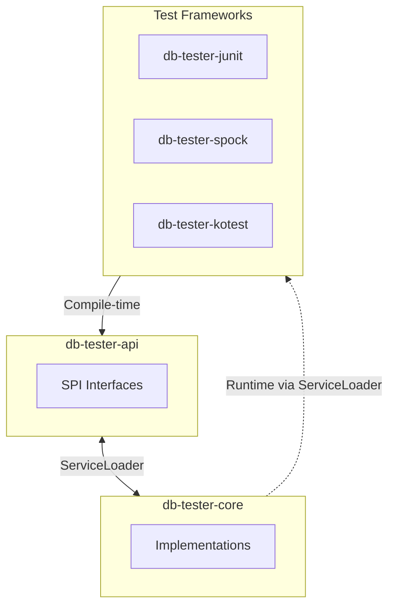

# DB Tester Specification - Service Provider Interface (SPI)

This document describes the SPI extension points in the DB Tester framework.


## SPI Overview

The framework uses Java ServiceLoader for loose coupling between modules:



### Design Principles

1. **API Independence**: Test framework modules depend only on `db-tester-api`
2. **Runtime Discovery**: Core implementations load via ServiceLoader
3. **Extensibility**: Custom implementations can replace defaults


## API Module SPIs

### TableSetLoaderProvider

Provides the default `TableSetLoader` implementation.

**Location**: `io.github.seijikohara.dbtester.api.spi.TableSetLoaderProvider`

**Interface**:

```java
public interface TableSetLoaderProvider {
    TableSetLoader getLoader();
}
```

**Default Implementation**: `DefaultTableSetLoaderProvider` in `db-tester-core`

**Usage**: Called by `Configuration.defaults()` to obtain the loader


### OperationProvider

Executes database operations on datasets.

**Location**: `io.github.seijikohara.dbtester.api.spi.OperationProvider`

**Interface**:

```java
public interface OperationProvider {
    void execute(
        Operation operation,
        TableSet tableSet,
        DataSource dataSource,
        TableOrderingStrategy tableOrderingStrategy);
}
```

**Default Implementation**: `DefaultOperationProvider` in `db-tester-core`

**Parameters**:

| Parameter | Type | Description |
|-----------|------|-------------|
| `operation` | `Operation` | The database operation to execute |
| `tableSet` | `TableSet` | The table set containing tables and rows |
| `dataSource` | `DataSource` | The JDBC data source for connections |
| `tableOrderingStrategy` | `TableOrderingStrategy` | Strategy for table processing order |

**Operations**:

| Operation | Description |
|-----------|-------------|
| `NONE` | No operation |
| `INSERT` | Insert rows |
| `UPDATE` | Update by primary key |
| `DELETE` | Delete by primary key |
| `DELETE_ALL` | Delete all rows |
| `REFRESH` | Upsert (insert or update) |
| `TRUNCATE_TABLE` | Truncate tables |
| `CLEAN_INSERT` | Delete all then insert |
| `TRUNCATE_INSERT` | Truncate then insert |


### AssertionProvider

Performs database assertions for expectation verification.

**Location**: `io.github.seijikohara.dbtester.api.spi.AssertionProvider`

**Interface**:

```java
public interface AssertionProvider {
    // Core comparison methods
    void assertEquals(TableSet expected, TableSet actual);
    void assertEquals(TableSet expected, TableSet actual, AssertionFailureHandler failureHandler);
    void assertEquals(Table expected, Table actual);
    void assertEquals(Table expected, Table actual, Collection<String> additionalColumnNames);
    void assertEquals(Table expected, Table actual, AssertionFailureHandler failureHandler);

    // Comparison with column exclusion
    void assertEqualsIgnoreColumns(TableSet expected, TableSet actual, String tableName,
                                   Collection<String> ignoreColumnNames);
    void assertEqualsIgnoreColumns(Table expected, Table actual,
                                   Collection<String> ignoreColumnNames);

    // SQL query-based comparison
    void assertEqualsByQuery(TableSet expected, DataSource dataSource, String sqlQuery,
                             String tableName, Collection<String> ignoreColumnNames);
    void assertEqualsByQuery(Table expected, DataSource dataSource, String tableName,
                             String sqlQuery, Collection<String> ignoreColumnNames);
}
```

**Default Implementation**: `DefaultAssertionProvider` in `db-tester-core`

**Key Methods**:

| Method | Description |
|--------|-------------|
| `assertEquals(TableSet, TableSet)` | Compare two table sets |
| `assertEquals(Table, Table)` | Compare two tables |
| `assertEqualsIgnoreColumns(...)` | Compare while ignoring specific columns |
| `assertEqualsByQuery(...)` | Compare query results against expected data |

**Behavior**:
1. Compare expected vs actual datasets or tables
2. Apply comparison strategies per column (STRICT, IGNORE, NUMERIC, and others)
3. Collect all differences (not fail-fast)
4. Output human-readable summary with YAML details on mismatch

See [Error Handling - Validation Errors](09-error-handling#validation-errors) for output format details.


### ExpectedDataSetProvider

Verifies database state against expected datasets.

**Location**: `io.github.seijikohara.dbtester.api.spi.ExpectedDataSetProvider`

**Interface**:

```java
public interface ExpectedDataSetProvider {
    void verifyExpectedDataSet(TableSet expectedTableSet, DataSource dataSource);
}
```

**Default Implementation**: `DefaultExpectedDataSetProvider` in `db-tester-core`

**Parameters**:

| Parameter | Type | Description |
|-----------|------|-------------|
| `expectedTableSet` | `TableSet` | The expected table set containing expected table data |
| `dataSource` | `DataSource` | The database connection source for retrieving actual data |

**Process**:
1. For each table in the expected dataset, fetch actual data from the database
2. Filter actual data to include only columns present in expected table
3. Compare filtered actual data against expected data
4. Throw `AssertionError` if verification fails


### ScenarioNameResolver

Resolves scenario names from test method context.

**Location**: `io.github.seijikohara.dbtester.api.scenario.ScenarioNameResolver`

**Interface**:

```java
public interface ScenarioNameResolver {
    int DEFAULT_PRIORITY = 0;

    ScenarioName resolve(Method testMethod);

    default boolean canResolve(Method testMethod) {
        return true;
    }

    default int priority() {
        return DEFAULT_PRIORITY;
    }
}
```

**Methods**:

| Method | Return Type | Default | Description |
|--------|-------------|---------|-------------|
| `resolve(Method)` | `ScenarioName` | - | Resolves scenario name from test method |
| `canResolve(Method)` | `boolean` | `true` | Returns whether this resolver can handle the method |
| `priority()` | `int` | `0` | Returns priority for resolver selection (higher = preferred) |

**Implementations**:

| Implementation | Module | Description |
|----------------|--------|-------------|
| `JUnitScenarioNameResolver` | `db-tester-junit` | Resolves from JUnit method name |
| `SpockScenarioNameResolver` | `db-tester-spock` | Resolves from Spock feature name |
| `KotestScenarioNameResolver` | `db-tester-kotest` | Resolves from Kotest test case name |

**Resolution Logic**:
1. Sort all registered resolvers by `priority()` (descending)
2. Query each resolver via `canResolve()`
3. Use first resolver that returns `true`
4. Call `resolve()` to obtain scenario name


## Core Module SPIs

### FormatProvider

Parses dataset files in specific formats.

**Location**: `io.github.seijikohara.dbtester.internal.format.spi.FormatProvider`

**Interface**:

```java
public interface FormatProvider {
    FileExtension supportedFileExtension();
    DataSet parse(Path directory);
}
```

**Methods**:

| Method | Return Type | Description |
|--------|-------------|-------------|
| `supportedFileExtension()` | `FileExtension` | Returns the file extension without leading dot (for example, "csv") |
| `parse(Path)` | `TableSet` | Parses all files in directory into a TableSet |

**Implementations**:

| Implementation | Extension | Delimiter |
|----------------|-----------|-----------|
| `CsvFormatProvider` | `.csv` | Comma |
| `TsvFormatProvider` | `.tsv` | Tab |

This is an internal SPI not intended for external implementation.


## ServiceLoader Registration

### META-INF/services Files

**db-tester-core**:

```
# META-INF/services/io.github.seijikohara.dbtester.api.spi.TableSetLoaderProvider
io.github.seijikohara.dbtester.internal.loader.DefaultTableSetLoaderProvider

# META-INF/services/io.github.seijikohara.dbtester.api.spi.OperationProvider
io.github.seijikohara.dbtester.internal.spi.DefaultOperationProvider

# META-INF/services/io.github.seijikohara.dbtester.api.spi.AssertionProvider
io.github.seijikohara.dbtester.internal.spi.DefaultAssertionProvider

# META-INF/services/io.github.seijikohara.dbtester.api.spi.ExpectedDataSetProvider
io.github.seijikohara.dbtester.internal.spi.DefaultExpectedDataSetProvider

# META-INF/services/io.github.seijikohara.dbtester.internal.format.spi.FormatProvider
io.github.seijikohara.dbtester.internal.format.csv.CsvFormatProvider
io.github.seijikohara.dbtester.internal.format.tsv.TsvFormatProvider
```

**db-tester-junit**:

```
# META-INF/services/io.github.seijikohara.dbtester.api.scenario.ScenarioNameResolver
io.github.seijikohara.dbtester.junit.jupiter.spi.JUnitScenarioNameResolver
```

**db-tester-spock**:

```
# META-INF/services/io.github.seijikohara.dbtester.api.scenario.ScenarioNameResolver
io.github.seijikohara.dbtester.spock.spi.SpockScenarioNameResolver
```

**db-tester-kotest**:

```
# META-INF/services/io.github.seijikohara.dbtester.api.scenario.ScenarioNameResolver
io.github.seijikohara.dbtester.kotest.spi.KotestScenarioNameResolver
```

### JPMS Module Declarations

**db-tester-api module-info.java**:

```java
module io.github.seijikohara.dbtester.api {
    uses io.github.seijikohara.dbtester.api.spi.TableSetLoaderProvider;
    uses io.github.seijikohara.dbtester.api.spi.OperationProvider;
    uses io.github.seijikohara.dbtester.api.spi.AssertionProvider;
    uses io.github.seijikohara.dbtester.api.spi.ExpectedDataSetProvider;
    uses io.github.seijikohara.dbtester.api.scenario.ScenarioNameResolver;
}
```

**db-tester-core module-info.java**:

```java
module io.github.seijikohara.dbtester.core {
    provides io.github.seijikohara.dbtester.api.spi.TableSetLoaderProvider
        with io.github.seijikohara.dbtester.internal.loader.DefaultTableSetLoaderProvider;
    provides io.github.seijikohara.dbtester.api.spi.OperationProvider
        with io.github.seijikohara.dbtester.internal.spi.DefaultOperationProvider;
    // ... other providers
}
```


## Custom Implementations

### Custom TableSetLoader

To provide a custom table set loader:

1. Implement the `TableSetLoader` interface:

```java
public class CustomTableSetLoader implements TableSetLoader {
    @Override
    public List<TableSet> loadDataSetTableSets(TestContext context) {
        // Custom loading logic
    }

    @Override
    public List<TableSet> loadExpectedDataSetTableSets(TestContext context) {
        // Custom loading logic
    }
}
```

2. Register via `Configuration`:

```java
var config = Configuration.withLoader(new CustomTableSetLoader());
DatabaseTestExtension.setConfiguration(context, config);
```

### Custom ScenarioNameResolver

To provide a custom scenario resolver:

1. Implement `ScenarioNameResolver`:

```java
public class CustomScenarioNameResolver implements ScenarioNameResolver {
    private static final int HIGH_PRIORITY = 100;

    @Override
    public ScenarioName resolve(Method testMethod) {
        // Extract scenario name from method
    }

    @Override
    public boolean canResolve(Method testMethod) {
        // Return true for supported methods
    }

    @Override
    public int priority() {
        return HIGH_PRIORITY;  // Higher priority than default resolvers
    }
}
```

2. Register via ServiceLoader:

```
# META-INF/services/io.github.seijikohara.dbtester.api.scenario.ScenarioNameResolver
com.example.CustomScenarioNameResolver
```

### Custom FormatProvider

To support additional file formats (internal SPI):

1. Implement `FormatProvider`:

```java
public class XmlFormatProvider implements FormatProvider {
    @Override
    public FileExtension supportedFileExtension() {
        return new FileExtension("xml");
    }

    @Override
    public TableSet parse(Path directory) {
        // Parse all XML files in directory
    }
}
```

2. Register via ServiceLoader:

```
# META-INF/services/io.github.seijikohara.dbtester.internal.format.spi.FormatProvider
com.example.XmlFormatProvider
```

### Provider Priority

When multiple providers are registered:

| SPI | Selection |
|-----|-----------|
| `TableSetLoaderProvider` | First found |
| `OperationProvider` | First found |
| `AssertionProvider` | First found |
| `ExpectedDataSetProvider` | First found |
| `ScenarioNameResolver` | Sorted by `priority()`, first that `canResolve()` returns true |
| `FormatProvider` | First matching `supportedFileExtension()` |


## Related Specifications

- [Overview](01-overview) - Framework purpose and key concepts
- [Architecture](02-architecture) - Module structure
- [Configuration](04-configuration) - Configuration classes
- [Test Frameworks](07-test-frameworks) - Framework integration
