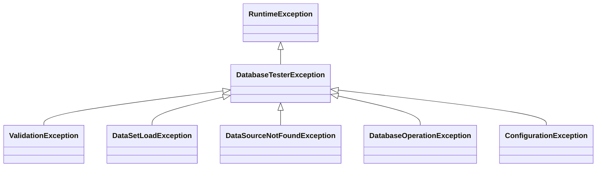

# DB Tester Specification - Error Handling

This document describes the error handling and error output in the DB Tester framework.


## Exception Hierarchy

All framework exceptions extend `DatabaseTesterException`:



**Location**: `io.github.seijikohara.dbtester.api.exception`

| Exception | Cause |
|-----------|-------|
| `ValidationException` | Expected vs actual data mismatch |
| `DataSetLoadException` | Dataset file read or parse failure |
| `DataSourceNotFoundException` | DataSource not registered |
| `DatabaseOperationException` | SQL execution failure |
| `ConfigurationException` | Framework initialization failure |


## Validation Errors

Thrown when expectation verification fails (`@ExpectedDataSet` phase).

### Output Format

Validation errors collect **all differences** and report them with a human-readable summary followed by YAML details:

```
Assertion failed: 3 differences in USERS, ORDERS
summary:
  status: FAILED
  total_differences: 3
tables:
  USERS:
    differences:
      - path: row_count
        expected: 3
        actual: 2
  ORDERS:
    differences:
      - path: "row[0].STATUS"
        expected: COMPLETED
        actual: PENDING
        column:
          type: VARCHAR(50)
          nullable: true
      - path: "row[1].AMOUNT"
        expected: 100.00
        actual: 99.99
        column:
          type: "DECIMAL(10,2)"
```

The output is **valid YAML** (after the first summary line). Standard YAML libraries can parse it for CI/CD integration.

### Output Structure

| Field | Description |
|-------|-------------|
| `summary.status` | `FAILED` when differences exist |
| `summary.total_differences` | Total count of all differences |
| `tables.<name>.differences` | List of differences for each table |
| `path` | Location: `table_count`, `row_count`, or `row[N].COLUMN` |
| `expected` and `actual` | The expected and actual values |
| `column` | JDBC metadata (type, nullable, primary_key) when available |

### Difference Types

| Path | Description |
|------|-------------|
| `table_count` | Expected and actual table counts differ |
| `table` | Expected table does not exist (`expected: exists`, `actual: not found`) |
| `row_count` | Table has different row counts |
| `row[N].COLUMN` | Cell value at row index N differs |

### Value Comparison Rules

The comparator applies the following rules before reporting mismatches:

| Rule | Description |
|------|-------------|
| NULL handling | Both NULL = match, one NULL = mismatch |
| Numeric comparison | String "123" matches Integer 123 |
| Floating point | Epsilon comparison (precision 1e-6) |
| Boolean | "1", "0", "true", "false", "yes", "no", "y", and "n" supported |
| Timestamp precision | "2024-01-01 10:00:00" matches "2024-01-01 10:00:00.0" |
| CLOB | Compared as string |


## Dataset Load Errors

Thrown when dataset files cannot be loaded or parsed.

### Directory Not Found (Classpath)

When dataset directory does not exist on classpath:

```
Dataset directory not found on classpath: 'com/example/UserRepositoryTest'
Expected location: src/test/resources/com/example/UserRepositoryTest
Hint: Create the directory and add dataset files...
```

### Directory Not Found (Filesystem)

When dataset directory does not exist on filesystem:

```
Dataset directory does not exist: '/path/to/datasets'
Hint: Create the directory and add dataset files...
```

### Path Is Not Directory

When the path exists but is a file:

```
Path exists but is not a directory: '/path/to/file.csv'
Hint: Ensure the path points to a directory, not a file.
```

### No Supported Files

When directory exists but contains no supported data files:

```
Dataset directory exists but contains no supported data files: '/path/to/datasets'
Supported file extensions: .csv, .tsv
Hint: Add at least one data file (for example, TABLE_NAME.csv)...
```

### Empty File

When a data file is empty:

```
File is empty: /path/to/USERS.csv
```

### Parse Failure

When file parsing fails:

```
Failed to parse file: /path/to/USERS.csv
```

### Load Order File Error

When `load-order.txt` file cannot be read or written:

```
Failed to read load order file: /path/to/load-order.txt
```

```
Failed to write load order file: /path/to/load-order.txt
```

For details about the load order file format and usage, see [Data Formats - Load Order](05-data-formats#load-order).


## DataSource Errors

Thrown when DataSource lookup fails.

### Default DataSource Not Registered

When no default DataSource is registered:

```
No default data source registered
```

**Solution**: Register a default DataSource in `@BeforeAll` or `setupSpec()`:

```java
registry.registerDefault(dataSource);
```

### Named DataSource Not Found

When a named DataSource is not registered:

```
No data source registered for name: secondary_db
```

**Solution**: Register the named DataSource:

```java
registry.register("secondary_db", dataSource);
```


## Database Operation Errors

Thrown when SQL operations fail during preparation phase.

### Wrapped SQL Exception

Database operation errors wrap the underlying `SQLException`:

```
DatabaseOperationException: Failed to execute INSERT on table USERS
Caused by: SQLException: Duplicate entry '1' for key 'PRIMARY'
```

### Invalid SQL Identifier

When a table name or column name contains invalid characters:

```
DatabaseOperationException: Invalid SQL identifier: 'user-accounts'.
Identifiers must start with a letter or underscore and contain only letters, digits, and underscores.
```

**Common causes**:

| Cause | Example | Solution |
|-------|---------|----------|
| Hyphen in name | `user-accounts.csv` | Rename to `user_accounts.csv` |
| Space in name | `user accounts.csv` | Rename to `user_accounts.csv` |
| Starts with digit | `123_table.csv` | Rename to `table_123.csv` |
| Special characters | `users$.csv` | Remove special characters |

### Common Causes

| Error | Cause | Solution |
|-------|-------|----------|
| Duplicate key | INSERT with existing primary key | Use CLEAN_INSERT or REFRESH |
| Foreign key violation | INSERT child before parent | Check table ordering |
| Column not found | CSV column name typo | Verify column names match schema |
| Data truncation | Value exceeds column size | Check data fits column definition |
| Invalid identifier | Table/column name has invalid characters | Use only letters, digits, underscores |


## Configuration Errors

Thrown during framework initialization.

### Invalid Configuration

When configuration values are invalid:

```
ConfigurationException: Invalid data format: XML
```

### Missing Required Setting

When a required setting is missing:

```
ConfigurationException: Convention settings cannot be null
```


## Error Context in Test Output

### JUnit Error Output

```
org.example.UserRepositoryTest > shouldCreateUser FAILED
    java.lang.AssertionError:
        Assertion failed: 1 difference in USERS
        summary:
          status: FAILED
          total_differences: 1
        tables:
          USERS:
            differences:
              - path: "row[0].EMAIL"
                expected: john@example.com
                actual: jane@example.com
                column:
                  type: VARCHAR(255)
                  nullable: false

        at io.github.seijikohara.dbtester.internal.assertion.DataSetComparator.assertEquals(DataSetComparator.java:85)
        at io.github.seijikohara.dbtester.junit.jupiter.lifecycle.ExpectationVerifier.verify(ExpectationVerifier.java:42)
```

### Spock Error Output

```
example.UserRepositorySpec > should create user FAILED
    java.lang.AssertionError:
        Assertion failed: 1 difference in USERS
        summary:
          status: FAILED
          total_differences: 1
        tables:
          USERS:
            differences:
              - path: row_count
                expected: 2
                actual: 1

Condition not satisfied:
    Expectation verification failed
```

### Test Method Context

Errors include the test method name for context:

```
Failed to verify expectation dataset for testUserCreation
```


## Debugging Tips

| Symptom | Check |
|---------|-------|
| Table not found | Verify CSV filename matches table name (case-sensitive) |
| Row count mismatch | Check `[Scenario]` column filtering |
| Value mismatch | Compare expected CSV with actual database state |
| Directory not found | Verify path matches `{package}/{TestClassName}/` convention |
| DataSource not found | Ensure registration in `@BeforeAll` or `setupSpec()` |

### Logging

Enable DEBUG logging for detailed operation output:

```properties
logging.level.io.github.seijikohara.dbtester=DEBUG
```


## Related Specifications

- [Overview](01-overview) - Framework purpose and key concepts
- [Public API](03-public-api) - Exception classes
- [Database Operations](06-database-operations) - Operation failures
- [Test Frameworks](07-test-frameworks) - Test lifecycle and error handling
