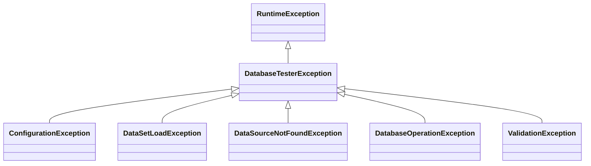

# Exceptions

## Exception Hierarchy

All exceptions extend `DatabaseTesterException`.

## DatabaseTesterException

Sealed base exception for all framework errors. Custom subclasses cannot be added.

**Location**: `io.github.seijikohara.dbtester.api.exception.DatabaseTesterException`

**Constructors**:

| Constructor | Description |
|-------------|-------------|
| `DatabaseTesterException(String)` | Message only |
| `DatabaseTesterException(String, Throwable)` | Message with cause |
| `DatabaseTesterException(Throwable)` | Cause only |

## ConfigurationException

Indicates invalid framework configuration.

**Typical Causes**:

- Missing required configuration values
- Invalid file paths
- Incompatible settings combination

## DataSetLoadException

Indicates failure to load dataset files.

**Typical Causes**:

- File not found
- Invalid file format
- Parse errors in CSV, TSV, JSON, or YAML content
- Table name conflict in `AUTO` format mode (same table name in multiple file formats)

## DataSourceNotFoundException

Indicates the requested DataSource is not registered.

**Typical Causes**:

- Named DataSource not registered in `DataSourceRegistry`
- Default DataSource not set when required

## DatabaseOperationException

Indicates database operation failure.

**Typical Causes**:

- SQL execution errors
- Constraint violations
- Connection failures

## ValidationException

Indicates that verification could not be completed, as opposed to a data mismatch.

**Typical Causes**:

- A value cannot be parsed for a flexible comparison strategy under `ComparisonMode.STRICT`
- A comparison strategy cannot be applied to a value
- Verification is interrupted during a retry delay

A data mismatch (row count difference or column value difference) throws `java.lang.AssertionError`,
not `ValidationException`. The assertion API and the annotation-driven path both surface mismatches
as `AssertionError` so a single `catch (AssertionError)` covers both entry points.

**Output Format**: An `AssertionError` for a mismatch carries a human-readable summary followed by
YAML details. See [Error Handling - Validation Errors](error-handling#validation-errors) for format
details.

## Default Values Reference

This table lists the default values for all configurable attributes.

### Annotation Attribute Defaults

| Annotation | Attribute | Default | Meaning |
|------------|-----------|---------|---------|
| `@DataSet` | `sources` | `{}` | Convention-based discovery |
| `@DataSet` | `operation` | `CLEAN_INSERT` | Delete all rows then insert |
| `@DataSet` | `tableOrdering` | `AUTO` | Automatic ordering |
| `@DataSet` | `batchSize` | `-1` | Use global setting |
| `@ExpectedDataSet` | `sources` | `{}` | Convention-based discovery |
| `@ExpectedDataSet` | `tableOrdering` | `AUTO` | Automatic ordering |
| `@ExpectedDataSet` | `rowOrdering` | `UNSET` | Defers to global `VerificationSettings.rowOrdering()` |
| `@ExpectedDataSet` | `retryCount` | `-1` | Use global setting |
| `@ExpectedDataSet` | `retryDelayMillis` | `-1` | Use global setting |
| `@DataSetSource` | `resourceLocation` | `""` | Convention-based discovery |
| `@DataSetSource` | `dataSourceName` | `""` | Default DataSource |
| `@DataSetSource` | `scenarioNames` | `{}` | Use test method name |
| `@DataSetSource` | `excludeColumns` | `{}` | No exclusions |
| `@DataSetSource` | `columnStrategies` | `{}` | Default STRICT for all columns |
| `@ColumnStrategy` | `strategy` | `STRICT` | Exact match |
| `@ColumnStrategy` | `pattern` | `""` | No pattern |
| `@ColumnStrategy` | `options` | `""` | No options |

**Magic Value: `-1`**

Attributes with a default of `-1` delegate to the global configuration in `OperationDefaults`.
This allows test-level overrides while maintaining consistent defaults across the test suite.
A value of `0` or higher uses the specified value directly.

## Column Comparison Precedence

When verifying expected database state, column comparison follows this precedence order:

1. **`excludeColumns`**: Columns listed in `excludeColumns` are skipped entirely. No comparison occurs.
2. **`columnStrategies`**: Columns with a `@ColumnStrategy` annotation use the specified strategy.
3. **`STRICT` (default)**: All remaining columns use exact match comparison.

Annotation-level `columnStrategies` override global strategies configured in `VerificationSettings`.
Global exclusions from `VerificationSettings` combine with per-dataset `excludeColumns`.

## Related Specifications

- [API Overview](public-api) - API layers and module organization
- [Annotations](annotations) - @DataSet, @ExpectedDataSet, @ColumnStrategy
- [Error Handling](error-handling) - Error messages and troubleshooting
- [Configuration](configuration) - Configuration classes
