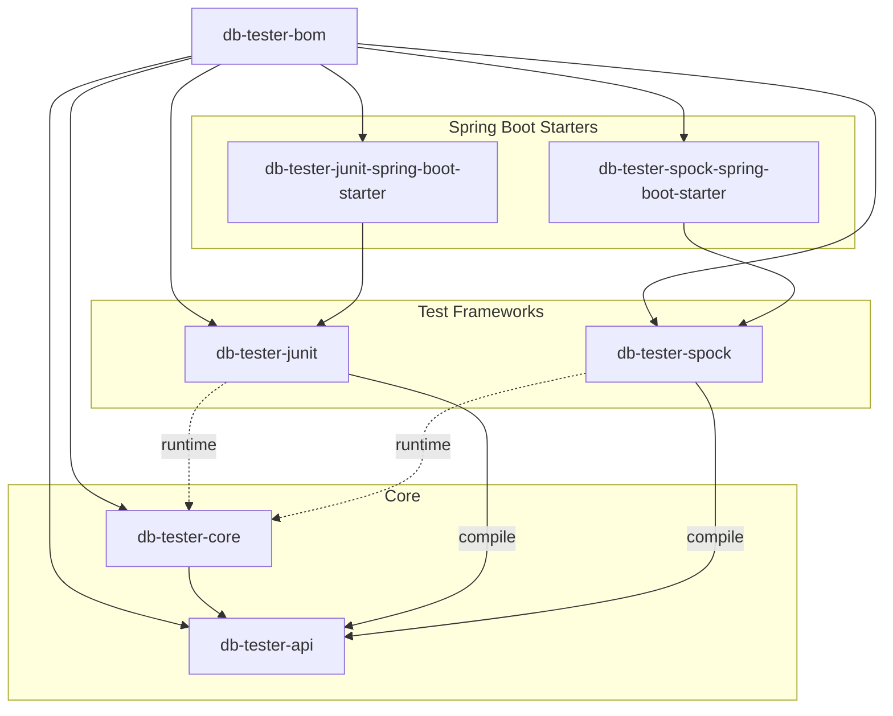
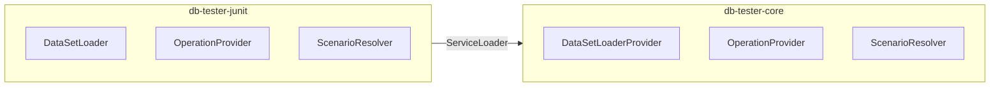

# DB Tester仕様 - アーキテクチャ

DB Testerフレームワークのモジュール構造、依存関係、およびアーキテクチャパターンについて説明します。

## モジュール構造

本フレームワークは、階層化されたアーキテクチャで構成された7つのモジュールから構成されています。



### モジュールの責務

| モジュール | 責務 |
|------------|------|
| `db-tester-bom` | バージョン管理と依存関係の整合 |
| `db-tester-api` | パブリックアノテーション、設定、SPIインターフェース |
| `db-tester-core` | JDBC操作、フォーマット解析、SPI実装 |
| `db-tester-junit` | JUnit Jupiter BeforeEach/AfterEachコールバック |
| `db-tester-spock` | Spockアノテーション駆動型拡張とインターセプター |
| `db-tester-junit-spring-boot-starter` | JUnit用Spring Boot自動設定 |
| `db-tester-spock-spring-boot-starter` | Spock用Spring Boot自動設定 |

## モジュール依存関係

### APIモジュール（`db-tester-api`）

APIモジュールは内部依存関係を持ちません。外部依存関係は以下の通りです。

| 依存関係 | 目的 |
|----------|------|
| `org.jspecify:jspecify` | Nullセーフティアノテーション |
| `java.sql` | `DataSource`インターフェース |

### Coreモジュール（`db-tester-core`）

| 依存関係 | スコープ | 目的 |
|----------|----------|------|
| `db-tester-api` | Compile | パブリックAPIクラス |
| `org.jspecify:jspecify` | Compile | Nullセーフティアノテーション |
| `org.slf4j:slf4j-api` | Compile | ロギング抽象化 |

### テストフレームワークモジュール

JUnitおよびSpockモジュールは、コンパイル時に`db-tester-api`に依存します。`db-tester-core`モジュールはServiceLoader経由でランタイム時に検出されます。

| モジュール | コンパイル依存関係 | ランタイム依存関係 |
|------------|-------------------|-------------------|
| `db-tester-junit` | `db-tester-api`, `junit-jupiter-api` | `db-tester-core` |
| `db-tester-spock` | `db-tester-api`, `spock-core` | `db-tester-core` |

### Spring Boot Starterモジュール

| モジュール | 依存関係 |
|------------|----------|
| `db-tester-junit-spring-boot-starter` | `db-tester-junit`, `db-tester-core`, `spring-boot-autoconfigure` |
| `db-tester-spock-spring-boot-starter` | `db-tester-spock`, `db-tester-core`, `spring-boot-autoconfigure` |

## パッケージ構成

### APIモジュールパッケージ

```
io.github.seijikohara.dbtester.api
├── annotation/
│   ├── Preparation.java
│   ├── Expectation.java
│   └── DataSet.java
├── assertion/
│   ├── DatabaseAssertion.java
│   └── AssertionFailureHandler.java
├── config/
│   ├── Configuration.java
│   ├── ConventionSettings.java
│   ├── DataFormat.java
│   ├── DataSourceRegistry.java
│   ├── OperationDefaults.java
│   └── TableMergeStrategy.java
├── context/
│   └── TestContext.java
├── dataset/
│   ├── DataSet.java
│   ├── Table.java
│   └── Row.java
├── domain/
│   ├── CellValue.java
│   ├── ColumnName.java
│   ├── TableName.java
│   ├── DataSourceName.java
│   ├── Column.java
│   ├── Cell.java
│   ├── ColumnMetadata.java
│   └── ComparisonStrategy.java
├── exception/
│   ├── DatabaseTesterException.java
│   ├── ConfigurationException.java
│   ├── DataSetLoadException.java
│   ├── DataSourceNotFoundException.java
│   ├── DatabaseOperationException.java
│   └── ValidationException.java
├── loader/
│   └── DataSetLoader.java
├── operation/
│   ├── Operation.java
│   └── TableOrderingStrategy.java
├── scenario/
│   ├── ScenarioName.java
│   └── ScenarioNameResolver.java
└── spi/
    ├── AssertionProvider.java
    ├── DataSetLoaderProvider.java
    ├── ExpectationProvider.java
    └── OperationProvider.java
```

### Coreモジュールパッケージ

```
io.github.seijikohara.dbtester.internal
├── assertion/
│   ├── ComparisonResult.java
│   ├── DataSetComparator.java
│   └── ExpectationVerifier.java
├── dataset/
│   ├── SimpleDataSet.java
│   ├── SimpleTable.java
│   ├── SimpleRow.java
│   ├── ScenarioTable.java
│   └── TableOrderingResolver.java
├── domain/
│   ├── ScenarioMarker.java
│   ├── SchemaName.java
│   ├── FileExtension.java
│   └── StringIdentifier.java
├── format/
│   ├── TableOrdering.java
│   ├── csv/CsvFormatProvider.java
│   ├── tsv/TsvFormatProvider.java
│   ├── parser/
│   │   ├── DelimitedParser.java
│   │   └── DelimiterConfig.java
│   └── spi/
│       ├── FormatProvider.java
│       └── FormatRegistry.java
├── jdbc/
│   ├── Jdbc.java
│   ├── read/
│   │   ├── TableReader.java
│   │   ├── TableOrderResolver.java
│   │   └── TypeConverter.java
│   └── write/
│       ├── OperationExecutor.java
│       ├── SqlBuilder.java
│       ├── ParameterBinder.java
│       ├── TableExecutor.java
│       ├── InsertExecutor.java
│       ├── UpdateExecutor.java
│       ├── DeleteExecutor.java
│       ├── RefreshExecutor.java
│       └── TruncateExecutor.java
├── loader/
│   ├── TestClassNameBasedDataSetLoader.java
│   ├── DefaultDataSetLoaderProvider.java
│   ├── AnnotationResolver.java
│   ├── DataSetFactory.java
│   ├── DataSetMerger.java
│   └── DirectoryResolver.java
├── scenario/
│   ├── ScenarioFilter.java
│   ├── FilteredDataSet.java
│   └── FilteredTable.java
├── spi/
│   ├── DefaultAssertionProvider.java
│   ├── DefaultExpectationProvider.java
│   ├── DefaultOperationProvider.java
│   └── ScenarioNameResolverRegistry.java
└── util/
    └── TopologicalSorter.java
```

## アーキテクチャパターン

### 階層化アーキテクチャ

| レイヤー | モジュール | 責務 |
|----------|----------|------|
| プレゼンテーション | junit, spock, starters | テストフレームワーク統合 |
| アプリケーション | api | パブリックインターフェースと契約 |
| ドメイン | core (dataset, domain) | ビジネスロジックとエンティティ |
| インフラストラクチャ | core (jdbc, format) | データベースおよびファイルシステムアクセス |

### ドメイン駆動設計パターン

| パターン | 実装 | 説明 |
|----------|------|------|
| 値オブジェクト | `TableName`, `ColumnName`, `CellValue` | 値による等価性を持つイミュータブルオブジェクト |
| エンティティ | `Table`, `Row` | 集約内で識別子を持つオブジェクト |
| 集約 | `DataSet` | 整合性境界を持つルートエンティティ |
| ファクトリ | `DataSetFactory` | 複雑なオブジェクトの生成 |
| リポジトリ | `DataSourceRegistry` | データソース管理 |
| ドメインサービス | `DataSetComparator` | エンティティに対するステートレス操作 |

### サービスプロバイダーインターフェース（SPI）

モジュール間の疎結合のためにSPIを使用します。



### ストラテジーパターン

操作と比較戦略はストラテジーパターンを使用します。

| 戦略インターフェース | 実装 |
|---------------------|------|
| `Operation` enum | NONE, INSERT, UPDATE, DELETE, REFRESH, CLEAN_INSERTなど |
| `ComparisonStrategy` | STRICT, IGNORE, NUMERIC, CASE_INSENSITIVE, TIMESTAMP_FLEXIBLE, NOT_NULL, REGEX |
| `TableMergeStrategy` | FIRST, LAST, UNION, UNION_ALL |
| `FormatProvider` | CsvFormatProvider, TsvFormatProvider |

## JPMSサポート

### 完全なモジュールサポート

以下のモジュールは完全な`module-info.java`を提供します。

| モジュール | モジュール名 |
|------------|-------------|
| `db-tester-api` | `io.github.seijikohara.dbtester.api` |
| `db-tester-core` | `io.github.seijikohara.dbtester.core` |
| `db-tester-junit` | `io.github.seijikohara.dbtester.junit` |

### 自動モジュール名

以下のモジュールは`MANIFEST.MF`で`Automatic-Module-Name`を使用します。

| モジュール | Automatic-Module-Name |
|------------|----------------------|
| `db-tester-spock` | `io.github.seijikohara.dbtester.spock` |
| `db-tester-junit-spring-boot-starter` | `io.github.seijikohara.dbtester.junit.spring.autoconfigure` |
| `db-tester-spock-spring-boot-starter` | `io.github.seijikohara.dbtester.spock.spring.autoconfigure` |

### モジュール依存関係

APIモジュールの`module-info.java`の例を以下に示します。

```java
module io.github.seijikohara.dbtester.api {
    requires transitive java.sql;
    requires transitive org.jspecify;

    exports io.github.seijikohara.dbtester.api.annotation;
    exports io.github.seijikohara.dbtester.api.assertion;
    exports io.github.seijikohara.dbtester.api.config;
    exports io.github.seijikohara.dbtester.api.context;
    exports io.github.seijikohara.dbtester.api.dataset;
    exports io.github.seijikohara.dbtester.api.domain;
    exports io.github.seijikohara.dbtester.api.exception;
    exports io.github.seijikohara.dbtester.api.loader;
    exports io.github.seijikohara.dbtester.api.operation;
    exports io.github.seijikohara.dbtester.api.scenario;
    exports io.github.seijikohara.dbtester.api.spi;

    uses io.github.seijikohara.dbtester.api.spi.AssertionProvider;
    uses io.github.seijikohara.dbtester.api.spi.DataSetLoaderProvider;
    uses io.github.seijikohara.dbtester.api.spi.OperationProvider;
    uses io.github.seijikohara.dbtester.api.spi.ExpectationProvider;
    uses io.github.seijikohara.dbtester.api.scenario.ScenarioNameResolver;
}
```

## 関連仕様

- [概要](01-overview) - フレームワークの目的と主要概念
- [パブリックAPI](03-public-api) - アノテーションと設定クラス
- [設定](04-configuration) - 設定オプション
- [テストフレームワーク](07-test-frameworks) - JUnitとSpockの統合
- [SPI](08-spi) - サービスプロバイダーインターフェース拡張ポイント
- [エラーハンドリング](09-error-handling) - エラーメッセージと例外型
