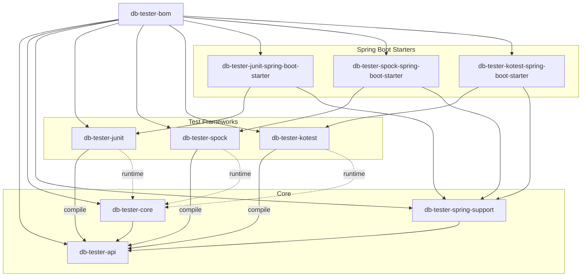
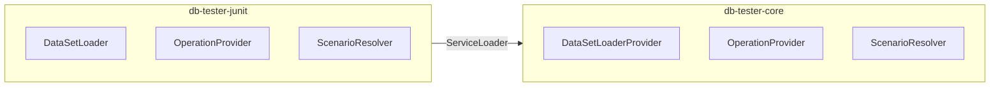

# DB Tester仕様 - アーキテクチャ

DB Testerフレームワークのモジュール構造、依存関係、およびアーキテクチャパターンについて説明します。

## モジュール構造

本フレームワークは、階層化されたアーキテクチャで構成された11のモジュールから構成されています。



### モジュールの責務

| モジュール | 責務 |
|------------|------|
| `db-tester-bom` | バージョン管理と依存関係の整合 |
| `db-tester-api` | パブリックアノテーション、設定、ドメインモデル、SPIインターフェース |
| `db-tester-core` | JDBC操作、フォーマット解析、SPI実装 |
| `db-tester-spring-support` | Spring Boot starter向け共通DataSource登録ロジック |
| `db-tester-junit` | JUnit Jupiter BeforeEach/AfterEachコールバック |
| `db-tester-spock` | Spockアノテーション駆動型拡張とインターセプター |
| `db-tester-kotest` | Kotest AnnotationSpec TestCaseExtension |
| `db-tester-junit-spring-boot-starter` | JUnit用Spring Boot自動設定 |
| `db-tester-spock-spring-boot-starter` | Spock用Spring Boot自動設定 |
| `db-tester-kotest-spring-boot-starter` | Kotest用Spring Boot自動設定 |

## モジュール依存関係

依存関係は各モジュールの`build.gradle.kts`で定義されています。現在の依存関係についてはソースファイルを参照してください。

| モジュール | ビルド設定 |
|------------|-----------|
| `db-tester-api` | [build.gradle.kts](https://github.com/seijikohara/db-tester/blob/main/db-tester-api/build.gradle.kts) |
| `db-tester-core` | [build.gradle.kts](https://github.com/seijikohara/db-tester/blob/main/db-tester-core/build.gradle.kts) |
| `db-tester-spring-support` | [build.gradle.kts](https://github.com/seijikohara/db-tester/blob/main/db-tester-spring-support/build.gradle.kts) |
| `db-tester-junit` | [build.gradle.kts](https://github.com/seijikohara/db-tester/blob/main/db-tester-junit/build.gradle.kts) |
| `db-tester-spock` | [build.gradle.kts](https://github.com/seijikohara/db-tester/blob/main/db-tester-spock/build.gradle.kts) |
| `db-tester-kotest` | [build.gradle.kts](https://github.com/seijikohara/db-tester/blob/main/db-tester-kotest/build.gradle.kts) |
| `db-tester-junit-spring-boot-starter` | [build.gradle.kts](https://github.com/seijikohara/db-tester/blob/main/db-tester-junit-spring-boot-starter/build.gradle.kts) |
| `db-tester-spock-spring-boot-starter` | [build.gradle.kts](https://github.com/seijikohara/db-tester/blob/main/db-tester-spock-spring-boot-starter/build.gradle.kts) |
| `db-tester-kotest-spring-boot-starter` | [build.gradle.kts](https://github.com/seijikohara/db-tester/blob/main/db-tester-kotest-spring-boot-starter/build.gradle.kts) |

テストフレームワークモジュールはコンパイル時に`db-tester-api`に依存します。`db-tester-core`モジュールはServiceLoader経由でランタイム時に検出されます。

## パッケージ構成

### APIモジュール

| パッケージ | 責務 |
|-----------|------|
| `annotation` | `@DataSet`, `@ExpectedDataSet`, `@DataSetSource`アノテーション |
| `assertion` | プログラマティックアサーションAPI |
| `config` | 設定クラスとレジストリ |
| `context` | テスト実行コンテキスト |
| `dataset` | TableSet, Table, Rowインターフェース |
| `domain` | 値オブジェクト（`TableName`, `ColumnName`, `CellValue`） |
| `exception` | 例外階層 |
| `loader` | データセットローダーインターフェース |
| `operation` | Operationenumと戦略 |
| `scenario` | シナリオフィルタリングインターフェース |
| `spi` | サービスプロバイダーインターフェース |

ソース: [db-tester-api/src/main/java](https://github.com/seijikohara/db-tester/tree/main/db-tester-api/src/main/java/io/github/seijikohara/dbtester/api)

### Coreモジュール

| パッケージ | 責務 |
|-----------|------|
| `assertion` | データセット比較と検証 |
| `dataset` | TableSet, Table, Row実装 |
| `domain` | 内部値オブジェクト |
| `format` | CSV/TSV解析とフォーマットプロバイダー |
| `jdbc` | JDBC読み取り/書き込み操作 |
| `loader` | 規約ベースのデータセット読み込み |
| `scenario` | シナリオフィルタリング実装 |
| `spi` | SPI実装 |

ソース: [db-tester-core/src/main/java](https://github.com/seijikohara/db-tester/tree/main/db-tester-core/src/main/java/io/github/seijikohara/dbtester/internal)

## アーキテクチャパターン

### 階層化アーキテクチャ

| レイヤー | モジュール | 責務 |
|----------|----------|------|
| プレゼンテーション | junit, spock, kotest, starters | テストフレームワーク統合 |
| アプリケーション | api | パブリックインターフェースと契約 |
| ドメイン | core (dataset, domain) | ビジネスロジックとエンティティ |
| インフラストラクチャ | core (jdbc, format) | データベースおよびファイルシステムアクセス |

### ドメイン駆動設計パターン

| パターン | 実装 | 説明 |
|----------|------|------|
| 値オブジェクト | `TableName`, `ColumnName`, `CellValue` | 値による等価性を持つイミュータブルオブジェクト |
| エンティティ | `Table`, `Row` | 集約内で識別子を持つオブジェクト |
| 集約 | `TableSet` | 整合性境界を持つルートエンティティ |
| ファクトリ | `TableSetFactory` | 複雑なオブジェクトの生成 |
| リポジトリ | `DataSourceRegistry` | データソース管理 |
| ドメインサービス | `TableSetComparator` | エンティティに対するステートレス操作 |

### サービスプロバイダーインターフェース（SPI）

モジュール間の疎結合のためにSPIを使用します。



### ストラテジーパターン

操作と比較戦略はストラテジーパターンを使用します。

| 戦略インターフェース | 実装 |
|---------------------|------|
| `Operation` enum | NONE, INSERT, UPDATE, DELETE, DELETE_ALL, REFRESH, TRUNCATE_TABLE, CLEAN_INSERT, TRUNCATE_INSERT |
| `ComparisonStrategy` | STRICT, IGNORE, NUMERIC, CASE_INSENSITIVE, TIMESTAMP_FLEXIBLE, NOT_NULL, REGEX |
| `TableMergeStrategy` | FIRST, LAST, UNION, UNION_ALL |
| `TableOrderingStrategy` | AUTO, LOAD_ORDER_FILE, FOREIGN_KEY, ALPHABETICAL |
| `FormatProvider` | CsvFormatProvider, TsvFormatProvider |

## JPMSサポート

### 完全なモジュールサポート

以下のモジュールは完全な`module-info.java`を提供します。

| モジュール | モジュール名 |
|------------|-------------|
| `db-tester-api` | `io.github.seijikohara.dbtester.api` |
| `db-tester-core` | `io.github.seijikohara.dbtester.core` |
| `db-tester-junit` | `io.github.seijikohara.dbtester.junit` |

### 自動モジュール名

以下のモジュールは`MANIFEST.MF`で`Automatic-Module-Name`を使用します。

| モジュール | Automatic-Module-Name |
|------------|----------------------|
| `db-tester-spock` | `io.github.seijikohara.dbtester.spock` |
| `db-tester-kotest` | `io.github.seijikohara.dbtester.kotest` |
| `db-tester-junit-spring-boot-starter` | `io.github.seijikohara.dbtester.junit.spring.autoconfigure` |
| `db-tester-spock-spring-boot-starter` | `io.github.seijikohara.dbtester.spock.spring.autoconfigure` |
| `db-tester-kotest-spring-boot-starter` | `io.github.seijikohara.dbtester.kotest.spring.autoconfigure` |

### モジュール依存関係

APIモジュールの`module-info.java`の例を以下に示します。

```java
module io.github.seijikohara.dbtester.api {
    requires transitive java.sql;
    requires transitive org.jspecify;

    exports io.github.seijikohara.dbtester.api.annotation;
    exports io.github.seijikohara.dbtester.api.assertion;
    exports io.github.seijikohara.dbtester.api.config;
    exports io.github.seijikohara.dbtester.api.context;
    exports io.github.seijikohara.dbtester.api.dataset;
    exports io.github.seijikohara.dbtester.api.domain;
    exports io.github.seijikohara.dbtester.api.exception;
    exports io.github.seijikohara.dbtester.api.loader;
    exports io.github.seijikohara.dbtester.api.operation;
    exports io.github.seijikohara.dbtester.api.scenario;
    exports io.github.seijikohara.dbtester.api.spi;

    uses io.github.seijikohara.dbtester.api.spi.AssertionProvider;
    uses io.github.seijikohara.dbtester.api.spi.DataSetLoaderProvider;
    uses io.github.seijikohara.dbtester.api.spi.OperationProvider;
    uses io.github.seijikohara.dbtester.api.spi.ExpectationProvider;
    uses io.github.seijikohara.dbtester.api.scenario.ScenarioNameResolver;
}
```

## 関連仕様

- [概要](01-overview) - フレームワークの目的と主要概念
- [パブリックAPI](03-public-api) - アノテーションと設定クラス
- [設定](04-configuration) - 設定オプション
- [テストフレームワーク](07-test-frameworks) - JUnit、Spock、およびKotestの統合
- [SPI](08-spi) - サービスプロバイダーインターフェース拡張ポイント
- [エラーハンドリング](09-error-handling) - エラーメッセージと例外型
