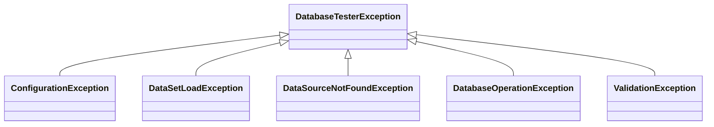

# DB Tester仕様 - パブリックAPI

`db-tester-api`モジュールが提供するパブリックAPIについて説明します。


## アノテーション

### @Preparation

テストメソッド実行前に適用するデータセットを宣言します。

**パッケージ**: `io.github.seijikohara.dbtester.api.annotation.Preparation`

**ターゲット**: `METHOD`, `TYPE`

**属性**:

| 属性 | 型 | デフォルト | 説明 |
|------|-----|-----------|------|
| `dataSets` | `DataSet[]` | `{}` | 実行するデータセット。空の場合は規約ベースの検出を使用 |
| `operation` | `Operation` | `CLEAN_INSERT` | 適用するデータベース操作 |
| `tableOrdering` | `TableOrderingStrategy` | `AUTO` | テーブル処理順序を決定する戦略 |

**アノテーションの継承**:

- クラスレベルのアノテーションはサブクラスに継承されます
- メソッドレベルのアノテーションはクラスレベルの宣言をオーバーライドします
- `@Inherited`で注釈されています

**例**:

```java
@Preparation
void testMethod() { }

@Preparation(operation = Operation.INSERT)
void testWithInsertOnly() { }

@Preparation(tableOrdering = TableOrderingStrategy.FOREIGN_KEY)
void testWithForeignKeyOrdering() { }

@Preparation(dataSets = @DataSet(resourceLocation = "custom/path"))
void testWithCustomPath() { }
```


### @Expectation

テスト実行後の期待されるデータベース状態を定義するデータセットを宣言します。

**パッケージ**: `io.github.seijikohara.dbtester.api.annotation.Expectation`

**ターゲット**: `METHOD`, `TYPE`

**属性**:

| 属性 | 型 | デフォルト | 説明 |
|------|-----|-----------|------|
| `dataSets` | `DataSet[]` | `{}` | 検証用データセット。空の場合は規約ベースの検出を使用 |
| `tableOrdering` | `TableOrderingStrategy` | `AUTO` | 検証時のテーブル処理順序を決定する戦略 |

**検証の動作**:

- 読み取り専用の比較（データ変更なし）
- 実際のデータベース状態を期待データセットと照合して検証
- アサーション失敗はテストフレームワーク経由で報告

**例**:

```java
@Preparation
@Expectation
void testWithVerification() { }

@Expectation(dataSets = @DataSet(resourceLocation = "expected/custom"))
void testWithCustomExpectation() { }

@Expectation(tableOrdering = TableOrderingStrategy.ALPHABETICAL)
void testWithAlphabeticalOrdering() { }
```


### @DataSet

`@Preparation`または`@Expectation`内で個々のデータセットパラメータを設定します。

**パッケージ**: `io.github.seijikohara.dbtester.api.annotation.DataSet`

**ターゲット**: なし (`@Target({})`) - このアノテーションはクラスやメソッドに直接適用できません。`@Preparation#dataSets()`と`@Expectation#dataSets()`配列内でのみ使用されます。直接適用しようとするとコンパイルエラーになります。

**属性**:

| 属性 | 型 | デフォルト | 説明 |
|------|-----|-----------|------|
| `resourceLocation` | `String` | `""` | データセットディレクトリパス。空の場合は規約ベースの検出を使用 |
| `dataSourceName` | `String` | `""` | 名前付きDataSource識別子。空の場合はデフォルトを使用 |
| `scenarioNames` | `String[]` | `{}` | シナリオフィルタ。空の場合はテストメソッド名を使用 |

**リソースロケーション形式**:

| 形式 | 例 | 解決方法 |
|------|-----|----------|
| クラスパス相対 | `data/users` | テストクラスパスルートから |
| クラスパスプレフィックス | `classpath:data/users` | 明示的なクラスパス解決 |
| 絶対パス | `/tmp/testdata` | ファイルシステム絶対パス |
| 空文字列 | `""` | 規約ベースの検出 |

**例**:

```java
@Preparation(dataSets = {
    @DataSet(dataSourceName = "primary"),
    @DataSet(dataSourceName = "secondary", resourceLocation = "secondary-data")
})
void testMultipleDataSources() { }

@Preparation(dataSets = @DataSet(scenarioNames = {"scenario1", "scenario2"}))
void testMultipleScenarios() { }
```


## DataSetインターフェース

### DataSet

データベーステーブルの論理的なコレクションを表します。

**パッケージ**: `io.github.seijikohara.dbtester.api.dataset.DataSet`

**メソッド**:

| メソッド | 戻り値型 | 説明 |
|----------|---------|------|
| `getTables()` | `List<Table>` | 宣言順序で格納されたテーブルのイミュータブルリストを返します |
| `getTable(TableName)` | `Optional<Table>` | 名前でテーブルを検索します |
| `getDataSource()` | `Optional<DataSource>` | 指定された場合、バインドされたDataSourceを返します |

**保証事項**:

- テーブル順序は保持されます（挿入順序）
- 返されるすべてのコレクションはイミュータブルです
- データセット内でテーブル名は一意です


### Table

データベーステーブルの構造とデータを表します。

**パッケージ**: `io.github.seijikohara.dbtester.api.dataset.Table`

**メソッド**:

| メソッド | 戻り値型 | 説明 |
|----------|---------|------|
| `getName()` | `TableName` | テーブル識別子を返します |
| `getColumns()` | `List<ColumnName>` | 定義順序でカラム名を返します |
| `getRows()` | `List<Row>` | すべての行を返します（空の場合もあります） |
| `getRowCount()` | `int` | 行数を返します |

**保証事項**:

- カラム順序はすべての行で一貫しています
- 返されるすべてのコレクションはイミュータブルです
- 行数は`getRows().size()`と等しくなります


### Row

単一のデータベースレコードを表します。

**パッケージ**: `io.github.seijikohara.dbtester.api.dataset.Row`

**メソッド**:

| メソッド | 戻り値型 | 説明 |
|----------|---------|------|
| `getValues()` | `Map<ColumnName, CellValue>` | イミュータブルなカラム値マッピングを返します |
| `getValue(ColumnName)` | `CellValue` | カラムの値を返します。存在しない場合は`CellValue.NULL` |


## ドメイン値オブジェクト

### CellValue

明示的なnull処理でセル値をラップします。

**パッケージ**: `io.github.seijikohara.dbtester.api.domain.CellValue`

**型**: `record`

**フィールド**:

| フィールド | 型 | 説明 |
|------------|-----|------|
| `value` | `@Nullable Object` | ラップされた値 |

**定数**:

| 定数 | 説明 |
|------|------|
| `CellValue.NULL` | SQL NULLを表すシングルトン |

**メソッド**:

| メソッド | 戻り値型 | 説明 |
|----------|---------|------|
| `isNull()` | `boolean` | 値がnullの場合`true`を返します |


### TableName

データベーステーブルのイミュータブルな識別子です。

**パッケージ**: `io.github.seijikohara.dbtester.api.domain.TableName`

**型**: `record`

**フィールド**:

| フィールド | 型 | 説明 |
|------------|-----|------|
| `value` | `String` | テーブル名文字列 |


### ColumnName

テーブルカラムのイミュータブルな識別子です。

**パッケージ**: `io.github.seijikohara.dbtester.api.domain.ColumnName`

**型**: `record`

**フィールド**:

| フィールド | 型 | 説明 |
|------------|-----|------|
| `value` | `String` | カラム名文字列 |


### DataSourceName

登録済みDataSourceのイミュータブルな識別子です。

**パッケージ**: `io.github.seijikohara.dbtester.api.domain.DataSourceName`

**型**: `record`

**フィールド**:

| フィールド | 型 | 説明 |
|------------|-----|------|
| `value` | `String` | DataSource名文字列 |


### ComparisonStrategy

アサーション時の値比較動作を定義します。

**パッケージ**: `io.github.seijikohara.dbtester.api.domain.ComparisonStrategy`

**定義済み戦略**:

| 戦略 | 説明 |
|------|------|
| `STRICT` | `equals()`を使用した完全一致（デフォルト） |
| `IGNORE` | 比較を完全にスキップ |
| `NUMERIC` | BigDecimalを使用した型を考慮した数値比較 |
| `CASE_INSENSITIVE` | 大文字小文字を区別しない文字列比較 |
| `TIMESTAMP_FLEXIBLE` | サブ秒精度とタイムゾーンを無視 |
| `NOT_NULL` | 値がnullでないことを検証 |

**ファクトリメソッド**:

| メソッド | 説明 |
|----------|------|
| `regex(String)` | 正規表現パターンマッチャーを作成 |

**比較動作**:

| 戦略 | null/null | null/value | value/null | value/value |
|------|-----------|------------|------------|-------------|
| `STRICT` | true | false | false | equals() |
| `IGNORE` | true | true | true | true |
| `NUMERIC` | true | false | false | BigDecimal比較 |
| `CASE_INSENSITIVE` | true | false | false | equalsIgnoreCase() |
| `TIMESTAMP_FLEXIBLE` | true | false | false | 正規化比較 |
| `NOT_NULL` | false | false | false | true |
| `REGEX` | false | false | false | Pattern.matches() |


## 例外

すべての例外は`DatabaseTesterException`を継承します。

### 例外階層



### DatabaseTesterException

すべてのフレームワークエラーの基底例外です。

**パッケージ**: `io.github.seijikohara.dbtester.api.exception.DatabaseTesterException`

**コンストラクタ**:

| コンストラクタ | 説明 |
|----------------|------|
| `DatabaseTesterException(String)` | メッセージのみ |
| `DatabaseTesterException(String, Throwable)` | メッセージと原因 |
| `DatabaseTesterException(Throwable)` | 原因のみ |


### ConfigurationException

無効なフレームワーク設定を示します。

**一般的な原因**:

- 必須の設定値が欠落
- 無効なファイルパス
- 互換性のない設定の組み合わせ


### DataSetLoadException

データセットファイルの読み込み失敗を示します。

**一般的な原因**:

- ファイルが見つからない
- 無効なファイル形式
- CSV/TSVコンテンツのパースエラー


### DataSourceNotFoundException

要求されたDataSourceが登録されていないことを示します。

**一般的な原因**:

- 名前付きDataSourceが`DataSourceRegistry`に登録されていない
- 必要な場合にデフォルトDataSourceが設定されていない


### DatabaseOperationException

データベース操作の失敗を示します。

**一般的な原因**:

- SQL実行エラー
- 制約違反
- 接続失敗


### ValidationException

アサーションまたは検証の失敗を示します。

**一般的な原因**:

- 期待値と実際のデータの不一致
- 行数の差異
- カラム値の不一致

**出力形式**: 検証エラーは人間が読みやすい要約に続いてYAML詳細を出力します。形式の詳細は[エラーハンドリング - 検証エラー](09-error-handling#検証エラー)を参照してください。


## 関連仕様

- [概要](01-overview) - フレームワークの紹介
- [設定](04-configuration) - 設定クラス
- [データベース操作](06-database-operations) - Operation enumの詳細
