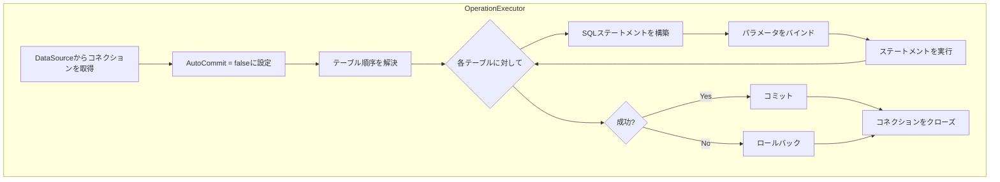

# DB Tester仕様 - データベース操作

DB Testerフレームワークがサポートするデータベース操作について説明します。


## Operation列挙型

**パッケージ**: `io.github.seijikohara.dbtester.api.operation.Operation`

### 利用可能な操作

| 操作 | 説明 | ユースケース |
|------|------|-------------|
| `NONE` | データベース操作なし | 読み取り専用の検証 |
| `INSERT` | 新規行を挿入 | 空テーブルまたは追加 |
| `UPDATE` | 主キーで既存行を更新 | 既存データの変更 |
| `REFRESH` | Upsert（挿入または更新） | 挿入と更新の混在 |
| `DELETE` | 主キーで特定行を削除 | 選択的な削除 |
| `DELETE_ALL` | テーブルの全行を削除 | シーケンスリセットなしのクリア |
| `TRUNCATE_TABLE` | テーブルを切り捨て | シーケンスリセット付きのクリア |
| `CLEAN_INSERT` | 全削除後に挿入（デフォルト） | 新鮮なテストデータ |
| `TRUNCATE_INSERT` | 切り捨て後に挿入 | シーケンスリセット付きの新鮮なデータ |


## 操作の詳細

### NONE

データベース操作を実行しません。

**動作**:
- データセット内のすべてのテーブルをスキップ
- データベース状態を変更しない

**ユースケース**:
- 以前のテストから準備データが存在する期待値のみのテスト
- 手動セットアップシナリオ


### INSERT

既存データを変更せずに新規行を挿入します。

**生成されるSQL**: `INSERT INTO table (columns) VALUES (?)`

**動作**:
- データセットから各行を挿入
- 主キー重複違反時は失敗
- 既存行には影響しない

**ユースケース**:
- 既存データを持つテーブルへの追加
- 特定の行追加を必要とするテスト

**制約**:
- ターゲット行が空であるか、一意のキーが必要


### UPDATE

主キーで識別される既存行を更新します。

**生成されるSQL**: `UPDATE table SET columns = ? WHERE pk_columns = ?`

**動作**:
- 主キーで行を照合
- 非キーカラムを更新
- データベースに存在しない行は無視

**ユースケース**:
- 既存テストデータの変更
- テスト内での状態遷移

**要件**:
- テーブルに主キーが定義されていること
- データセットに主キーカラムが含まれていること


### REFRESH

Upsert操作（挿入または更新）を実行します。

**動作**:
- 主キーで行の存在を確認
- 既存行を更新
- 新規行を挿入

**ユースケース**:
- 既存データが部分的に存在する混合シナリオ
- 増分データセットアップ

**要件**:
- テーブルに主キーが定義されていること


### DELETE

主キーで識別される特定行を削除します。

**生成されるSQL**: `DELETE FROM table WHERE pk_columns = ?`

**動作**:
- データセットの主キーで行を照合
- 一致する行のみを削除
- 他の行は変更されない

**ユースケース**:
- 特定のテストレコードの削除
- 個別行のクリーンアップ

**要件**:
- データセットに主キーカラムが含まれていること


### DELETE_ALL

参照されているテーブルの全行を削除します。

**生成されるSQL**: `DELETE FROM table`

**動作**:
- データセット内の各テーブルから全行を削除
- ID/シーケンスカラムをリセットしない
- 外部キー制約を尊重（失敗する場合あり）

**ユースケース**:
- シーケンスを保持しながらテーブルをクリア
- 挿入専用操作のセットアップ

**テーブル処理順序**:
- テーブルは外部キーの逆順で処理


### TRUNCATE_TABLE

テーブルを切り捨て、サポートされている場合はIDカラムをリセットします。

**生成されるSQL**: `TRUNCATE TABLE table`

**動作**:
- テーブルから全行を削除
- ID/自動インクリメントカラムをリセット
- 外部キーの動作はデータベース依存

**ユースケース**:
- シーケンスを含む完全なテーブルリセット
- パフォーマンス重視のクリーンアップ

**データベースサポート**:

| データベース | IDリセット | FK処理 |
|-------------|-----------|--------|
| H2 | 対応 | CASCADEが必要 |
| MySQL | 対応 | FKチェックの無効化が必要 |
| PostgreSQL | 対応 | CASCADEが必要 |
| SQL Server | 対応 | FK参照がないことが必要 |
| Oracle | 対応 | CASCADEが必要 |


### CLEAN_INSERT

全行を削除してからデータセットの行を挿入します。

**等価操作**: `DELETE_ALL`に続いて`INSERT`

**動作**:
1. 各テーブルから全行を削除（FK逆順）
2. データセットから全行を挿入（FK順）

**ユースケース**:
- 標準的なテスト準備（デフォルト操作）
- 決定論的な初期状態

**実行順序**:
- DELETEフェーズ: 子テーブルが先
- INSERTフェーズ: 親テーブルが先


### TRUNCATE_INSERT

テーブルを切り捨ててからデータセットの行を挿入します。

**等価操作**: `TRUNCATE_TABLE`に続いて`INSERT`

**動作**:
1. 各テーブルを切り捨て（CASCADEが必要な場合あり）
2. データセットから全行を挿入

**ユースケース**:
- シーケンスリセット付きのテスト準備
- パフォーマンス最適化されたセットアップ


## 実行フロー

### 準備フェーズ

1. 設定された場所からデータセットファイルを読み込む
2. シナリオマーカーで行をフィルタリング
3. 外部キーに基づいてテーブル順序を解決
4. 設定された操作を実行
5. トランザクションをコミット

### 期待フェーズ

1. 期待データセットファイルを読み込む
2. シナリオマーカーで行をフィルタリング
3. データベースから実際のデータを読み取る
4. 期待値と実際のデータを比較
5. 不一致をテスト失敗として報告

### 操作の実行




## テーブル順序戦略

### TableOrderingStrategy列挙型

**パッケージ**: `io.github.seijikohara.dbtester.api.operation.TableOrderingStrategy`

`TableOrderingStrategy`列挙型は、データベース操作中にテーブルが処理される順序を本フレームワークがどのように決定するかを制御します。

### 利用可能な戦略

| 戦略 | 説明 |
|------|------|
| `AUTO` | 最適な順序を自動的に決定（デフォルト） |
| `LOAD_ORDER_FILE` | `load-order.txt`ファイルを使用（見つからない場合はエラー） |
| `FOREIGN_KEY` | FKベースの順序付けにJDBCメタデータを使用 |
| `ALPHABETICAL` | テーブル名でアルファベット順にソート |

### 戦略の詳細

#### AUTO（デフォルト）

本フレームワークは以下の順序で戦略を試みます:

1. **LOAD_ORDER_FILE** - データセットディレクトリに`load-order.txt`が存在する場合、それを使用
2. **FOREIGN_KEY** - JDBCメタデータをクエリして外部キー依存関係を解決
3. **ALPHABETICAL** - 大文字小文字を区別しないアルファベット順にフォールバック

AUTO戦略は最も柔軟な動作を提供し、ほとんどのユースケースに適しています。

#### LOAD_ORDER_FILE

データセットディレクトリに`load-order.txt`ファイルが必要です。ファイルが存在しない場合、`DataSetLoadException`がスローされます。

**ユースケース**: テーブル順序を明示的に制御し、順序が常に指定されていることを保証したい場合。

```java
@DataSet(tableOrdering = TableOrderingStrategy.LOAD_ORDER_FILE)
void testWithExplicitOrder() { }
```

#### FOREIGN_KEY

JDBCデータベースメタデータ（`DatabaseMetaData.getExportedKeys()`）を使用して外部キー依存関係を分析し、トポロジカルソートを実行します。

**動作**:
- 親テーブル（外部キーによって参照されるテーブル）が子テーブルより先に処理される
- 外部キーメタデータを取得できない場合、元のテーブル順序にフォールバック
- 循環依存が検出された場合、警告をログに出力して宣言順を使用

**ユースケース**: 外部キー制約が適切に定義されており、自動順序付けが望ましいデータベース。

```java
@DataSet(tableOrdering = TableOrderingStrategy.FOREIGN_KEY)
void testWithFkOrdering() { }
```

#### ALPHABETICAL

テーブルはアルファベット昇順（大文字小文字を区別しない）でソートされます。

**ユースケース**: テーブル順序が重要でない場合（FK制約がない）、またはシンプルなシナリオでの決定論的な順序付け。

```java
@DataSet(tableOrdering = TableOrderingStrategy.ALPHABETICAL)
void testWithAlphabeticalOrder() { }
```

### アノテーションでの使用

```java
// デフォルトのAUTO戦略
@DataSet
void testDefault() { }

// @DataSetで明示的な戦略
@DataSet(tableOrdering = TableOrderingStrategy.FOREIGN_KEY)
void testWithFkOrder() { }

// @ExpectedDataSetでの戦略（検証順序に影響）
@ExpectedDataSet(tableOrdering = TableOrderingStrategy.ALPHABETICAL)
void testExpectationOrder() { }

// 組み合わせて使用
@DataSet(operation = Operation.CLEAN_INSERT, tableOrdering = TableOrderingStrategy.LOAD_ORDER_FILE)
@ExpectedDataSet(tableOrdering = TableOrderingStrategy.ALPHABETICAL)
void testBothPhases() { }
```


## テーブル順序

### `load-order.txt`による手動順序付け

テーブル処理順序を制御する推奨方法は`load-order.txt`ファイルです。`load-order.txt`ファイルは、テーブルが処理される正確な順序を指定します。

ファイル形式と使用方法の詳細については、[データフォーマット - 読み込み順序](05-data-formats#読み込み順序)を参照してください。

### 外部キーの認識

`load-order.txt`ファイルが存在しない場合、本フレームワークはデータベースメタデータを使用してテーブル依存関係を解決できます:

1. 各テーブルに対して`DatabaseMetaData.getExportedKeys()`をクエリ
2. 依存関係グラフを構築
3. テーブルをトポロジカルソート

### 順序付けルール

| 操作 | 順序 |
|------|------|
| INSERT, REFRESH | 親テーブルが先（FK順） |
| DELETE, DELETE_ALL | 子テーブルが先（FK逆順） |
| TRUNCATE_TABLE | 子テーブルが先 |
| CLEAN_INSERT | DELETE逆順、INSERT順方向 |
| TRUNCATE_INSERT | TRUNCATE逆順、INSERT順方向 |

### 順序解決の優先順位

テーブル順序は`TableOrderingStrategy`によって決定されます。`AUTO`（デフォルト）を使用する場合、優先順位は以下の通りです:

1. **手動順序付け**: データセットディレクトリの`load-order.txt`ファイル
2. **FKベースの順序付け**: データベースメタデータを使用した自動解決
3. **アルファベット順**: 他の順序付けが利用できない場合のフォールバック

**注意**: 他のフレームワークとは異なり、DB Testerは`load-order.txt`ファイルを自動生成**しません**。詳細は[テーブル順序戦略](#テーブル順序戦略)を参照してください。

### 循環依存

循環外部キー参照を持つテーブルの場合:

1. 依存関係グラフで循環を検出
2. 警告をログに出力
3. データセット宣言順で処理


## トランザクション処理

### デフォルト動作

- 操作中はAutoCommitが無効
- データセットごとに単一トランザクション
- 成功時はコミット、失敗時はロールバック

### トランザクション境界

| フェーズ | トランザクションスコープ |
|----------|-------------------------|
| 準備 | 全テーブルで単一トランザクション |
| 期待 | 読み取り専用（トランザクションなし） |

### コネクション管理

1. `DataSource`からコネクションを取得
2. 現在のAutoCommit設定を保存
3. AutoCommit = falseに設定
4. 操作を実行
5. コミットまたはロールバック
6. AutoCommit設定を復元
7. コネクションをクローズ

### エラー回復

例外発生時:
1. トランザクションをロールバック
2. コネクションをクローズ
3. 例外を`DatabaseOperationException`でラップ
4. テストフレームワークに伝播


## SQL識別子の検証

### 概要

本フレームワークは、SQL文に識別子を挿入する前に、すべてのSQL識別子（テーブル名とカラム名）を検証します。この検証により、不正な入力によるSQL構文エラーや潜在的なセキュリティ問題を防止します。

### 検証ルール

識別子は以下のパターンに一致する必要があります:

```regex
^[a-zA-Z_][a-zA-Z0-9_]*(\.[a-zA-Z_][a-zA-Z0-9_]*)?$
```

**有効な識別子**:

| 例 | 説明 |
|----|------|
| `USERS` | シンプルな大文字名 |
| `user_accounts` | アンダースコア付きの小文字 |
| `_temp_table` | アンダースコアで始まる |
| `public.users` | スキーマ修飾名 |
| `Table123` | 数字を含む混合ケース |

**無効な識別子**:

| 例 | 理由 |
|----|------|
| `123table` | 数字で始まる |
| `user-accounts` | ハイフンを含む |
| `user name` | スペースを含む |
| `table;DROP` | セミコロンを含む |

### エラーハンドリング

無効な識別子が検出されると、説明的なメッセージを含む`IllegalArgumentException`がスローされます:

```
Invalid SQL identifier: 'user-accounts'. Identifiers must start with a letter or underscore and contain only letters, digits, and underscores.
```

この例外は通常、データベース操作中に`DatabaseOperationException`でラップされます。

### 識別子のソース

識別子は以下から派生します:

| ソース | 例 |
|--------|-----|
| CSV/TSVファイル名 | `USERS.csv` → テーブル `USERS` |
| CSV/TSVヘッダー行 | `ID,NAME,EMAIL` → カラム |
| `@DataSetSource`属性 | カスタムパスと名前 |

検証エラーを避けるため、すべてのデータファイルが命名規則に従っていることを確認してください。

## 型変換

### 文字列からSQL型への変換

本フレームワークは、CSV/TSVの文字列値を適切なSQL型に変換します:

| ターゲットSQL型 | 変換メソッド |
|-----------------|--------------|
| `VARCHAR`, `CHAR`, `TEXT` | 文字列のまま |
| `INTEGER`, `SMALLINT` | `Integer.parseInt()` |
| `BIGINT` | `Long.parseLong()` |
| `DECIMAL`, `NUMERIC` | `new BigDecimal()` |
| `REAL`, `FLOAT` | `Float.parseFloat()` |
| `DOUBLE` | `Double.parseDouble()` |
| `BOOLEAN`, `BIT` | `Boolean.parseBoolean()` |
| `DATE` | `LocalDate.parse()` |
| `TIME` | `LocalTime.parse()` |
| `TIMESTAMP` | `LocalDateTime.parse()` |
| `BLOB`, `BINARY` | Base64デコード |
| `CLOB` | 文字列のまま |

### NULL処理

- 空のCSVフィールド = SQL NULL
- 適切なSQL型で`PreparedStatement.setNull()`を使用

### 日付/時刻形式

| 型 | 受け入れられる形式 |
|-----|-------------------|
| DATE | `yyyy-MM-dd` |
| TIME | `HH:mm:ss`, `HH:mm:ss.SSS` |
| TIMESTAMP | `yyyy-MM-dd HH:mm:ss`, `yyyy-MM-dd HH:mm:ss.SSS` |

### LOB処理

| 型 | 変換 |
|-----|------|
| BLOB | Base64文字列 → byte[] |
| CLOB | String → Reader |


## 関連仕様

- [概要](01-overview) - フレームワークの目的と主要概念
- [パブリックAPI](03-public-api) - Operation enumリファレンス
- [データフォーマット](05-data-formats) - ソースファイル構造
- [設定](04-configuration) - OperationDefaults
- [エラーハンドリング](09-error-handling) - データベース操作エラー
