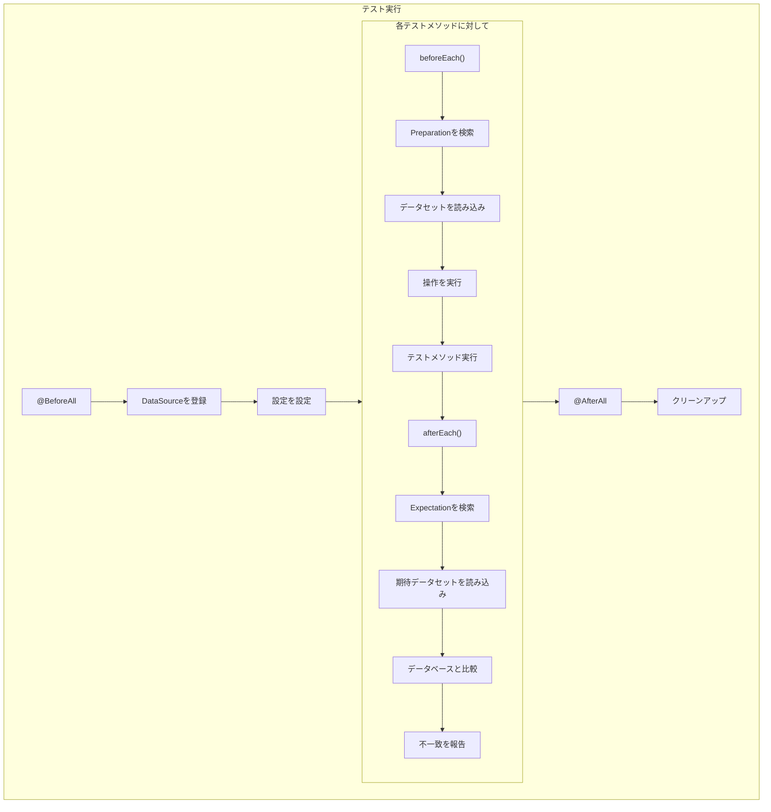
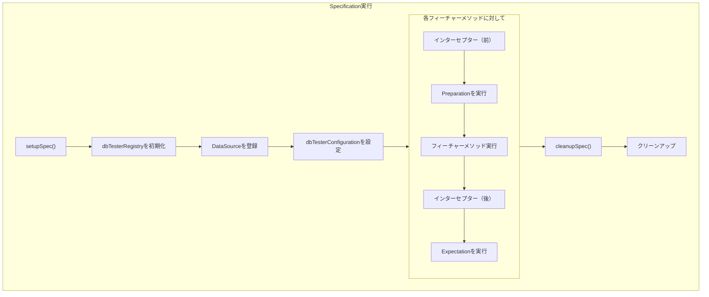
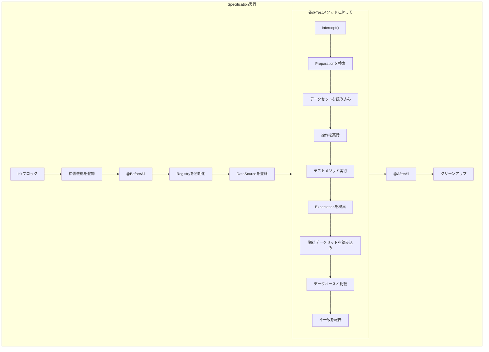

# DB Tester仕様 - テストフレームワーク統合

JUnit、Spock、およびKotestテストフレームワークとの統合について説明します。


## JUnit統合

### モジュール

`db-tester-junit`

### 拡張クラス

**パッケージ**: `io.github.seijikohara.dbtester.junit.jupiter.extension.DatabaseTestExtension`

**実装インターフェース**:
- `BeforeEachCallback` - 準備フェーズの実行
- `AfterEachCallback` - 期待フェーズの検証
- `ParameterResolver` - `ExtensionContext`のインジェクション

### 登録

```java
@ExtendWith(DatabaseTestExtension.class)
class UserRepositoryTest {
    // ...
}
```

### DataSource登録

`@BeforeAll`でデータソースを登録します:

```java
@ExtendWith(DatabaseTestExtension.class)
class UserRepositoryTest {

    @BeforeAll
    static void setup(ExtensionContext context) {
        var registry = DatabaseTestExtension.getRegistry(context);
        registry.registerDefault(dataSource);
    }

    @Test
    @Preparation
    @Expectation
    void testCreateUser() {
        // テスト実装
    }
}
```

### 設定のカスタマイズ

```java
@BeforeAll
static void setup(ExtensionContext context) {
    var registry = DatabaseTestExtension.getRegistry(context);
    registry.registerDefault(dataSource);

    var conventions = ConventionSettings.standard()
        .withDataFormat(DataFormat.TSV);
    var config = Configuration.withConventions(conventions);
    DatabaseTestExtension.setConfiguration(context, config);
}
```

### 静的メソッド

| メソッド | 説明 |
|----------|------|
| `getRegistry(ExtensionContext)` | DataSourceRegistryを返すか作成 |
| `setConfiguration(ExtensionContext, Configuration)` | カスタム設定を設定 |

### ネストされたテストクラス

拡張機能はネストされたテストクラス間で状態を共有します:

```java
@ExtendWith(DatabaseTestExtension.class)
class UserRepositoryTest {

    @BeforeAll
    static void setup(ExtensionContext context) {
        var registry = DatabaseTestExtension.getRegistry(context);
        registry.registerDefault(dataSource);
    }

    @Nested
    class CreateTests {
        @Test
        @Preparation
        @Expectation
        void testCreateUser() { }  // 親のレジストリを使用
    }

    @Nested
    class UpdateTests {
        @Test
        @Preparation
        @Expectation
        void testUpdateUser() { }  // 親のレジストリを使用
    }
}
```

### アノテーション優先順位

メソッドレベルのアノテーションがクラスレベルをオーバーライドします:

```java
@Preparation(operation = Operation.CLEAN_INSERT)  // クラスデフォルト
class UserRepositoryTest {

    @Test
    @Preparation(operation = Operation.INSERT)  // クラスをオーバーライド
    void testWithInsert() { }

    @Test
    @Preparation  // クラスデフォルトを使用
    void testWithDefault() { }
}
```


## Spock統合

### モジュール

`db-tester-spock`

### 拡張クラス

**パッケージ**: `io.github.seijikohara.dbtester.spock.extension.DatabaseTestExtension`

**タイプ**: アノテーション駆動型拡張（`IAnnotationDrivenExtension<DatabaseTest>`）

### 登録

拡張機能は、Specificationクラスに`@DatabaseTest`を追加することで有効化されます:

```groovy
@DatabaseTest
class UserRepositorySpec extends Specification {

    @Shared
    DataSourceRegistry dbTesterRegistry

    def setupSpec() {
        dbTesterRegistry = new DataSourceRegistry()
        dbTesterRegistry.registerDefault(dataSource)
    }

    @Preparation
    @Expectation
    def 'should create user'() {
        // テスト実装
    }
}
```

### 設定のカスタマイズ

`dbTesterConfiguration`という名前の`@Shared`フィールドを使用します:

```groovy
@DatabaseTest
class UserRepositorySpec extends Specification {

    @Shared
    DataSourceRegistry dbTesterRegistry

    @Shared
    Configuration dbTesterConfiguration

    def setupSpec() {
        dbTesterRegistry = new DataSourceRegistry()
        dbTesterRegistry.registerDefault(dataSource)

        def conventions = ConventionSettings.standard()
            .withDataFormat(DataFormat.TSV)
        dbTesterConfiguration = Configuration.withConventions(conventions)
    }

    @Preparation
    @Expectation
    def 'should create user'() { }
}
```

### 予約フィールド名

| フィールド名 | 型 | 目的 |
|--------------|-----|------|
| `dbTesterRegistry` | `DataSourceRegistry` | データソース登録 |
| `dbTesterConfiguration` | `Configuration` | カスタム設定 |

### フィーチャーメソッド命名

シナリオ名はフィーチャーメソッドから導出されます:

```groovy
@Preparation
def 'should create user with email'() {
    // シナリオ名: "should create user with email"
}
```

### データ駆動テスト

`where:`ブロックを使用したパラメータ化テストの場合、イテレーション名が使用されます:

```groovy
@Preparation
def 'should process #status order'() {
    expect:
    // テスト実装

    where:
    status << ['PENDING', 'COMPLETED']
}
```

シナリオ名: `"should process PENDING order"`, `"should process COMPLETED order"`


## Kotest統合

### モジュール

`db-tester-kotest`

### 拡張クラス

**パッケージ**: `io.github.seijikohara.dbtester.kotest.extension.DatabaseTestExtension`

**タイプ**: `TestCaseExtension` - 準備フェーズと期待フェーズのためにテストケース実行をインターセプトします。

### 登録

`init`ブロックで拡張機能を登録します。Kotest 6では`extensions()`メソッドがfinalになり、オーバーライドできません:

```kotlin
class UserRepositorySpec : AnnotationSpec() {

    private val registry = DataSourceRegistry()

    init {
        extensions(DatabaseTestExtension(registryProvider = { registry }))
    }

    @BeforeAll
    fun setupSpec() {
        registry.registerDefault(dataSource)
    }

    @Test
    @Preparation
    @Expectation
    fun `should create user`() {
        // テスト実装
    }
}
```

### DataSource登録

拡張機能は遅延バインドされたDataSource登録のために`registryProvider`ラムダを受け取ります:

```kotlin
class UserRepositorySpec : AnnotationSpec() {

    companion object {
        private var sharedRegistry: DataSourceRegistry? = null
        private var sharedDataSource: DataSource? = null

        private fun initializeSharedResources() {
            sharedDataSource = createDataSource()
            sharedRegistry = DataSourceRegistry().apply {
                registerDefault(sharedDataSource!!)
            }
        }

        fun getDbTesterRegistry(): DataSourceRegistry {
            if (sharedRegistry == null) {
                initializeSharedResources()
            }
            return sharedRegistry!!
        }
    }

    init {
        extensions(DatabaseTestExtension(registryProvider = { getDbTesterRegistry() }))
    }

    @BeforeAll
    fun setupSpec() {
        if (sharedDataSource == null) {
            initializeSharedResources()
        }
    }
}
```

### 設定のカスタマイズ

拡張機能にカスタム`Configuration`を渡します:

```kotlin
class UserRepositorySpec : AnnotationSpec() {

    init {
        val conventions = ConventionSettings.standard()
            .withDataFormat(DataFormat.TSV)
        val config = Configuration.withConventions(conventions)

        extensions(DatabaseTestExtension(
            registryProvider = { registry },
            configuration = config
        ))
    }
}
```

### テストメソッド命名

説明的なテスト名にはバッククォートメソッド名を使用します:

```kotlin
@Test
@Preparation
fun `should create user with email`() {
    // シナリオ名: "should create user with email"
}
```

### AnnotationSpec要件

DB TesterはKotest統合に`AnnotationSpec`スタイルを必要とします:
1. アノテーション（`@Preparation`、`@Expectation`）をテストメソッドに適用可能
2. リフレクションによるメソッド解決が信頼性が高い
3. Java開発者にとって馴染みのあるJUnit風の構造


## Spring Boot統合

### JUnit Spring Boot Starter

**モジュール**: `db-tester-junit-spring-boot-starter`

**拡張機能**: `SpringBootDatabaseTestExtension`

### 自動DataSource検出

Spring Boot拡張機能は自動的に以下を実行します:
1. Spring `ApplicationContext`を検出
2. `DataSource` Beanを検索
3. `DataSourceRegistry`に登録

```java
@SpringBootTest
@ExtendWith(SpringBootDatabaseTestExtension.class)
class UserRepositoryTest {

    @Test
    @Preparation
    @Expectation
    void testCreateUser() {
        // DataSourceはSpringコンテキストから自動登録
    }
}
```

### 複数DataSource

複数のデータソースには`@Qualifier`を使用します:

```java
@Configuration
class DataSourceConfig {

    @Bean
    @Primary
    DataSource primaryDataSource() { }

    @Bean
    @Qualifier("secondary")
    DataSource secondaryDataSource() { }
}
```

```java
@SpringBootTest
@ExtendWith(SpringBootDatabaseTestExtension.class)
class MultiDatabaseTest {

    @Test
    @Preparation(dataSets = {
        @DataSet(dataSourceName = ""),          // Primary（デフォルト）
        @DataSet(dataSourceName = "secondary")  // Secondary
    })
    void testMultipleDatabases() { }
}
```

### 設定プロパティ

`application.properties`または`application.yml`で設定します:

```properties
# DB Testerの有効化/無効化（デフォルト: true）
db-tester.enabled=true

# DataSource Beanの自動登録（デフォルト: true）
db-tester.auto-register-data-sources=true

# データフォーマット（CSVまたはTSV）
db-tester.convention.data-format=CSV

# 期待ディレクトリサフィックス
db-tester.convention.expectation-suffix=/expected

# シナリオマーカーカラム名
db-tester.convention.scenario-marker=[Scenario]

# テーブルマージ戦略（FIRST, LAST, UNION, UNION_ALL）
db-tester.convention.table-merge-strategy=UNION_ALL

# デフォルト準備操作
db-tester.operation.preparation=CLEAN_INSERT

# デフォルト期待操作（通常は検証のみのためNONE）
db-tester.operation.expectation=NONE
```

**注意**: プロパティ名は複数形ではなく単数形（`convention`, `operation`）を使用します。

### Spock Spring Boot Starter

**モジュール**: `db-tester-spock-spring-boot-starter`

**拡張機能**: `SpringBootDatabaseTestExtension`（Groovy）

**タイプ**: アノテーション駆動型拡張（`IAnnotationDrivenExtension<SpringBootDatabaseTest>`）

```groovy
@SpringBootTest
@SpringBootDatabaseTest
class UserRepositorySpec extends Specification {

    @Preparation
    @Expectation
    def 'should create user'() {
        // DataSourceはSpringコンテキストから自動登録
    }
}
```

### Kotest Spring Boot Starter

**モジュール**: `db-tester-kotest-spring-boot-starter`

**拡張機能**: `SpringBootDatabaseTestExtension`（Kotlin）

**タイプ**: 自動Spring ApplicationContext統合を持つ`TestCaseExtension`。

```kotlin
@SpringBootTest
class UserRepositorySpec : AnnotationSpec() {

    @Autowired
    private lateinit var userRepository: UserRepository

    init {
        extensions(SpringBootDatabaseTestExtension())
    }

    @Test
    @Preparation
    @Expectation
    fun `should create user`() {
        // DataSourceはSpringコンテキストから自動登録
    }
}
```

### 自動設定

自動設定クラス:

| モジュール | 自動設定クラス |
|------------|---------------|
| JUnit Starter | `DbTesterJUnitAutoConfiguration` |
| Spock Starter | `DbTesterSpockAutoConfiguration` |
| Kotest Starter | `DbTesterKotestAutoConfiguration` |


## ライフサイクルフック

### JUnitライフサイクル



### Spockライフサイクル



### Kotestライフサイクル



### ライフサイクル実行クラス

| フレームワーク | 準備 | 期待 |
|---------------|------|------|
| JUnit | `PreparationExecutor` | `ExpectationVerifier` |
| Spock | `SpockPreparationExecutor` | `SpockExpectationVerifier` |
| Kotest | `KotestPreparationExecutor` | `KotestExpectationVerifier` |

### エラーハンドリング

| フェーズ | エラー型 | 動作 |
|---------|----------|------|
| 準備 | `DatabaseOperationException` | 実行前にテスト失敗 |
| テスト | 任意の例外 | Expectationは引き続き実行 |
| 期待 | `ValidationException` | 比較詳細付きでテスト失敗 |


## 関連仕様

- [概要](01-overview) - フレームワークの目的と主要概念
- [パブリックAPI](03-public-api) - アノテーションの詳細
- [設定](04-configuration) - 設定オプション
- [SPI](08-spi) - サービスプロバイダーインターフェース拡張ポイント
- [エラーハンドリング](09-error-handling) - ライフサイクルエラーハンドリング
