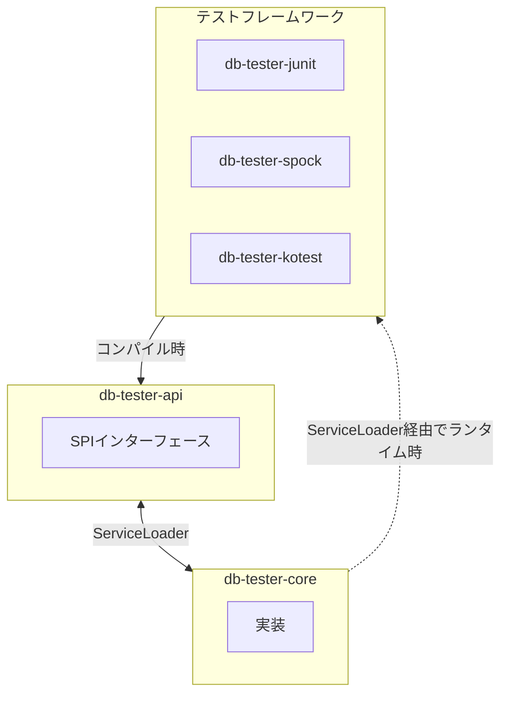

# DB Tester仕様 - サービスプロバイダーインターフェース（SPI）

DB TesterフレームワークのSPI拡張ポイントについて説明します。


## SPI概要

本フレームワークはモジュール間の疎結合のためにJava ServiceLoaderを使用します:



### 設計原則

1. **API独立性**: テストフレームワークモジュールは`db-tester-api`のみに依存
2. **ランタイム検出**: Core実装はServiceLoader経由で読み込み
3. **拡張性**: カスタム実装でデフォルトを置換可能


## APIモジュールSPI

### DataSetLoaderProvider

デフォルトの`DataSetLoader`実装を提供します。

**パッケージ**: `io.github.seijikohara.dbtester.api.spi.DataSetLoaderProvider`

**インターフェース**:

```java
public interface DataSetLoaderProvider {
    DataSetLoader getLoader();
}
```

**デフォルト実装**: `db-tester-core`の`DefaultDataSetLoaderProvider`

**使用方法**: ローダーを取得するために`Configuration.defaults()`から呼び出される


### OperationProvider

データセットに対するデータベース操作を実行します。

**パッケージ**: `io.github.seijikohara.dbtester.api.spi.OperationProvider`

**インターフェース**:

```java
public interface OperationProvider {
    void execute(
        Operation operation,
        DataSet dataSet,
        DataSource dataSource,
        TableOrderingStrategy tableOrderingStrategy);
}
```

**デフォルト実装**: `db-tester-core`の`DefaultOperationProvider`

**パラメータ**:

| パラメータ | 型 | 説明 |
|-----------|-----|------|
| `operation` | `Operation` | 実行するデータベース操作 |
| `dataSet` | `DataSet` | テーブルと行を含むデータセット |
| `dataSource` | `DataSource` | コネクション用のJDBCデータソース |
| `tableOrderingStrategy` | `TableOrderingStrategy` | テーブル処理順序の戦略 |

**操作**:
- `NONE` - 操作なし
- `INSERT` - 行を挿入
- `UPDATE` - 主キーで更新
- `DELETE` - 主キーで削除
- `DELETE_ALL` - 全行を削除
- `REFRESH` - Upsert（挿入または更新）
- `TRUNCATE_TABLE` - テーブルを切り捨て
- `CLEAN_INSERT` - 全削除後に挿入
- `TRUNCATE_INSERT` - 切り捨て後に挿入


### AssertionProvider

期待値検証のためのデータベースアサーションを実行します。

**パッケージ**: `io.github.seijikohara.dbtester.api.spi.AssertionProvider`

**インターフェース**:

```java
public interface AssertionProvider {
    // コア比較メソッド
    void assertEquals(DataSet expected, DataSet actual);
    void assertEquals(DataSet expected, DataSet actual, AssertionFailureHandler failureHandler);
    void assertEquals(Table expected, Table actual);
    void assertEquals(Table expected, Table actual, Collection<String> additionalColumnNames);
    void assertEquals(Table expected, Table actual, AssertionFailureHandler failureHandler);

    // カラム除外付き比較
    void assertEqualsIgnoreColumns(DataSet expected, DataSet actual, String tableName,
                                   Collection<String> ignoreColumnNames);
    void assertEqualsIgnoreColumns(Table expected, Table actual,
                                   Collection<String> ignoreColumnNames);

    // SQLクエリベース比較
    void assertEqualsByQuery(DataSet expected, DataSource dataSource, String sqlQuery,
                             String tableName, Collection<String> ignoreColumnNames);
    void assertEqualsByQuery(Table expected, DataSource dataSource, String tableName,
                             String sqlQuery, Collection<String> ignoreColumnNames);
}
```

**デフォルト実装**: `db-tester-core`の`DefaultAssertionProvider`

**主要メソッド**:

| メソッド | 説明 |
|----------|------|
| `assertEquals(DataSet, DataSet)` | 2つのデータセットを比較 |
| `assertEquals(Table, Table)` | 2つのテーブルを比較 |
| `assertEqualsIgnoreColumns(...)` | 特定カラムを無視して比較 |
| `assertEqualsByQuery(...)` | クエリ結果を期待データと比較 |

**動作**:
1. 期待値と実際のデータセット/テーブルを比較
2. カラムごとに比較戦略を適用（STRICT、IGNORE、NUMERICなど）
3. すべての差異を収集（フェイルファストではない）
4. 不一致時は人間が読みやすい要約 + YAML詳細を出力

出力形式の詳細については[エラーハンドリング - 検証エラー](09-error-handling#検証エラー)を参照してください。


### ExpectationProvider

期待データセットに対するデータベース状態を検証します。

**パッケージ**: `io.github.seijikohara.dbtester.api.spi.ExpectationProvider`

**インターフェース**:

```java
public interface ExpectationProvider {
    void verifyExpectation(DataSet expectedDataSet, DataSource dataSource);
}
```

**デフォルト実装**: `db-tester-core`の`DefaultExpectationProvider`

**パラメータ**:

| パラメータ | 型 | 説明 |
|-----------|-----|------|
| `expectedDataSet` | `DataSet` | 期待テーブルデータを含む期待データセット |
| `dataSource` | `DataSource` | 実際のデータを取得するためのデータベースコネクションソース |

**プロセス**:
1. 期待データセット内の各テーブルに対して、データベースから実際のデータを取得
2. 実際のデータを期待テーブルに存在するカラムのみにフィルタリング
3. フィルタリングされた実際のデータを期待データと比較
4. 検証失敗時は`AssertionError`をスロー


### ScenarioNameResolver

テストメソッドコンテキストからシナリオ名を解決します。

**パッケージ**: `io.github.seijikohara.dbtester.api.scenario.ScenarioNameResolver`

**インターフェース**:

```java
public interface ScenarioNameResolver {
    int DEFAULT_PRIORITY = 0;

    ScenarioName resolve(Method testMethod);

    default boolean canResolve(Method testMethod) {
        return true;
    }

    default int priority() {
        return DEFAULT_PRIORITY;
    }
}
```

**メソッド**:

| メソッド | 戻り値型 | デフォルト | 説明 |
|----------|---------|----------|------|
| `resolve(Method)` | `ScenarioName` | - | テストメソッドからシナリオ名を解決 |
| `canResolve(Method)` | `boolean` | `true` | リゾルバがメソッドを処理できるかを返す |
| `priority()` | `int` | `0` | リゾルバ選択の優先度を返す（大きいほど優先） |

**実装**:

| 実装 | モジュール | 説明 |
|------|----------|------|
| `JUnitScenarioNameResolver` | `db-tester-junit` | JUnitメソッド名から解決 |
| `SpockScenarioNameResolver` | `db-tester-spock` | Spockフィーチャー名から解決 |
| `KotestScenarioNameResolver` | `db-tester-kotest` | Kotestテストケース名から解決 |

**解決ロジック**:
1. 登録されたすべてのリゾルバを`priority()`で降順ソート
2. 各リゾルバに`canResolve()`を問い合わせ
3. `true`を返す最初のリゾルバを使用
4. `resolve()`を呼び出してシナリオ名を取得


## CoreモジュールSPI

### FormatProvider

特定形式のデータセットファイルを解析します。

**パッケージ**: `io.github.seijikohara.dbtester.internal.format.spi.FormatProvider`

**インターフェース**:

```java
public interface FormatProvider {
    FileExtension supportedFileExtension();
    DataSet parse(Path directory);
}
```

**メソッド**:

| メソッド | 戻り値型 | 説明 |
|----------|---------|------|
| `supportedFileExtension()` | `FileExtension` | 先頭ドットなしのファイル拡張子を返す（例: "csv"） |
| `parse(Path)` | `DataSet` | ディレクトリ内のすべてのファイルをDataSetに解析 |

**実装**:

| 実装 | 拡張子 | 区切り文字 |
|------|--------|----------|
| `CsvFormatProvider` | `.csv` | カンマ |
| `TsvFormatProvider` | `.tsv` | タブ |

**注意**: FormatProviderは外部実装を意図していない内部SPIです。


## ServiceLoader登録

### META-INF/servicesファイル

**db-tester-core**:

```
# META-INF/services/io.github.seijikohara.dbtester.api.spi.DataSetLoaderProvider
io.github.seijikohara.dbtester.internal.loader.DefaultDataSetLoaderProvider

# META-INF/services/io.github.seijikohara.dbtester.api.spi.OperationProvider
io.github.seijikohara.dbtester.internal.spi.DefaultOperationProvider

# META-INF/services/io.github.seijikohara.dbtester.api.spi.AssertionProvider
io.github.seijikohara.dbtester.internal.spi.DefaultAssertionProvider

# META-INF/services/io.github.seijikohara.dbtester.api.spi.ExpectationProvider
io.github.seijikohara.dbtester.internal.spi.DefaultExpectationProvider

# META-INF/services/io.github.seijikohara.dbtester.internal.format.spi.FormatProvider
io.github.seijikohara.dbtester.internal.format.csv.CsvFormatProvider
io.github.seijikohara.dbtester.internal.format.tsv.TsvFormatProvider
```

**db-tester-junit**:

```
# META-INF/services/io.github.seijikohara.dbtester.api.scenario.ScenarioNameResolver
io.github.seijikohara.dbtester.junit.jupiter.spi.JUnitScenarioNameResolver
```

**db-tester-spock**:

```
# META-INF/services/io.github.seijikohara.dbtester.api.scenario.ScenarioNameResolver
io.github.seijikohara.dbtester.spock.spi.SpockScenarioNameResolver
```

**db-tester-kotest**:

```
# META-INF/services/io.github.seijikohara.dbtester.api.scenario.ScenarioNameResolver
io.github.seijikohara.dbtester.kotest.spi.KotestScenarioNameResolver
```

### JPMSモジュール宣言

**db-tester-api module-info.java**:

```java
module io.github.seijikohara.dbtester.api {
    uses io.github.seijikohara.dbtester.api.spi.DataSetLoaderProvider;
    uses io.github.seijikohara.dbtester.api.spi.OperationProvider;
    uses io.github.seijikohara.dbtester.api.spi.AssertionProvider;
    uses io.github.seijikohara.dbtester.api.spi.ExpectationProvider;
    uses io.github.seijikohara.dbtester.api.scenario.ScenarioNameResolver;
}
```

**db-tester-core module-info.java**:

```java
module io.github.seijikohara.dbtester.core {
    provides io.github.seijikohara.dbtester.api.spi.DataSetLoaderProvider
        with io.github.seijikohara.dbtester.internal.loader.DefaultDataSetLoaderProvider;
    provides io.github.seijikohara.dbtester.api.spi.OperationProvider
        with io.github.seijikohara.dbtester.internal.spi.DefaultOperationProvider;
    // ... 他のプロバイダー
}
```


## カスタム実装

### カスタムDataSetLoader

カスタムデータセットローダーを提供するには:

1. `DataSetLoader`インターフェースを実装:

```java
public class CustomDataSetLoader implements DataSetLoader {
    @Override
    public List<DataSet> loadPreparationDataSets(TestContext context) {
        // カスタム読み込みロジック
    }

    @Override
    public List<DataSet> loadExpectationDataSets(TestContext context) {
        // カスタム読み込みロジック
    }
}
```

2. `Configuration`経由で登録:

```java
var config = Configuration.withLoader(new CustomDataSetLoader());
DatabaseTestExtension.setConfiguration(context, config);
```

### カスタムScenarioNameResolver

カスタムシナリオリゾルバを提供するには:

1. `ScenarioNameResolver`を実装:

```java
public class CustomScenarioNameResolver implements ScenarioNameResolver {
    private static final int HIGH_PRIORITY = 100;

    @Override
    public ScenarioName resolve(Method testMethod) {
        // メソッドからシナリオ名を抽出
    }

    @Override
    public boolean canResolve(Method testMethod) {
        // サポートされるメソッドに対してtrueを返す
    }

    @Override
    public int priority() {
        return HIGH_PRIORITY;  // デフォルトリゾルバより高い優先度
    }
}
```

2. ServiceLoader経由で登録:

```
# META-INF/services/io.github.seijikohara.dbtester.api.scenario.ScenarioNameResolver
com.example.CustomScenarioNameResolver
```

### カスタムFormatProvider

追加のファイル形式をサポートするには（内部SPI）:

1. `FormatProvider`を実装:

```java
public class XmlFormatProvider implements FormatProvider {
    @Override
    public boolean canHandle(String fileExtension) {
        return ".xml".equals(fileExtension);
    }

    @Override
    public DataSet parseDataSet(Path filePath, ConventionSettings conventions) {
        // XMLファイルを解析
    }
}
```

2. ServiceLoader経由で登録:

```
# META-INF/services/io.github.seijikohara.dbtester.internal.format.spi.FormatProvider
com.example.XmlFormatProvider
```

### プロバイダー優先順位

複数のプロバイダーが登録されている場合:

| SPI | 選択方法 |
|-----|----------|
| `DataSetLoaderProvider` | 最初に見つかったもの |
| `OperationProvider` | 最初に見つかったもの |
| `AssertionProvider` | 最初に見つかったもの |
| `ExpectationProvider` | 最初に見つかったもの |
| `ScenarioNameResolver` | `priority()`でソート、`canResolve()`がtrueを返す最初のもの |
| `FormatProvider` | `canHandle()`がtrueを返す最初のもの |


## 関連仕様

- [アーキテクチャ](02-architecture) - モジュール構造
- [設定](04-configuration) - 設定クラス
- [テストフレームワーク](07-test-frameworks) - フレームワーク統合
