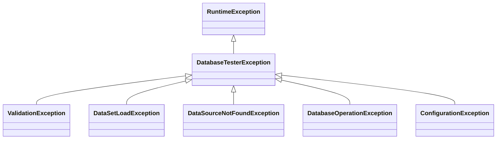

# DB Tester仕様 - エラーハンドリング

## 例外階層

フレームワーク例外はすべて`DatabaseTesterException`を継承します。



**パッケージ**: `io.github.seijikohara.dbtester.api.exception`

| 例外 | 原因 |
|------|------|
| `java.lang.AssertionError` | 期待値と実際のデータの不一致（行数またはカラム値） |
| `ValidationException` | 検証を完了できなかった（STRICTモードでのパース/戦略失敗） |
| `DataSetLoadException` | データセットファイルの読み込み/解析失敗 |
| `DataSourceNotFoundException` | DataSourceが登録されていない |
| `DatabaseOperationException` | SQL実行失敗 |
| `ConfigurationException` | フレームワーク初期化失敗 |


## 検証エラー

期待値検証でデータの不一致が見つかると、フレームワークは`java.lang.AssertionError`をスローします（`@ExpectedDataSet`フェーズ）。リトライを設定している場合は、この不一致に対して再試行します。`ValidationException`は、`ComparisonMode.STRICT`下でパースできない値など、検証自体を完了できない失敗のために予約されており、再試行されません。

### 出力形式

フレームワークは**すべての差異**を収集し、人間が読みやすい要約とYAML詳細を報告します。

```
Assertion failed: 3 differences in USERS, ORDERS
summary:
  status: FAILED
  total_differences: 3
tables:
  USERS:
    differences:
      - path: row_count
        expected: 3
        actual: 2
  ORDERS:
    differences:
      - path: "row[0].STATUS"
        expected: COMPLETED
        actual: PENDING
      - path: "row[1].AMOUNT"
        expected: 100.00
        actual: 99.99
```

出力は（最初の要約行の後）**有効なYAML**です。標準YAMLライブラリでCI/CD統合用に解析できます。

### 出力構造

| フィールド | 説明 |
|------------|------|
| `summary.status` | 差異が存在する場合は`FAILED` |
| `summary.total_differences` | すべての差異の合計数 |
| `tables.<name>.differences` | 各テーブルの差異リスト |
| `path` | 場所: `table_count`、`row_count`、または`row[N].COLUMN` |
| `expected` / `actual` | 期待値と実際の値 |

### 差異の種類

| パス | 説明 |
|------|------|
| `table_count` | 期待テーブル数と実際のテーブル数が異なる |
| `table` | 期待テーブルが存在しない（`expected: exists`、`actual: not found`） |
| `row_count` | テーブルの行数が異なる |
| `row[N].COLUMN` | 行インデックスNのセル値が異なる |

### 値比較ルール

コンパレータは不一致を報告する前に以下のルールを適用します。

| ルール | 説明 |
|--------|------|
| NULL処理 | 両方がNULL = 一致、片方がNULL = 不一致 |
| 数値比較 | 文字列"123"はInteger 123と一致 |
| 浮動小数点 | イプシロン比較（精度1e-6） |
| ブール値 | "1"/"0"/"true"/"false"/"yes"/"no"/"y"/"n"をサポート |
| タイムスタンプ精度 | "2024-01-01 10:00:00"は"2024-01-01 10:00:00.0"と一致 |
| CLOB | 文字列として比較 |


## データセット読み込みエラー

データセットファイルの読み込みまたは解析に失敗すると、フレームワークは`DataSetLoadException`をスローします。

### ディレクトリが見つからない（クラスパス）

データセットディレクトリがクラスパス上に存在しない場合。

```
Dataset directory not found on classpath: 'com/example/UserRepositoryTest'
Expected location: src/test/resources/com/example/UserRepositoryTest
Hint: Create the directory and add dataset files...
```

### ディレクトリが見つからない（ファイルシステム）

データセットディレクトリがファイルシステム上に存在しない場合。

```
Dataset directory does not exist: '/path/to/datasets'
Hint: Create the directory and add dataset files...
```

### パスがディレクトリではない

パスは存在するがファイルの場合。

```
Path exists but is not a directory: '/path/to/file.csv'
Hint: Ensure the path points to a directory, not a file.
```

### サポートされるファイルがない

ディレクトリは存在するがサポートされるデータファイルがない場合。

```
Dataset directory exists but contains no supported data files: '/path/to/datasets'
Supported file extensions: [.csv, .tsv, .json, .yaml]
Hint: Add at least one data file (for example, TABLE_NAME.csv)...
Found files: [README.txt, notes.md]
```

`Found files`行はディレクトリ内の全ファイルを列挙し、問題の診断に役立ちます。ディレクトリが空の場合、この行は省略されます。

### テーブル名の競合（AUTOフォーマット）

`DataFormat.AUTO`が同一テーブル名を複数のファイル形式で検出した場合。

```
Table name conflict detected in AUTO format mode.
The following table names are defined in multiple files with different formats:

  Table 'USERS':
    - USERS.csv
    - USERS.yaml

Each table name must be unique across all file formats in a directory.
To resolve, remove duplicate files or specify a concrete format:
  DataFormat.CSV, DataFormat.TSV, DataFormat.JSON, or DataFormat.YAML
```

**解決策**: 重複ファイルを削除してテーブル名ごとに1つの形式にするか、`ConventionSettings`で`DataFormat`を明示指定してください。

### 空のファイル

データファイルが空の場合。

```
File is empty: /path/to/USERS.csv
```

### 解析失敗

ファイル解析が失敗した場合。

```
Failed to parse file: /path/to/USERS.csv
```

### 読み込み順序ファイルエラー

`load-order.txt`ファイルの読み取りまたは書き込みに失敗した場合。

```
Failed to read load order file: /path/to/load-order.txt
```

```
Failed to write load order file: /path/to/load-order.txt
```

読み込み順序ファイルの形式と使用方法の詳細については、[データフォーマット - 読み込み順序](data-formats#読み込み順序)を参照してください。


## DataSourceエラー

DataSourceの検索に失敗すると、フレームワークは`DataSourceNotFoundException`をスローします。

### デフォルトDataSourceが登録されていない

デフォルトDataSourceが登録されていない場合。

```
No default data source registered
```

**解決策**: `@BeforeAll`または`setupSpec()`でデフォルトDataSourceを登録します。

```java
registry.registerDefault(dataSource);
```

### 名前付きDataSourceが見つからない

名前付きDataSourceが登録されていない場合。

```
No data source registered for name: secondary_db
```

**解決策**: 名前付きDataSourceを登録します。

```java
registry.register("secondary_db", dataSource);
```


## データベース操作エラー

準備フェーズ中にSQL操作が失敗すると、フレームワークは`DatabaseOperationException`をスローします。

### ラップされたSQL例外

`DatabaseOperationException`は`SQLException`をラップします。

```
DatabaseOperationException: Failed to execute INSERT on table USERS
Caused by: SQLException: Duplicate entry '1' for key 'PRIMARY'
```

### 無効なSQL識別子

テーブル名またはカラム名に無効な文字が含まれている場合。

```
DatabaseOperationException: Invalid SQL identifier: 'user-accounts'.
Identifiers must start with a letter or underscore and contain only letters, digits, and underscores.
```

**一般的な原因**:

| 原因 | 例 | 解決策 |
|------|-----|--------|
| 名前にハイフン | `user-accounts.csv` | `user_accounts.csv`にリネーム |
| 名前にスペース | `user accounts.csv` | `user_accounts.csv`にリネーム |
| 数字で始まる | `123_table.csv` | `table_123.csv`にリネーム |
| 特殊文字 | `users$.csv` | 特殊文字を削除 |

### 一般的な原因

| エラー | 原因 | 解決策 |
|--------|------|--------|
| 重複キー | 既存の主キーでINSERT | CLEAN_INSERTまたはUPSERTを使用 |
| 外部キー違反 | 親より先に子をINSERT | テーブル順序を確認 |
| カラムが見つからない | CSVカラム名のタイプミス | カラム名がスキーマと一致することを確認 |
| データ切り詰め | 値がカラムサイズを超過 | データがカラム定義に収まることを確認 |
| 無効な識別子 | テーブル/カラム名に無効な文字 | 英字、数字、アンダースコアのみを使用 |


## 設定エラー

初期化中に設定値が不正だと、フレームワークは`ConfigurationException`をスローします。

### 無効な設定

設定値が無効な場合。

```
ConfigurationException: Invalid data format: XML
```

### 必須設定が欠落

必須設定が欠落している場合。

```
ConfigurationException: Convention settings cannot be null
```


## テスト出力でのエラーコンテキスト

### JUnitエラー出力

```
org.example.UserRepositoryTest > shouldCreateUser FAILED
    java.lang.AssertionError:
        Assertion failed: 1 difference in USERS
        summary:
          status: FAILED
          total_differences: 1
        tables:
          USERS:
            differences:
              - path: "row[0].EMAIL"
                expected: john@example.com
                actual: jane@example.com

        at io.github.seijikohara.dbtester.internal.assertion.DataSetComparator.assertEquals(DataSetComparator.java:85)
        at io.github.seijikohara.dbtester.junit.jupiter.lifecycle.ExpectationVerifier.verify(ExpectationVerifier.java:42)
```

### Spockエラー出力

```
example.UserRepositorySpec > should create user FAILED
    java.lang.AssertionError:
        Assertion failed: 1 difference in USERS
        summary:
          status: FAILED
          total_differences: 1
        tables:
          USERS:
            differences:
              - path: row_count
                expected: 2
                actual: 1

Condition not satisfied:
    Expectation verification failed
```

### テストメソッドコンテキスト

フレームワークはエラーにテストメソッド名をコンテキストとして含めます。

```
Failed to verify expectation dataset for testUserCreation
```


## デバッグのヒント

| 症状 | 確認事項 |
|------|----------|
| テーブルが見つからない | CSVファイル名がテーブル名と一致することを確認（大文字小文字を区別） |
| 行数の不一致 | `[Scenario]`カラムのフィルタリングを確認 |
| 値の不一致 | 期待CSVを実際のデータベース状態と比較 |
| ディレクトリが見つからない | パスが`{package}/{TestClassName}/`規約と一致することを確認 |
| DataSourceが見つからない | `@BeforeAll`または`setupSpec()`での登録を確認 |

### ロギング

詳細な操作出力のためにDEBUGロギングを有効化します。

```properties
logging.level.io.github.seijikohara.dbtester=DEBUG
```


## 関連仕様

- [概要](overview) - フレームワークの目的と主要概念
- [パブリックAPI](public-api) - 例外クラス
- [データベース操作](database-operations) - 操作失敗
- [テストフレームワーク](test-frameworks) - テストライフサイクルとエラーハンドリング
