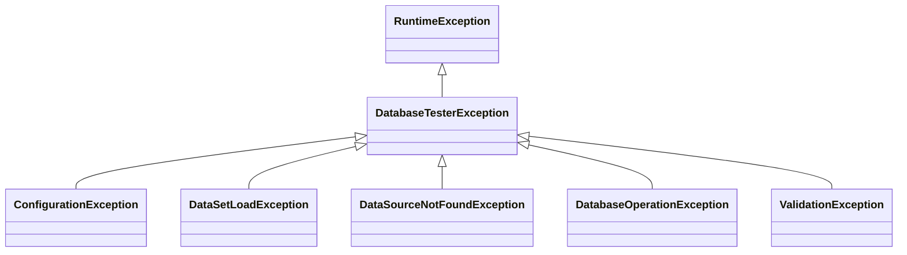

# 例外

## 例外階層

すべての例外は`DatabaseTesterException`を継承します。

## DatabaseTesterException

すべてのフレームワークエラーのsealed基底例外です。カスタムサブクラスの追加はできません。

**パッケージ**: `io.github.seijikohara.dbtester.api.exception.DatabaseTesterException`

**コンストラクタ**:

| コンストラクタ | 説明 |
|----------------|------|
| `DatabaseTesterException(String)` | メッセージのみ |
| `DatabaseTesterException(String, Throwable)` | メッセージと原因 |
| `DatabaseTesterException(Throwable)` | 原因のみ |

## ConfigurationException

無効なフレームワーク設定を示します。

**一般的な原因**:

- 必須の設定値が欠落
- 無効なファイルパス
- 互換性のない設定の組み合わせ

## DataSetLoadException

データセットファイルの読み込み失敗を示します。

**一般的な原因**:

- ファイルが見つからない
- 無効なファイル形式
- CSV、TSV、JSON、またはYAMLコンテンツのパースエラー
- `AUTO`形式モードでのテーブル名衝突（同じテーブル名が複数のファイル形式に存在）

## DataSourceNotFoundException

要求されたDataSourceが登録されていないことを示します。

**一般的な原因**:

- 名前付きDataSourceが`DataSourceRegistry`に登録されていない
- 必要な場合にデフォルトDataSourceが設定されていない

## DatabaseOperationException

データベース操作の失敗を示します。

**一般的な原因**:

- SQL実行エラー
- 制約違反
- 接続失敗

## ValidationException

アサーションまたは検証の失敗を示します。

**一般的な原因**:

- 期待値と実際のデータの不一致
- 行数の差異
- カラム値の不一致

**出力形式**: 検証エラーは人間が読みやすい要約に続いてYAML詳細を出力します。形式の詳細は[エラーハンドリング - 検証エラー](error-handling#検証エラー)を参照してください。

## デフォルト値リファレンス

設定可能な属性のデフォルト値を一覧にします。

### アノテーション属性のデフォルト値

| アノテーション | 属性 | デフォルト | 意味 |
|---------------|------|-----------|------|
| `@DataSet` | `sources` | `{}` | 規約ベースの検出 |
| `@DataSet` | `operation` | `CLEAN_INSERT` | 全行削除後に挿入 |
| `@DataSet` | `tableOrdering` | `AUTO` | 自動順序決定 |
| `@DataSet` | `batchSize` | `-1` | グローバル設定を使用 |
| `@ExpectedDataSet` | `sources` | `{}` | 規約ベースの検出 |
| `@ExpectedDataSet` | `tableOrdering` | `AUTO` | 自動順序決定 |
| `@ExpectedDataSet` | `rowOrdering` | `UNSET` | グローバル`VerificationSettings.rowOrdering()`に委譲 |
| `@ExpectedDataSet` | `retryCount` | `-1` | グローバル設定を使用 |
| `@ExpectedDataSet` | `retryDelayMillis` | `-1` | グローバル設定を使用 |
| `@DataSetSource` | `resourceLocation` | `""` | 規約ベースの検出 |
| `@DataSetSource` | `dataSourceName` | `""` | デフォルトDataSource |
| `@DataSetSource` | `scenarioNames` | `{}` | テストメソッド名を使用 |
| `@DataSetSource` | `excludeColumns` | `{}` | 除外なし |
| `@DataSetSource` | `columnStrategies` | `{}` | 全カラムにデフォルトSTRICT |
| `@ColumnStrategy` | `strategy` | `STRICT` | 完全一致 |
| `@ColumnStrategy` | `pattern` | `""` | パターンなし |
| `@ColumnStrategy` | `options` | `""` | オプションなし |

**マジックバリュー: `-1`**

デフォルト値`-1`の属性は、`OperationDefaults`のグローバル設定に委譲します。テストスイート全体で一貫したデフォルト値を維持しつつ、テスト単位でオーバーライドできます。`0`以上の値を指定すると、その値を直接使用します。

## カラム比較の優先順位

期待データベース状態の検証時、カラム比較は以下の優先順位で適用されます。

1. **`excludeColumns`**: `excludeColumns`に記載されたカラムは完全にスキップされます。比較は行われません。
2. **`columnStrategies`**: `@ColumnStrategy`アノテーションが設定されたカラムは指定された戦略を使用します。
3. **`STRICT`（デフォルト）**: 残りのすべてのカラムは完全一致比較を使用します。

アノテーションレベルの`columnStrategies`は`VerificationSettings`のグローバル戦略をオーバーライドします。`VerificationSettings`のグローバル除外はデータセットごとの`excludeColumns`と結合されます。

## 関連仕様

- [API概要](public-api) - APIレイヤーとモジュール構成
- [アノテーション](annotations) - @DataSet、@ExpectedDataSet、@ColumnStrategy
- [エラーハンドリング](error-handling) - エラーメッセージとトラブルシューティング
- [設定](configuration) - 設定クラス
