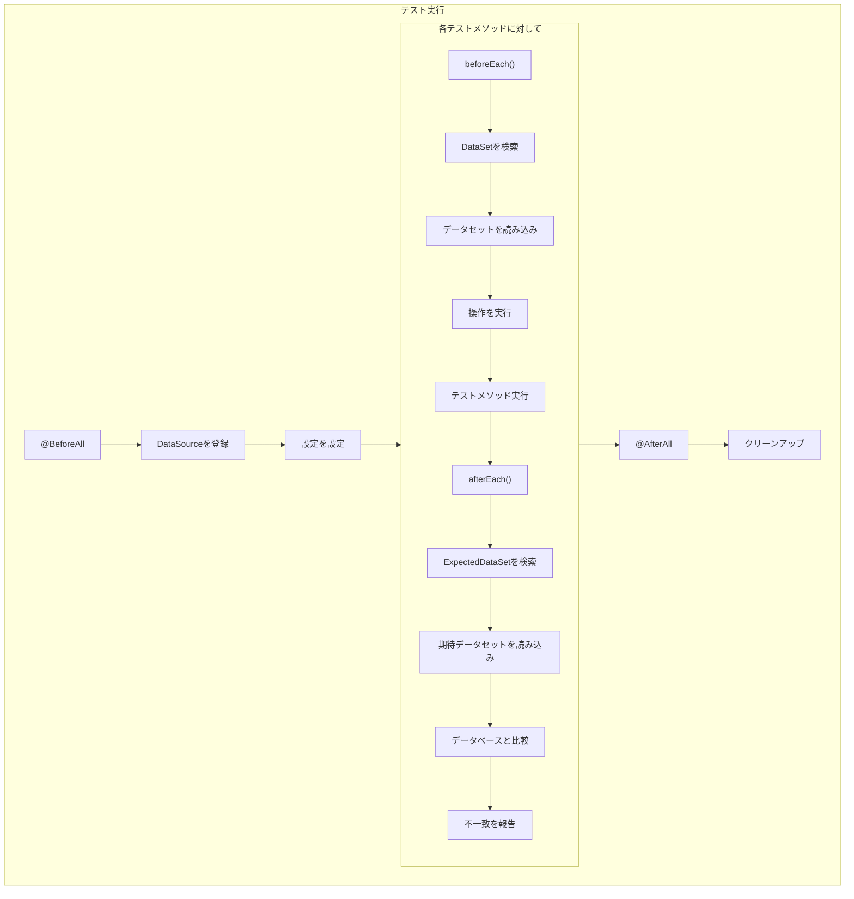
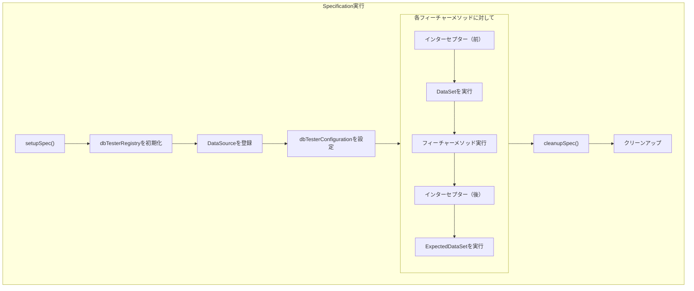
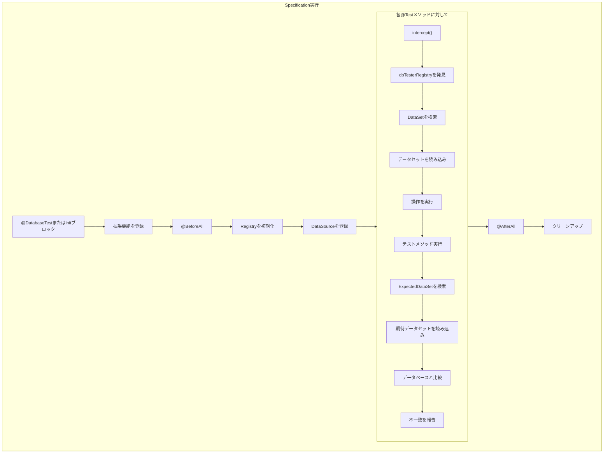

# ライフサイクルフック

## JUnitライフサイクル

## Spockライフサイクル

## Kotestライフサイクル

## ライフサイクル実行クラス

| フレームワーク | 準備 | 期待 |
|---------------|------|------|
| JUnit | `PreparationExecutor` | `ExpectationVerifier` |
| Spock | `SpockPreparationExecutor` | `SpockExpectationVerifier` |
| Kotest | `KotestPreparationExecutor` | `KotestExpectationVerifier` |

## エラーハンドリング

| フェーズ | エラー型 | 動作 |
|---------|----------|------|
| 準備 | `DatabaseOperationException` | 実行前にテスト失敗 |
| テスト | 任意の例外 | ExpectedDataSetはスキップされる |
| 期待 | `ValidationException` | 比較詳細付きでテスト失敗 |

## 関連仕様

- [テストフレームワーク概要](test-frameworks) - サポートフレームワーク一覧
- [JUnit](junit) - JUnit統合
- [Spock](spock) - Spock統合
- [Kotest](kotest) - Kotest統合
- [Spring Boot](spring-boot) - Spring Boot自動設定
- [エラーハンドリング](error-handling) - エラーハンドリングの詳細
