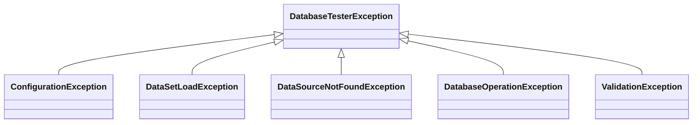

# DB Tester仕様 - パブリックAPI

## アノテーション

### @DataSet

テストメソッド実行前に適用するデータセットを宣言します。

**パッケージ**: `io.github.seijikohara.dbtester.api.annotation.DataSet`

**ターゲット**: `METHOD`, `TYPE`

**属性**:

| 属性 | 型 | デフォルト | 説明 |
|------|-----|-----------|------|
| `sources` | `DataSetSource[]` | `{}` | 実行するデータセット。空の場合は規約ベースの検出を使用 |
| `operation` | `Operation` | `CLEAN_INSERT` | 適用するデータベース操作 |
| `tableOrdering` | `TableOrderingStrategy` | `AUTO` | テーブル処理順序を決定する戦略 |
| `batchSize` | `int` | `-1` | INSERT操作のバッチあたりの行数。`-1`はグローバル設定を使用、`0`は単一バッチ |

**アノテーションの継承**:

- クラスレベルのアノテーションはサブクラスに継承されます
- メソッドレベルのアノテーションはクラスレベルの宣言をオーバーライドします
- `@Inherited`で注釈されています

**例**:

```java
@DataSet
void testMethod() { }

@DataSet(operation = Operation.INSERT)
void testWithInsertOnly() { }

@DataSet(tableOrdering = TableOrderingStrategy.FOREIGN_KEY)
void testWithForeignKeyOrdering() { }

@DataSet(sources = @DataSetSource(resourceLocation = "custom/path"))
void testWithCustomPath() { }
```


### @ExpectedDataSet

テスト実行後の期待されるデータベース状態を定義するデータセットを宣言します。

**パッケージ**: `io.github.seijikohara.dbtester.api.annotation.ExpectedDataSet`

**ターゲット**: `METHOD`, `TYPE`

**属性**:

| 属性 | 型 | デフォルト | 説明 |
|------|-----|-----------|------|
| `sources` | `DataSetSource[]` | `{}` | 検証用データセット。空の場合は規約ベースの検出を使用 |
| `tableOrdering` | `TableOrderingStrategy` | `AUTO` | 検証時のテーブル処理順序を決定する戦略 |
| `rowOrdering` | `RowOrdering` | `ORDERED` | 行比較戦略（位置ベースまたはセットベース） |
| `retryCount` | `int` | `-1` | 検証のリトライ回数。`-1`はグローバル設定を使用 |
| `retryDelayMillis` | `long` | `-1` | リトライ間隔（ミリ秒）。`-1`はグローバル設定を使用 |

**検証の動作**:

- 読み取り専用の比較（データ変更なし）
- 実際のデータベース状態を期待データセットと照合して検証
- アサーション失敗はテストフレームワーク経由で報告

**例**:

```java
@DataSet
@ExpectedDataSet
void testWithVerification() { }

@ExpectedDataSet(sources = @DataSetSource(resourceLocation = "expected/custom"))
void testWithCustomExpectation() { }

@ExpectedDataSet(tableOrdering = TableOrderingStrategy.ALPHABETICAL)
void testWithAlphabeticalOrdering() { }

@ExpectedDataSet(rowOrdering = RowOrdering.UNORDERED)
void testWithUnorderedComparison() { }

@ExpectedDataSet(retryCount = 3, retryDelayMillis = 500)
void testWithRetry() { }
```


### @DataSetSource

`@DataSet`または`@ExpectedDataSet`内で個々のデータセットパラメータを設定します。

**パッケージ**: `io.github.seijikohara.dbtester.api.annotation.DataSetSource`

**ターゲット**: なし (`@Target({})`) - このアノテーションはクラスやメソッドに直接適用できません。`@DataSet#sources()`と`@ExpectedDataSet#sources()`配列内でのみ使用されます。直接適用しようとするとコンパイルエラーになります。

**属性**:

| 属性 | 型 | デフォルト | 説明 |
|------|-----|-----------|------|
| `resourceLocation` | `String` | `""` | データセットディレクトリパス。空の場合は規約ベースの検出を使用 |
| `dataSourceName` | `String` | `""` | 名前付きDataSource識別子。空の場合はデフォルトを使用 |
| `scenarioNames` | `String[]` | `{}` | シナリオフィルタ。空の場合はテストメソッド名を使用 |
| `excludeColumns` | `String[]` | `{}` | 検証から除外するカラム名（大文字小文字を区別しない）。`@ExpectedDataSet`でのみ有効 |
| `columnStrategies` | `ColumnStrategy[]` | `{}` | カラムごとの比較戦略。`@ExpectedDataSet`でのみ有効 |

**リソースロケーション形式**:

| 形式 | 例 | 解決方法 |
|------|-----|----------|
| クラスパス相対 | `data/users` | テストクラスパスルートから |
| クラスパスプレフィックス | `classpath:data/users` | 明示的なクラスパス解決 |
| 絶対パス | `/tmp/testdata` | ファイルシステム絶対パス |
| 空文字列 | `""` | 規約ベースの検出 |

**例**:

```java
@DataSet(sources = {
    @DataSetSource(dataSourceName = "primary"),
    @DataSetSource(dataSourceName = "secondary", resourceLocation = "secondary-data")
})
void testMultipleDataSources() { }

@DataSet(sources = @DataSetSource(scenarioNames = {"scenario1", "scenario2"}))
void testMultipleScenarios() { }

@ExpectedDataSet(sources = @DataSetSource(
    excludeColumns = {"CREATED_AT", "UPDATED_AT", "VERSION"}
))
void testWithExcludedColumns() { }

@ExpectedDataSet(sources = @DataSetSource(
    columnStrategies = {
        @ColumnStrategy(name = "EMAIL", strategy = Strategy.CASE_INSENSITIVE),
        @ColumnStrategy(name = "CREATED_AT", strategy = Strategy.IGNORE),
        @ColumnStrategy(name = "ID", strategy = Strategy.REGEX, pattern = "[a-f0-9-]{36}")
    }
))
void testWithColumnStrategies() { }
```

**カラム除外の動作**:

- カラム名は比較のために大文字に正規化されます
- データセットごとの除外は`ConventionSettings`のグローバル除外と結合されます
- 除外は`@ExpectedDataSet`の検証にのみ適用され、`@DataSet`の準備には適用されません

**カラム戦略の動作**:

- カラム戦略は特定のカラムのデフォルトの厳密比較をオーバーライドします
- アノテーションレベルの戦略は`ConventionSettings`のグローバル戦略をオーバーライドします
- 除外が優先されます：除外されたカラムは戦略が適用される前にスキップされます


### @ColumnStrategy

期待値検証時に特定のカラムの比較戦略を設定します。

**パッケージ**: `io.github.seijikohara.dbtester.api.annotation.ColumnStrategy`

**ターゲット**: なし (`@Target({})`) - `@DataSetSource#columnStrategies()`内でのみ使用されます。

**属性**:

| 属性 | 型 | デフォルト | 説明 |
|------|-----|-----------|------|
| `name` | `String` | (必須) | カラム名（大文字小文字を区別しない） |
| `strategy` | `Strategy` | `STRICT` | 使用する比較戦略 |
| `pattern` | `String` | `""` | `REGEX`戦略用の正規表現パターン |
| `options` | `String` | `""` | 戦略固有のオプション（下記参照） |

**options属性**:

`options`属性はパラメータ化された戦略に設定を提供します：

| 戦略 | オプション形式 | 例 |
|------|---------------|-----|
| `RANGE` | `"min=N,max=M"`（N, M: 数値、両端を含む） | `"min=100,max=200"` |
| `CONTAINS` | 検索する部分文字列（任意。空の場合は期待値を使用） | `"expected-substring"` |


### Strategy

`@ColumnStrategy`アノテーションで使用する比較戦略の種類を定義するenumです。

**パッケージ**: `io.github.seijikohara.dbtester.api.annotation.Strategy`

**値**:

| 値 | 説明 | 必須属性 |
|-----|------|---------|
| `STRICT` | `equals()`を使用した完全一致（デフォルト） | — |
| `IGNORE` | 比較を完全にスキップ | — |
| `NUMERIC` | 型を考慮した数値比較 | — |
| `CASE_INSENSITIVE` | 大文字小文字を区別しない文字列比較 | — |
| `TIMESTAMP_FLEXIBLE` | UTCに変換しサブ秒精度を無視 | — |
| `NOT_NULL` | 値がnullでないことを検証 | — |
| `REGEX` | 正規表現を使用したパターンマッチング | `pattern` |
| `DATE_FLEXIBLE` | 複数形式の日付比較（ISO-8601、スラッシュ区切り、ドット区切り） | — |
| `JSON_EQUIVALENT` | JSON構造比較（キー順序と空白を無視） | — |
| `CONTAINS` | 部分文字列包含チェック | `options`（任意） |
| `RANGE` | 数値範囲検証（両端を含む） | `options` |

**新しい戦略の使用例**:

```java
@ExpectedDataSet(sources = @DataSetSource(
    columnStrategies = {
        @ColumnStrategy(name = "BIRTH_DATE", strategy = Strategy.DATE_FLEXIBLE),
        @ColumnStrategy(name = "METADATA", strategy = Strategy.JSON_EQUIVALENT),
        @ColumnStrategy(name = "DESCRIPTION", strategy = Strategy.CONTAINS),
        @ColumnStrategy(name = "PRICE", strategy = Strategy.RANGE, options = "min=100,max=200")
    }
))
void testWithExtendedStrategies() { }
```


### RowOrdering

`@ExpectedDataSet`アノテーションで使用する行比較戦略を定義するenumです。

**パッケージ**: `io.github.seijikohara.dbtester.api.config.RowOrdering`

**値**:

| 値 | 説明 |
|-----|------|
| `ORDERED` | 位置ベースの比較（インデックスによる行ごと比較）。デフォルト動作 |
| `UNORDERED` | セットベースの比較（位置に関係なく行をマッチング） |

**使用場面**:

| モード | ユースケース |
|--------|------------|
| `ORDERED` | クエリにORDER BYを含む場合。行順序が重要な場合。最大パフォーマンス |
| `UNORDERED` | ORDER BYなしの場合。行順序が重要でない場合。データベースが予測不能な順序で行を返す可能性がある場合 |

**パフォーマンスに関する注意**: UNORDERED比較は最悪の場合O(n*m)の計算量になります。


## TableSetインターフェース

### TableSet

データベーステーブルの論理的なコレクションを表します。

**パッケージ**: `io.github.seijikohara.dbtester.api.dataset.TableSet`

**ファクトリメソッド**:

| メソッド | 戻り値型 | 説明 |
|----------|---------|------|
| `of(List<Table>)` | `TableSet` | 指定されたテーブルでテーブルセットを作成します |
| `of(Table...)` | `TableSet` | 指定されたテーブルでテーブルセットを作成します（可変長引数） |

**インスタンスメソッド**:

| メソッド | 戻り値型 | 説明 |
|----------|---------|------|
| `getTables()` | `List<Table>` | 宣言順序で格納されたテーブルのイミュータブルリストを返します |
| `getTable(TableName)` | `Optional<Table>` | 名前でテーブルを検索します |
| `getDataSource()` | `Optional<DataSource>` | 指定された場合、バインドされたDataSourceを返します |

**保証事項**:

- テーブル順序は保持されます（挿入順序）
- 返されるすべてのコレクションはイミュータブルです
- テーブルセット内でテーブル名は一意です


### Table

データベーステーブルの構造とデータを表します。

**パッケージ**: `io.github.seijikohara.dbtester.api.dataset.Table`

**ファクトリメソッド**:

| メソッド | 戻り値型 | 説明 |
|----------|---------|------|
| `of(TableName, List<ColumnName>, List<Row>)` | `Table` | 型安全な名前でテーブルを作成します |
| `of(String, List<String>, List<Row>)` | `Table` | 文字列名でテーブルを作成します（簡易版） |
| `ofValues(String, List<String>, List<List<?>>)` | `Table` | 生の値からテーブルを作成します（ラッピング不要の簡易版） |

**インスタンスメソッド**:

| メソッド | 戻り値型 | 説明 |
|----------|---------|------|
| `getName()` | `TableName` | テーブル識別子を返します |
| `getColumns()` | `List<ColumnName>` | 定義順序でカラム名を返します |
| `getRows()` | `List<Row>` | すべての行を返します（空の場合もあります） |
| `getRowCount()` | `int` | 行数を返します |

**保証事項**:

- カラム順序はすべての行で一貫しています
- 返されるすべてのコレクションはイミュータブルです
- 行数は`getRows().size()`と等しくなります


### Row

単一のデータベースレコードを表します。

**パッケージ**: `io.github.seijikohara.dbtester.api.dataset.Row`

**ファクトリメソッド**:

| メソッド | 戻り値型 | 説明 |
|----------|---------|------|
| `of(Map<ColumnName, CellValue>)` | `Row` | 指定されたカラム値ペアで行を作成します |
| `of(List<String>, List<?>)` | `Row` | カラム名と生の値をペアにして行を作成します（簡易版） |

**インスタンスメソッド**:

| メソッド | 戻り値型 | 説明 |
|----------|---------|------|
| `getValues()` | `Map<ColumnName, CellValue>` | イミュータブルなカラム値マッピングを返します |
| `getValue(ColumnName)` | `CellValue` | カラムの値を返します。存在しない場合は`CellValue.NULL` |


## ドメイン値オブジェクト

### CellValue

明示的なnull処理でセル値をラップします。

**パッケージ**: `io.github.seijikohara.dbtester.api.domain.CellValue`

**型**: `record`

**フィールド**:

| フィールド | 型 | 説明 |
|------------|-----|------|
| `value` | `@Nullable Object` | ラップされた値 |

**定数**:

| 定数 | 説明 |
|------|------|
| `CellValue.NULL` | SQL NULLを表すシングルトン |

**メソッド**:

| メソッド | 戻り値型 | 説明 |
|----------|---------|------|
| `isNull()` | `boolean` | 値がnullの場合`true`を返します |


### TableName

データベーステーブルのイミュータブルな識別子です。

**パッケージ**: `io.github.seijikohara.dbtester.api.domain.TableName`

**型**: `record`

**フィールド**:

| フィールド | 型 | 説明 |
|------------|-----|------|
| `value` | `String` | テーブル名文字列 |


### ColumnName

テーブルカラムのイミュータブルな識別子です。

**パッケージ**: `io.github.seijikohara.dbtester.api.domain.ColumnName`

**型**: `record`

**フィールド**:

| フィールド | 型 | 説明 |
|------------|-----|------|
| `value` | `String` | カラム名文字列 |


### DataSourceName

登録済みDataSourceのイミュータブルな識別子です。

**パッケージ**: `io.github.seijikohara.dbtester.api.domain.DataSourceName`

**型**: `record`

**フィールド**:

| フィールド | 型 | 説明 |
|------------|-----|------|
| `value` | `String` | DataSource名文字列 |


### Column

カラム名と比較戦略を持つカラムを表します。

**パッケージ**: `io.github.seijikohara.dbtester.api.domain.Column`

**型**: `record`

**フィールド**:

| フィールド | 型 | 説明 |
|------------|-----|------|
| `name` | `ColumnName` | カラム識別子 |
| `comparisonStrategy` | `ComparisonStrategy` | このカラムの比較戦略 |


### Cell

カラムメタデータと値を含むセルを表します。

**パッケージ**: `io.github.seijikohara.dbtester.api.domain.Cell`

**型**: `record`

**フィールド**:

| フィールド | 型 | 説明 |
|------------|-----|------|
| `column` | `Column` | カラム定義 |
| `value` | `CellValue` | セル値 |


### ColumnMetadata

JDBCから取得したデータベースカラムメタデータを表します。

**パッケージ**: `io.github.seijikohara.dbtester.api.domain.ColumnMetadata`

**型**: `record`

**フィールド**:

| フィールド | 型 | 説明 |
|------------|-----|------|
| `name` | `ColumnName` | カラム名 |
| `jdbcType` | `int` | `java.sql.Types`からのJDBC型コード |
| `typeName` | `String` | データベース固有の型名 |
| `nullable` | `boolean` | カラムがnull値を許可するかどうか |


### ColumnStrategyMapping

プログラマティックなカラム比較戦略設定を表します。

**パッケージ**: `io.github.seijikohara.dbtester.api.config.ColumnStrategyMapping`

**型**: `record`

**フィールド**:

| フィールド | 型 | 説明 |
|------------|-----|------|
| `columnName` | `String` | 大文字に正規化されたカラム名 |
| `strategy` | `ComparisonStrategy` | このカラムの比較戦略 |

**ファクトリメソッド**:

| メソッド | 説明 |
|----------|------|
| `of(String, ComparisonStrategy)` | 指定された戦略でマッピングを作成 |
| `strict(String)` | STRICT戦略でマッピングを作成 |
| `ignore(String)` | IGNORE戦略でマッピングを作成 |
| `caseInsensitive(String)` | CASE_INSENSITIVE戦略でマッピングを作成 |
| `numeric(String)` | NUMERIC戦略でマッピングを作成 |
| `timestampFlexible(String)` | TIMESTAMP_FLEXIBLE戦略でマッピングを作成 |
| `notNull(String)` | NOT_NULL戦略でマッピングを作成 |
| `regex(String, String)` | REGEX戦略でマッピングを作成（パターン付き） |
| `dateFlexible(String)` | DATE_FLEXIBLE戦略でマッピングを作成 |
| `jsonEquivalent(String)` | JSON_EQUIVALENT戦略でマッピングを作成 |
| `contains(String)` | CONTAINS戦略でマッピングを作成（期待値を使用） |
| `contains(String, String)` | CONTAINS戦略でマッピングを作成（部分文字列指定） |
| `range(String, double, double)` | RANGE戦略でマッピングを作成（最小値・最大値指定） |

**例**:

```java
// プログラマティックなカラム戦略設定
var strategies = List.of(
    ColumnStrategyMapping.ignore("CREATED_AT"),
    ColumnStrategyMapping.caseInsensitive("EMAIL"),
    ColumnStrategyMapping.regex("TOKEN", "[a-f0-9-]{36}"),
    ColumnStrategyMapping.dateFlexible("BIRTH_DATE"),
    ColumnStrategyMapping.jsonEquivalent("METADATA"),
    ColumnStrategyMapping.contains("DESCRIPTION"),
    ColumnStrategyMapping.range("PRICE", 100.0, 200.0)
);

DatabaseAssertion.assertEqualsWithStrategies(expectedTable, actualTable, strategies);
```


### ComparisonStrategy

アサーション時の値比較動作を定義します。

**パッケージ**: `io.github.seijikohara.dbtester.api.domain.ComparisonStrategy`

**定義済み戦略**:

| 戦略 | 説明 |
|------|------|
| `STRICT` | `equals()`を使用した完全一致（デフォルト） |
| `IGNORE` | 比較を完全にスキップ |
| `NUMERIC` | BigDecimalを使用した型を考慮した数値比較 |
| `CASE_INSENSITIVE` | 大文字小文字を区別しない文字列比較 |
| `TIMESTAMP_FLEXIBLE` | UTCに変換しサブ秒精度を無視 |
| `DATE_FLEXIBLE` | 複数形式の日付比較（ISO-8601 `yyyy-MM-dd`、スラッシュ `yyyy/MM/dd`、ドット `yyyy.MM.dd`） |
| `JSON_EQUIVALENT` | JSON構造比較（キー順序と空白を無視） |
| `NOT_NULL` | 値がnullでないことを検証 |

**ファクトリメソッド**:

| メソッド | 説明 |
|----------|------|
| `regex(String)` | 正規表現パターンマッチャーを作成 |
| `contains()` | 部分文字列包含チェックを作成（期待値を使用） |
| `contains(String)` | 部分文字列包含チェックを作成（部分文字列を指定） |
| `range(double, double)` | 数値範囲チェックを作成（最小値・最大値を指定） |
| `range(String)` | オプション文字列から数値範囲チェックを作成（`"min=N,max=M"`） |

**比較動作**:

| 戦略 | null/null | null/value | value/null | value/value |
|------|-----------|------------|------------|-------------|
| `STRICT` | true | false | false | equals() |
| `IGNORE` | true | true | true | true |
| `NUMERIC` | true | false | false | BigDecimal比較 |
| `CASE_INSENSITIVE` | true | false | false | equalsIgnoreCase() |
| `TIMESTAMP_FLEXIBLE` | true | false | false | UTCエポック比較 |
| `DATE_FLEXIBLE` | true | false | false | LocalDate比較 |
| `JSON_EQUIVALENT` | true | false | false | 正規化JSON比較 |
| `NOT_NULL` | false | false | false | true |
| `REGEX` | false | false | false | Pattern.matches() |
| `CONTAINS` | false | false | false | String.contains() |
| `RANGE` | false | false | false | min <= value <= max |


## アサーションAPI

### DatabaseAssertion

プログラマティックなデータベースアサーションのための静的ファサードです。このユーティリティクラスはSPI経由でロードされたアサーションプロバイダーに処理を委譲します。

**パッケージ**: `io.github.seijikohara.dbtester.api.assertion.DatabaseAssertion`

**型**: ユーティリティクラス（インスタンス化不可、静的メソッドのみ）

**静的メソッド**:

| メソッド | 説明 |
|----------|------|
| `assertEquals(TableSet, TableSet)` | 2つのテーブルセットが等しいことを検証 |
| `assertEquals(TableSet, TableSet, AssertionFailureHandler)` | カスタム失敗ハンドラーで検証 |
| `assertEquals(Table, Table)` | 2つのテーブルが等しいことを検証 |
| `assertEquals(Table, Table, Collection<String>)` | 追加カラムを含めてテーブルを検証 |
| `assertEquals(Table, Table, AssertionFailureHandler)` | カスタム失敗ハンドラーでテーブルを検証 |
| `assertEqualsIgnoreColumns(TableSet, TableSet, String, Collection<String>)` | 指定カラムを除外してテーブルセット内のテーブルを検証 |
| `assertEqualsIgnoreColumns(Table, Table, Collection<String>)` | 指定カラムを除外してテーブルを検証 |
| `assertEqualsWithStrategies(Table, Table, Collection<ColumnStrategyMapping>)` | カラムごとの比較戦略でテーブルを検証 |
| `assertEqualsByQuery(TableSet, DataSource, String, String, Collection<String>)` | SQLクエリ結果を期待テーブルセットと検証 |
| `assertEqualsByQuery(Table, DataSource, String, String, Collection<String>)` | SQLクエリ結果を期待テーブルと検証 |

**可変長引数オーバーロード**: カラム名に`Collection<String>`を受け取るメソッドは、利便性のため`String...`可変長引数オーバーロードも提供しています。

**例**:

```java
// 基本的なテーブルセット比較
DatabaseAssertion.assertEquals(expectedTableSet, actualTableSet);

// カスタム失敗ハンドラー付き
DatabaseAssertion.assertEquals(expectedTableSet, actualTableSet, (message, expected, actual) -> {
    // カスタム失敗処理
});

// 特定カラムを除外
DatabaseAssertion.assertEqualsIgnoreColumns(expectedTableSet, actualTableSet, "USERS", "CREATED_AT", "UPDATED_AT");

// SQLクエリ結果の比較
DatabaseAssertion.assertEqualsByQuery(expectedTableSet, dataSource, "USERS", "SELECT * FROM USERS WHERE status = 'ACTIVE'");

// カラムごとの比較戦略を使用
DatabaseAssertion.assertEqualsWithStrategies(expectedTable, actualTable,
    ColumnStrategyMapping.ignore("CREATED_AT"),
    ColumnStrategyMapping.caseInsensitive("EMAIL"),
    ColumnStrategyMapping.regex("TOKEN", "[a-f0-9-]{36}"));
```

### AssertionFailureHandler

アサーション不一致に対応するための戦略インターフェースです。実装はカスタム例外のスロー、診断ログの出力、差分の蓄積など、ドメイン固有のアクションに変換できます。

**パッケージ**: `io.github.seijikohara.dbtester.api.assertion.AssertionFailureHandler`

**型**: `@FunctionalInterface`

**メソッド**:

| メソッド | 説明 |
|----------|------|
| `handleFailure(String, @Nullable Object, @Nullable Object)` | 期待値と実際値の比較失敗を処理 |

**パラメータ**:

| パラメータ | 型 | 説明 |
|-----------|-----|------|
| `message` | `String` | コンテキスト（テーブル名、行番号、カラム名）を含む説明的な失敗メッセージ |
| `expected` | `@Nullable Object` | 期待値。nullの場合あり |
| `actual` | `@Nullable Object` | データベースで見つかった実際の値。nullの場合あり |

**例**:

```java
// フェイルファスト戦略（デフォルト動作）
AssertionFailureHandler failFast = (message, expected, actual) -> {
    throw new AssertionError(message);
};

// 全失敗を収集
List<String> failures = new ArrayList<>();
AssertionFailureHandler collector = (message, expected, actual) -> {
    failures.add(String.format("%s: expected=%s, actual=%s", message, expected, actual));
};

DatabaseAssertion.assertEquals(expectedDataSet, actualDataSet, collector);
if (!failures.isEmpty()) {
    throw new AssertionError("Multiple failures:\n" + String.join("\n", failures));
}
```


## エクスポートAPI

### DataSetExporter

データベースコンテンツをファイルにエクスポートするための静的ファサードです。このユーティリティクラスは`ExportProvider` SPI経由でロードされた形式固有の実装に処理を委譲します。

**パッケージ**: `io.github.seijikohara.dbtester.api.export.DataSetExporter`

**型**: ユーティリティクラス（インスタンス化不可、静的メソッドのみ）

**静的メソッド**:

| メソッド | 説明 |
|----------|------|
| `export(DataSource, List<String>, Path, DataFormat)` | デフォルト設定で指定形式のファイルにテーブルをエクスポート |
| `export(DataSource, List<String>, Path, DataFormat, ExportConfiguration)` | カスタム設定でファイルにテーブルをエクスポート |
| `exportQuery(DataSource, String, String, Path, DataFormat)` | デフォルト設定でSQLクエリ結果をファイルにエクスポート |
| `exportQuery(DataSource, String, String, Path, DataFormat, ExportConfiguration)` | カスタム設定でSQLクエリ結果をファイルにエクスポート |
| `csv(DataSource, List<String>, Path)` | CSVファイルにテーブルをエクスポート（簡易メソッド） |
| `tsv(DataSource, List<String>, Path)` | TSVファイルにテーブルをエクスポート（簡易メソッド） |
| `json(DataSource, List<String>, Path)` | JSONファイルにテーブルをエクスポート（簡易メソッド） |
| `yaml(DataSource, List<String>, Path)` | YAMLファイルにテーブルをエクスポート（簡易メソッド） |

**注意**: `DataFormat.AUTO`をエクスポート形式として指定すると`IllegalArgumentException`がスローされます。エクスポート時は具体的な形式（CSV、TSV、JSON、YAML）を指定してください。

**例**:

```java
// テーブルをCSVファイルにエクスポート
DataSetExporter.csv(dataSource, List.of("USERS", "ORDERS"), Paths.get("export"));

// カスタム設定でエクスポート
var config = ExportConfiguration.builder()
    .lobHandling(LobHandling.OMIT)
    .writeLoadOrderFile(true)
    .build();
DataSetExporter.export(dataSource, List.of("USERS"), Paths.get("export"), DataFormat.JSON, config);

// クエリ結果をエクスポート
DataSetExporter.exportQuery(
    dataSource,
    "SELECT * FROM USERS WHERE active = true",
    "ACTIVE_USERS",
    Paths.get("export"),
    DataFormat.CSV);
```

### ExportConfiguration

データエクスポート操作の設定です。

**パッケージ**: `io.github.seijikohara.dbtester.api.export.ExportConfiguration`

**ファクトリメソッド**:

| メソッド | 戻り値型 | 説明 |
|----------|---------|------|
| `defaults()` | `ExportConfiguration` | デフォルト値で設定を作成 |
| `builder()` | `Builder` | カスタム設定用の新しいビルダーを作成 |

**設定プロパティ**:

| プロパティ | 型 | デフォルト | 説明 |
|-----------|-----|-----------|------|
| `nullValue` | `String` | `""` | 区切り形式でのnull値の文字列表現 |
| `dateFormatter` | `DateTimeFormatter` | `ISO_LOCAL_DATE` | 日付値のフォーマッタ（`yyyy-MM-dd`） |
| `timeFormatter` | `DateTimeFormatter` | `ISO_LOCAL_TIME` | 時刻値のフォーマッタ（`HH:mm:ss`） |
| `timestampFormatter` | `DateTimeFormatter` | `yyyy-MM-dd HH:mm:ss` | タイムスタンプ値のフォーマッタ |
| `lobHandling` | `LobHandling` | `BASE64` | LOBカラムの処理戦略 |
| `writeLoadOrderFile` | `boolean` | `false` | ロード順序ファイルを生成するかどうか |
| `loadOrderFileName` | `String` | `load-order.txt` | ロード順序ファイルの名前 |

**例**:

```java
// デフォルト値を使用
var config = ExportConfiguration.defaults();

// カスタム設定
var config = ExportConfiguration.builder()
    .nullValue("NULL")
    .lobHandling(LobHandling.OMIT)
    .writeLoadOrderFile(true)
    .build();
```

### LobHandling

エクスポート時のLOB（Large Object）カラムの処理方法を定義するenumです。

**パッケージ**: `io.github.seijikohara.dbtester.api.export.LobHandling`

**値**:

| 値 | 説明 |
|-----|------|
| `BASE64` | LOB値を`[BASE64]`プレフィックス付きのBase64エンコード文字列としてエクスポート。エクスポートとインポートの往復をサポート |
| `OMIT` | LOBカラムをエクスポートから除外。バイナリデータが不要な場合やファイルサイズを削減する場合に使用 |

### ExportProvider（SPI）

形式固有のエクスポートロジックを実装するためのSPIです。

**パッケージ**: `io.github.seijikohara.dbtester.api.spi.ExportProvider`

**型**: `interface`

**メソッド**:

| メソッド | 戻り値型 | 説明 |
|----------|---------|------|
| `supportedFormat()` | `DataFormat` | このプロバイダーが処理するデータ形式を返す |
| `export(DataSource, List<String>, Path, ExportConfiguration)` | `void` | テーブルをファイルにエクスポート |
| `exportQuery(DataSource, String, String, Path, ExportConfiguration)` | `void` | SQLクエリ結果をファイルにエクスポート |

**検出方法**: プロバイダーは`java.util.ServiceLoader`経由で検出されます。`META-INF/services/io.github.seijikohara.dbtester.api.spi.ExportProvider`に実装を登録してください。

**スレッドセーフティ**: 実装はスレッドセーフかつステートレスである必要があります。

## 例外

すべての例外は`DatabaseTesterException`を継承します。

### 例外階層



### DatabaseTesterException

すべてのフレームワークエラーの基底例外です。

**パッケージ**: `io.github.seijikohara.dbtester.api.exception.DatabaseTesterException`

**コンストラクタ**:

| コンストラクタ | 説明 |
|----------------|------|
| `DatabaseTesterException(String)` | メッセージのみ |
| `DatabaseTesterException(String, Throwable)` | メッセージと原因 |
| `DatabaseTesterException(Throwable)` | 原因のみ |


### ConfigurationException

無効なフレームワーク設定を示します。

**一般的な原因**:

- 必須の設定値が欠落
- 無効なファイルパス
- 互換性のない設定の組み合わせ


### DataSetLoadException

データセットファイルの読み込み失敗を示します。

**一般的な原因**:

- ファイルが見つからない
- 無効なファイル形式
- CSV、TSV、JSON、またはYAMLコンテンツのパースエラー


### DataSourceNotFoundException

要求されたDataSourceが登録されていないことを示します。

**一般的な原因**:

- 名前付きDataSourceが`DataSourceRegistry`に登録されていない
- 必要な場合にデフォルトDataSourceが設定されていない


### DatabaseOperationException

データベース操作の失敗を示します。

**一般的な原因**:

- SQL実行エラー
- 制約違反
- 接続失敗


### ValidationException

アサーションまたは検証の失敗を示します。

**一般的な原因**:

- 期待値と実際のデータの不一致
- 行数の差異
- カラム値の不一致

**出力形式**: 検証エラーは人間が読みやすい要約に続いてYAML詳細を出力します。形式の詳細は[エラーハンドリング - 検証エラー](error-handling#検証エラー)を参照してください。


## デフォルト値リファレンス

すべての設定可能な属性のデフォルト値を一覧にしています。

### アノテーション属性のデフォルト値

| アノテーション | 属性 | デフォルト | 意味 |
|---------------|------|-----------|------|
| `@DataSet` | `sources` | `{}` | 規約ベースの検出 |
| `@DataSet` | `operation` | `CLEAN_INSERT` | 全行削除後に挿入 |
| `@DataSet` | `tableOrdering` | `AUTO` | 自動順序決定 |
| `@DataSet` | `batchSize` | `-1` | グローバル設定を使用 |
| `@ExpectedDataSet` | `sources` | `{}` | 規約ベースの検出 |
| `@ExpectedDataSet` | `tableOrdering` | `AUTO` | 自動順序決定 |
| `@ExpectedDataSet` | `rowOrdering` | `ORDERED` | 位置ベースの行比較 |
| `@ExpectedDataSet` | `retryCount` | `-1` | グローバル設定を使用 |
| `@ExpectedDataSet` | `retryDelayMillis` | `-1` | グローバル設定を使用 |
| `@DataSetSource` | `resourceLocation` | `""` | 規約ベースの検出 |
| `@DataSetSource` | `dataSourceName` | `""` | デフォルトDataSource |
| `@DataSetSource` | `scenarioNames` | `{}` | テストメソッド名を使用 |
| `@DataSetSource` | `excludeColumns` | `{}` | 除外なし |
| `@DataSetSource` | `columnStrategies` | `{}` | 全カラムにデフォルトSTRICT |
| `@ColumnStrategy` | `strategy` | `STRICT` | 完全一致 |
| `@ColumnStrategy` | `pattern` | `""` | パターンなし |
| `@ColumnStrategy` | `options` | `""` | オプションなし |

**マジックバリュー: `-1`**

デフォルト値が`-1`の属性は、`OperationDefaults`のグローバル設定に委譲します。テストスイート全体で一貫したデフォルト値を維持しながら、テストレベルでのオーバーライドが可能です。`0`以上の値を指定すると、その値が直接使用されます。

## カラム比較の優先順位

期待データベース状態の検証時、カラム比較は以下の優先順位に従います：

1. **`excludeColumns`**: `excludeColumns`に記載されたカラムは完全にスキップされます。比較は行われません。
2. **`columnStrategies`**: `@ColumnStrategy`アノテーションが設定されたカラムは指定された戦略を使用します。
3. **`STRICT`（デフォルト）**: 残りのすべてのカラムは完全一致比較を使用します。

アノテーションレベルの`columnStrategies`は`ConventionSettings`で設定されたグローバル戦略をオーバーライドします。`ConventionSettings`のグローバル除外はデータセットごとの`excludeColumns`と結合されます。

## 関連仕様

- [概要](overview) - フレームワークの紹介
- [設定](configuration) - 設定クラス
- [データベース操作](database-operations) - Operation enumの詳細
- [SPI](spi) - サービスプロバイダーインターフェース拡張ポイント
- [エラーハンドリング](error-handling) - エラーメッセージと例外型
