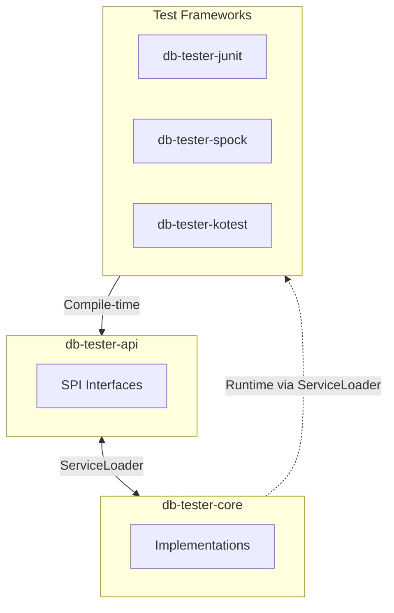
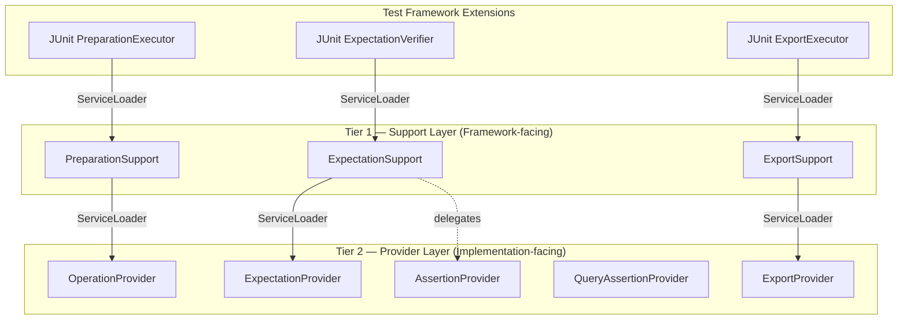

# DB Tester仕様 - サービスプロバイダーインターフェース（SPI）

## SPIアーキテクチャ

本フレームワークはモジュール間の疎結合のためにJava ServiceLoaderを使用します。



### 設計原則

1. **API独立性**: テストフレームワークモジュールは`db-tester-api`のみに依存する。
2. **ランタイム検出**: ServiceLoaderがCore実装をランタイムに読み込む。
3. **拡張性**: カスタム実装を登録するとデフォルトを置換できる。

### 2層SPIアーキテクチャ

本フレームワークは、フレームワーク向けの関心事と実装の詳細を分離する2層SPIアーキテクチャを使用します。



**Tier 1 -- サポートレイヤー**: テストフレームワークエクステンション（JUnit、Spock、Kotest）が読み込む高レベルのライフサイクルSPIです。各Supportインターフェースはテストライフサイクルの1フェーズ（準備、検証、エクスポート）をカプセル化し、アノテーションとコンテキストパラメータを受け取ります。

**Tier 2 -- プロバイダーレイヤー**: `db-tester-core`のSupport実装が読み込む低レベルの操作SPIです。Providerインターフェースは細粒度のデータベース操作（SQL実行、データセット比較、ファイルエクスポート）を定義します。

**スタンドアロンSPI**: 2層パターンに属さないSPIは以下のとおりです。
- `DataSetLoaderProvider` -- デフォルトデータセットローダーを提供するために`Configuration.defaults()`から読み込まれる
- `ScenarioNameResolver` -- コアのシナリオ解決インフラストラクチャから読み込まれる
- `TypeHandler` -- カスタムデータベース型処理のために`TypeHandlerRegistry`から読み込まれる
- `FormatProvider` -- ファイル形式解析のために`FormatRegistry`から読み込まれる内部SPI

## サポートレイヤー

### PreparationSupport

テストライフサイクル中にデータベース準備操作を実行します。

**パッケージ**: `io.github.seijikohara.dbtester.api.spi.PreparationSupport`

**インターフェース**:

```java
public interface PreparationSupport {
    void execute(TestContext context, DataSet dataSet);
}
```

**デフォルト実装**: `db-tester-core`の`DefaultPreparationSupport`

**読み込み元**: テストフレームワークエクステンション（JUnitの`PreparationExecutor`、Spockの`DatabaseTestInterceptor`、Kotestの`DatabaseTestExtension`）

**内部で使用**: `OperationProvider`（Tier 2）をServiceLoader経由で使用

**パラメータ**:

| パラメータ | 型 | 説明 |
|-----------|-----|------|
| `context` | `TestContext` | 設定、レジストリ、テストメタデータを含むテストコンテキスト |
| `dataSet` | `DataSet` | 準備設定を含む`@DataSet`アノテーション |

### ExpectationSupport

テストライフサイクル中にデータベース期待値検証を実行します。

**パッケージ**: `io.github.seijikohara.dbtester.api.spi.ExpectationSupport`

**インターフェース**:

```java
public interface ExpectationSupport {
    void verify(TestContext context, ExpectedDataSet expectedDataSet);
}
```

**デフォルト実装**: `db-tester-core`の`DefaultExpectationSupport`

**読み込み元**: テストフレームワークエクステンション（JUnitの`ExpectationVerifier`、Spockの`DatabaseTestInterceptor`、Kotestの`DatabaseTestExtension`）

**内部で使用**: `ExpectationProvider`と`AssertionProvider`（Tier 2）

**パラメータ**:

| パラメータ | 型 | 説明 |
|-----------|-----|------|
| `context` | `TestContext` | 設定、レジストリ、テストメタデータを含むテストコンテキスト |
| `expectedDataSet` | `ExpectedDataSet` | 検証設定を含む`@ExpectedDataSet`アノテーション |

**スロー**: 設定済みリトライ回数を超えても検証が失敗した場合、`ValidationException`をスローする。

### ExportSupport

テスト実行後にデータベース状態をエクスポートします。

**パッケージ**: `io.github.seijikohara.dbtester.api.spi.ExportSupport`

**インターフェース**:

```java
public interface ExportSupport {
    void export(TestContext context, ExportDataSet exportDataSet);
}
```

**デフォルト実装**: `db-tester-core`の`DefaultExportSupport`

**読み込み元**: テストフレームワークエクステンション（JUnitの`ExportExecutor`、Spockの`DatabaseTestInterceptor`、Kotestの`DatabaseTestExtension`）

**内部で使用**: `ExportProvider`（Tier 2）を`DataSetExporter`経由で使用

**パラメータ**:

| パラメータ | 型 | 説明 |
|-----------|-----|------|
| `context` | `TestContext` | 設定、レジストリ、テストメタデータを含むテストコンテキスト |
| `exportDataSet` | `ExportDataSet` | エクスポート設定を含む`@ExportDataSet`アノテーション |

## SPIリファレンスページ

| ページ | 説明 |
|--------|------|
| [SPIプロバイダー](spi-providers) | プロバイダーレイヤーのインターフェース: OperationProvider、AssertionProvider、ExpectationProvider、ExportProvider、TypeHandlerなど |
| [SPI登録](spi-registration) | ServiceLoader登録、JPMSモジュール宣言、カスタム実装 |

## 関連仕様

- [概要](overview) - フレームワークの目的と主要概念
- [アーキテクチャ](architecture) - モジュール構造
- [設定](configuration) - 設定クラス
- [テストフレームワーク](test-frameworks) - フレームワーク統合
