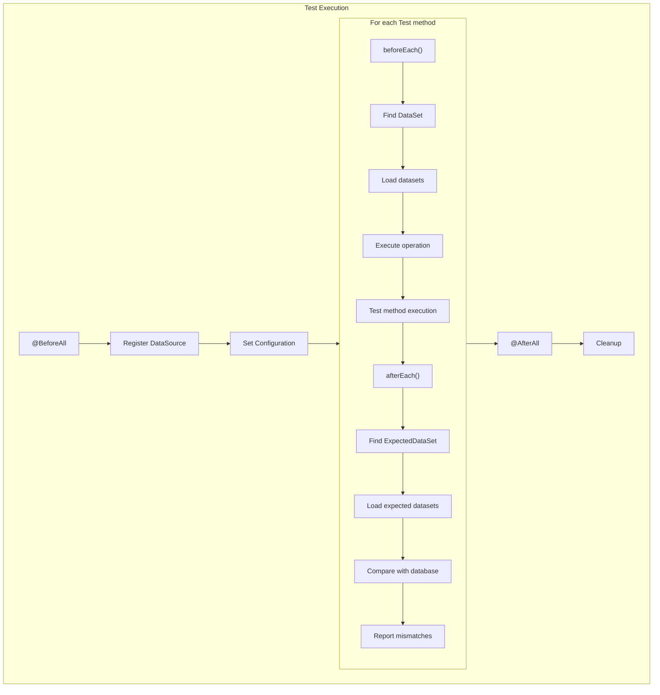
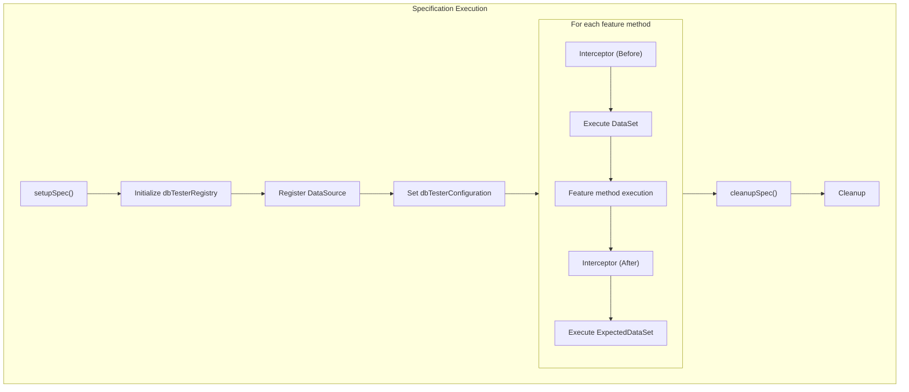
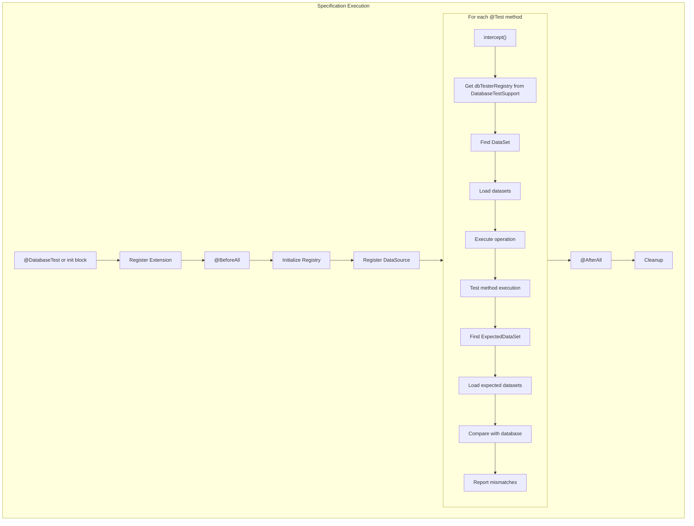

# Lifecycle Hooks

## JUnit Lifecycle

## Spock Lifecycle

## Kotest Lifecycle

## Lifecycle Executor Classes

| Framework | Preparation | Expectation |
|-----------|-------------|-------------|
| JUnit | `PreparationExecutor` | `ExpectationVerifier` |
| Spock | `SpockPreparationExecutor` | `SpockExpectationVerifier` |
| Kotest | `KotestPreparationExecutor` | `KotestExpectationVerifier` |

## Error Handling

| Phase | Error Type | Behavior |
|-------|------------|----------|
| DataSet | `DatabaseOperationException` | Test fails before execution |
| Test | Any exception | ExpectedDataSet verification is skipped |
| ExpectedDataSet | `ValidationException` | Test fails with comparison details |

## Related Specifications

- [Test Frameworks Overview](test-frameworks) - Supported frameworks summary
- [JUnit](junit) - JUnit integration
- [Spock](spock) - Spock integration
- [Kotest](kotest) - Kotest integration
- [Spring Boot](spring-boot) - Spring Boot auto-configuration
- [Error Handling](error-handling) - Detailed error handling reference
