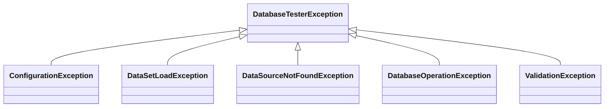

# DB Tester Specification - Public API

## API Layers

The `db-tester-api` module exports packages organized into three layers by intended audience:

| Layer | Packages | Audience | Stability |
|-------|----------|----------|-----------|
| **User API** | `annotation`, `config`, `operation`, `exception`, `preparation` | All users | Stable |
| **Advanced API** | `assertion`, `export`, `domain`, `dataset` | Users with programmatic needs | Stable |
| **Extension SPI** | `spi`, `loader`, `context`, `scenario` | Framework integrators | Evolving SPI |

### User API

The User API contains the types that most users interact with directly:

- **`annotation`** — `@DataSet`, `@ExpectedDataSet`, `@DataSetSource`, `@ColumnStrategy`
- **`assertion`** — `DatabaseAssertion`, `DatabaseQueryAssertion` for programmatic database verification
- **`config`** — `Configuration`, `ConventionSettings`, `DataSourceRegistry`, `ExpectationContext`
- **`operation`** — `Operation` enum (`CLEAN_INSERT`, `INSERT`, `TRUNCATE_INSERT`, etc.)
- **`exception`** — Framework exceptions (passive consumption via catch/inspect)
- **`export`** — `DataSetExporter` for exporting database content to files
- **`preparation`** — `DatabasePreparation` for programmatic test data setup

### Advanced API

The Advanced API provides programmatic access to datasets and type-safe value objects:

- **`domain`** — Type-safe value objects (`CellValue`, `TableName`, `ColumnName`, `ComparisonStrategy`)
- **`dataset`** — `TableSet`, `Table`, `Row` interfaces for dataset representation

### Extension SPI

The Extension SPI is for framework integrators who build custom test extensions or data loaders:

- **`spi`** — `OperationProvider`, `ExpectationProvider`, `DataSetLoaderProvider`
- **`loader`** — `DataSetLoader`, `ExpectedTableSet` for custom data loading
- **`context`** — `TestContext` for framework-agnostic test execution
- **`scenario`** — `ScenarioNameResolver` for custom scenario name resolution

## Annotations

### @DataSet

Declares the datasets to apply before a test method executes.

**Location**: `io.github.seijikohara.dbtester.api.annotation.DataSet`

**Target**: `METHOD`, `TYPE`, `ANNOTATION_TYPE`

**Attributes**:

| Attribute | Type | Default | Description |
|-----------|------|---------|-------------|
| `sources` | `DataSetSource[]` | `{}` | Dataset sources to execute; empty triggers convention-based discovery |
| `operation` | `Operation` | `CLEAN_INSERT` | Database operation to apply |
| `tableOrdering` | `TableOrderingStrategy` | `AUTO` | Strategy for determining table processing order |
| `batchSize` | `int` | `-1` | Rows per batch for INSERT operations; `-1` uses global setting, `0` uses single batch |

**Annotation Inheritance**:

- Class-level annotations are inherited by subclasses
- Method-level annotations override class-level declarations
- Annotated with `@Inherited`

**Example**:

```java
@DataSet
void testMethod() { }

@DataSet(operation = Operation.INSERT)
void testWithInsertOnly() { }

@DataSet(tableOrdering = TableOrderingStrategy.FOREIGN_KEY)
void testWithForeignKeyOrdering() { }

@DataSet(sources = @DataSetSource(resourceLocation = "custom/path"))
void testWithCustomPath() { }
```

### @ExpectedDataSet

Declares the datasets that define the expected database state after test execution.

**Location**: `io.github.seijikohara.dbtester.api.annotation.ExpectedDataSet`

**Target**: `METHOD`, `TYPE`, `ANNOTATION_TYPE`

**Attributes**:

| Attribute | Type | Default | Description |
|-----------|------|---------|-------------|
| `sources` | `DataSetSource[]` | `{}` | Dataset sources for verification; empty triggers convention-based discovery |
| `tableOrdering` | `TableOrderingStrategy` | `AUTO` | Strategy for determining table processing order during verification |
| `rowOrdering` | `RowOrdering` | `UNSET` | Row comparison strategy; `UNSET` defers to global `VerificationSettings` |
| `retryCount` | `int` | `-1` | Retry attempts for verification; `-1` uses global setting |
| `retryDelayMillis` | `long` | `-1` | Delay between retries in milliseconds; `-1` uses global setting |

**Verification Behavior**:

- Read-only comparison (no data modification)
- Validates actual database state against expected datasets
- Reports assertion failures via test framework

**Example**:

```java
@DataSet
@ExpectedDataSet
void testWithVerification() { }

@ExpectedDataSet(sources = @DataSetSource(resourceLocation = "expected/custom"))
void testWithCustomExpectation() { }

@ExpectedDataSet(tableOrdering = TableOrderingStrategy.ALPHABETICAL)
void testWithAlphabeticalOrdering() { }

@ExpectedDataSet(rowOrdering = RowOrdering.UNORDERED)
void testWithUnorderedComparison() { }

@ExpectedDataSet(retryCount = 3, retryDelayMillis = 500)
void testWithRetry() { }
```

### @DataSetSource

Configures individual dataset source parameters within `@DataSet` or `@ExpectedDataSet`.

**Location**: `io.github.seijikohara.dbtester.api.annotation.DataSetSource`

**Target**: None (`@Target({})`) - This annotation cannot be applied directly to classes or methods. Use it exclusively within `@DataSet#sources()` and `@ExpectedDataSet#sources()` arrays.

**Attributes**:

| Attribute | Type | Default | Description |
|-----------|------|---------|-------------|
| `resourceLocation` | `String` | `""` | Dataset directory path; empty uses convention-based discovery |
| `dataSourceName` | `String` | `""` | Named DataSource identifier; empty uses default |
| `scenarioNames` | `String[]` | `{}` | Scenario filters; empty uses test method name |
| `excludeColumns` | `String[]` | `{}` | Column names to exclude from verification (case-insensitive); only effective in `@ExpectedDataSet` |
| `columnStrategies` | `ColumnStrategy[]` | `{}` | Column-specific comparison strategies; only effective in `@ExpectedDataSet` |

**Resource Location Formats**:

| Format | Example | Resolution |
|--------|---------|------------|
| Classpath relative | `data/users` | From test classpath root |
| Classpath prefix | `classpath:data/users` | Explicit classpath resolution |
| Absolute path | `/tmp/testdata` | File system absolute path |
| Empty string | `""` | Convention-based discovery |

**Example**:

```java
@DataSet(sources = {
    @DataSetSource(dataSourceName = "primary"),
    @DataSetSource(dataSourceName = "secondary", resourceLocation = "secondary-data")
})
void testMultipleDataSources() { }

@DataSet(sources = @DataSetSource(scenarioNames = {"scenario1", "scenario2"}))
void testMultipleScenarios() { }

@ExpectedDataSet(sources = @DataSetSource(
    excludeColumns = {"CREATED_AT", "UPDATED_AT", "VERSION"}
))
void testWithExcludedColumns() { }

@ExpectedDataSet(sources = @DataSetSource(
    columnStrategies = {
        @ColumnStrategy(name = "EMAIL", strategy = Strategy.CASE_INSENSITIVE),
        @ColumnStrategy(name = "CREATED_AT", strategy = Strategy.IGNORE),
        @ColumnStrategy(name = "ID", strategy = Strategy.REGEX, pattern = "[a-f0-9-]{36}")
    }
))
void testWithColumnStrategies() { }
```

**Column Exclusion Behavior**:

- Column names are normalized to uppercase for comparison
- Per-dataset exclusions are combined with global exclusions from `ConventionSettings`
- Exclusions apply only to `@ExpectedDataSet` verification, not `@DataSet` preparation

**Column Strategy Behavior**:

- Column strategies override default strict comparison for specific columns
- Annotation-level strategies override global strategies from `ConventionSettings`
- Exclusions take precedence: excluded columns are skipped before strategies apply

### @ColumnStrategy

Configures the comparison strategy for a column during expectation verification.

**Location**: `io.github.seijikohara.dbtester.api.annotation.ColumnStrategy`

**Target**: None (`@Target({})`) - Use exclusively within `@DataSetSource#columnStrategies()`.

**Attributes**:

| Attribute | Type | Default | Description |
|-----------|------|---------|-------------|
| `name` | `String` | (required) | Column name (case-insensitive) |
| `strategy` | `Strategy` | `STRICT` | Comparison strategy to use |
| `pattern` | `String` | `""` | Regex pattern for `REGEX` strategy |
| `options` | `String` | `""` | Strategy-specific options (see below) |

**Options Attribute**:

The `options` attribute is reserved for future use by strategies that require additional parameters
beyond the `pattern` attribute.

### Strategy

Enum defining comparison strategy types for use in `@ColumnStrategy` annotations.

**Location**: `io.github.seijikohara.dbtester.api.annotation.Strategy`

**Values**:

| Value | Description | Required Attribute |
|-------|-------------|-------------------|
| `STRICT` | Exact match using `equals()` (default) | — |
| `IGNORE` | Skip comparison entirely | — |
| `NUMERIC` | Type-aware numeric comparison | — |
| `CASE_INSENSITIVE` | Case-insensitive string comparison | — |
| `TIMESTAMP_FLEXIBLE` | Converts to UTC and ignores sub-second precision | — |
| `NOT_NULL` | Verifies value is not null | — |
| `REGEX` | Pattern matching using regular expressions | `pattern` |
| `DATE_FLEXIBLE` | Multi-format date comparison (ISO-8601, slashed, dot) | — |
| `JSON_EQUIVALENT` | JSON structural comparison (ignores key order and whitespace) | — |

**Examples**:

```java
@ExpectedDataSet(sources = @DataSetSource(
    columnStrategies = {
        @ColumnStrategy(name = "BIRTH_DATE", strategy = Strategy.DATE_FLEXIBLE),
        @ColumnStrategy(name = "METADATA", strategy = Strategy.JSON_EQUIVALENT)
    }
))
void testWithExtendedStrategies() { }
```

### RowOrdering

Enum defining row comparison strategies for use in `@ExpectedDataSet` annotations.

**Location**: `io.github.seijikohara.dbtester.api.config.RowOrdering`

**Values**:

| Value | Description |
|-------|-------------|
| `UNSET` | Annotation default sentinel. Defers to global `VerificationSettings.rowOrdering()`. |
| `ORDERED` | Positional comparison (row-by-row by index). Default behavior. |
| `UNORDERED` | Set-based comparison (rows matched regardless of position). |

`UNSET` is the default for `@ExpectedDataSet.rowOrdering()`. When set, the global setting from `VerificationSettings` is used.

**When to Use**:

| Mode | Use Case |
|------|----------|
| `ORDERED` | Query includes ORDER BY; row order is significant; maximum performance |
| `UNORDERED` | No ORDER BY; row order not significant; database may return rows in unpredictable order |

**Performance Note**: Unordered comparison has O(n*m) complexity in the worst case.

## TableSet Interfaces

### TableSet

Represents a collection of database tables.

**Location**: `io.github.seijikohara.dbtester.api.dataset.TableSet`

**Factory Methods**:

| Method | Return Type | Description |
|--------|-------------|-------------|
| `of(List<Table>)` | `TableSet` | Creates a table set with the specified tables |
| `of(Table...)` | `TableSet` | Creates a table set with the specified tables (varargs) |

**Instance Methods**:

| Method | Return Type | Description |
|--------|-------------|-------------|
| `getTables()` | `List<Table>` | Returns immutable list of tables in declaration order |
| `getTable(TableName)` | `Optional<Table>` | Finds table by name |
| `getDataSource()` | `Optional<DataSource>` | Returns bound DataSource if specified |

**Guarantees**:

- Table order is preserved (insertion order)
- All returned collections are immutable
- Table names are unique within a table set

### Table

Represents the structure and data of a database table.

**Location**: `io.github.seijikohara.dbtester.api.dataset.Table`

**Factory Methods**:

| Method | Return Type | Description |
|--------|-------------|-------------|
| `of(TableName, List<ColumnName>, List<Row>)` | `Table` | Creates a table with type-safe names |
| `of(String, List<String>, List<Row>)` | `Table` | Creates a table with string names (convenience) |
| `ofValues(String, List<String>, List<List<?>>)` | `Table` | Creates a table from raw values without wrapping (convenience) |

**Instance Methods**:

| Method | Return Type | Description |
|--------|-------------|-------------|
| `getName()` | `TableName` | Returns table identifier |
| `getColumns()` | `List<ColumnName>` | Returns column names in definition order |
| `getRows()` | `List<Row>` | Returns all rows (may be empty) |
| `getRowCount()` | `int` | Returns number of rows |

**Guarantees**:

- Column order is consistent across all rows
- All returned collections are immutable
- Row count equals `getRows().size()`

### Row

Represents a single database record.

**Location**: `io.github.seijikohara.dbtester.api.dataset.Row`

**Factory Methods**:

| Method | Return Type | Description |
|--------|-------------|-------------|
| `of(Map<ColumnName, CellValue>)` | `Row` | Creates a row with the specified column-value pairs |
| `of(List<String>, List<?>)` | `Row` | Creates a row by pairing column names with raw values (convenience) |

**Instance Methods**:

| Method | Return Type | Description |
|--------|-------------|-------------|
| `getValues()` | `Map<ColumnName, CellValue>` | Returns immutable column-value mapping |
| `getValue(ColumnName)` | `CellValue` | Returns value for column; `CellValue.NULL` if absent |

## Domain Value Objects

### CellValue

Wraps a cell value with explicit null handling.

**Location**: `io.github.seijikohara.dbtester.api.domain.CellValue`

**Type**: `record`

**Fields**:

| Field | Type | Description |
|-------|------|-------------|
| `value` | `@Nullable Object` | The wrapped value |

**Constants**:

| Constant | Description |
|----------|-------------|
| `CellValue.NULL` | Singleton representing SQL NULL |

**Methods**:

| Method | Return Type | Description |
|--------|-------------|-------------|
| `isNull()` | `boolean` | Returns `true` if value is null |

### TableName

Immutable identifier for a database table.

**Location**: `io.github.seijikohara.dbtester.api.domain.TableName`

**Type**: `record`

**Fields**:

| Field | Type | Description |
|-------|------|-------------|
| `value` | `String` | Table name string |

### ColumnName

Immutable identifier for a table column.

**Location**: `io.github.seijikohara.dbtester.api.domain.ColumnName`

**Type**: `record`

**Fields**:

| Field | Type | Description |
|-------|------|-------------|
| `value` | `String` | Column name string |

### DataSourceName

Immutable identifier for a registered DataSource.

**Location**: `io.github.seijikohara.dbtester.api.domain.DataSourceName`

**Type**: `record`

**Fields**:

| Field | Type | Description |
|-------|------|-------------|
| `value` | `String` | DataSource name string |

### Column

Represents a column with its name and comparison strategy.

**Location**: `io.github.seijikohara.dbtester.api.domain.Column`

**Type**: `record`

**Fields**:

| Field | Type | Description |
|-------|------|-------------|
| `name` | `ColumnName` | Column identifier |
| `comparisonStrategy` | `ComparisonStrategy` | Comparison strategy for this column |

### Cell

Represents a cell containing column metadata and value.

**Location**: `io.github.seijikohara.dbtester.api.domain.Cell`

**Type**: `record`

**Fields**:

| Field | Type | Description |
|-------|------|-------------|
| `column` | `Column` | Column definition |
| `value` | `CellValue` | Cell value |

### ColumnMetadata

Represents database column metadata retrieved from JDBC.

**Location**: `io.github.seijikohara.dbtester.api.domain.ColumnMetadata`

**Type**: `record`

**Fields**:

| Field | Type | Description |
|-------|------|-------------|
| `name` | `ColumnName` | Column name |
| `jdbcType` | `int` | JDBC type code from `java.sql.Types` |
| `typeName` | `String` | Database-specific type name |
| `nullable` | `boolean` | Whether column allows null values |

### ColumnStrategyMapping

Represents programmatic column comparison strategy configuration.

**Location**: `io.github.seijikohara.dbtester.api.config.ColumnStrategyMapping`

**Type**: `record`

**Fields**:

| Field | Type | Description |
|-------|------|-------------|
| `columnName` | `String` | Column name normalized to uppercase |
| `strategy` | `ComparisonStrategy` | Comparison strategy for this column |

**Factory Methods**:

| Method | Description |
|--------|-------------|
| `of(String, ComparisonStrategy)` | Creates mapping with specified strategy |
| `strict(String)` | Creates mapping with STRICT strategy |
| `ignore(String)` | Creates mapping with IGNORE strategy |
| `caseInsensitive(String)` | Creates mapping with CASE_INSENSITIVE strategy |
| `numeric(String)` | Creates mapping with NUMERIC strategy |
| `timestampFlexible(String)` | Creates mapping with TIMESTAMP_FLEXIBLE strategy |
| `notNull(String)` | Creates mapping with NOT_NULL strategy |
| `regex(String, String)` | Creates mapping with REGEX strategy and pattern |
| `dateFlexible(String)` | Creates mapping with DATE_FLEXIBLE strategy |
| `jsonEquivalent(String)` | Creates mapping with JSON_EQUIVALENT strategy |

**Example**:

```java
// Programmatic column strategy configuration
var strategies = List.of(
    ColumnStrategyMapping.ignore("CREATED_AT"),
    ColumnStrategyMapping.caseInsensitive("EMAIL"),
    ColumnStrategyMapping.regex("TOKEN", "[a-f0-9-]{36}"),
    ColumnStrategyMapping.dateFlexible("BIRTH_DATE"),
    ColumnStrategyMapping.jsonEquivalent("METADATA")
);

DatabaseAssertion.assertEqualsWithStrategies(expectedTable, actualTable, strategies);
```

### ComparisonStrategy

Defines value comparison behavior during assertion.

**Location**: `io.github.seijikohara.dbtester.api.domain.ComparisonStrategy`

**Predefined Strategies**:

| Strategy | Description |
|----------|-------------|
| `STRICT` | Exact match using `equals()` (default) |
| `IGNORE` | Skip comparison entirely |
| `NUMERIC` | Type-aware numeric comparison using BigDecimal |
| `CASE_INSENSITIVE` | Case-insensitive string comparison |
| `TIMESTAMP_FLEXIBLE` | Converts to UTC and ignores sub-second precision |
| `DATE_FLEXIBLE` | Multi-format date comparison (ISO-8601 `yyyy-MM-dd`, slashed `yyyy/MM/dd`, dot `yyyy.MM.dd`) |
| `JSON_EQUIVALENT` | JSON structural comparison (ignores key order and whitespace) |
| `NOT_NULL` | Verifies value is not null |

**Factory Methods**:

| Method | Description |
|--------|-------------|
| `regex(String)` | Creates regex pattern matcher with the specified pattern |
| `contains()` | Creates substring containment check using expected value |
| `contains(String)` | Creates substring containment check with specific substring |
| `range(double, double)` | Creates numeric range check with min and max bounds |
| `range(String)` | Creates numeric range check from options string (`"min=N,max=M"`) |

**Comparison Behavior**:

| Strategy | null/null | null/value | value/null | value/value |
|----------|-----------|------------|------------|-------------|
| `STRICT` | true | false | false | equals() |
| `IGNORE` | true | true | true | true |
| `NUMERIC` | true | false | false | BigDecimal comparison |
| `CASE_INSENSITIVE` | true | false | false | equalsIgnoreCase() |
| `TIMESTAMP_FLEXIBLE` | true | false | false | UTC epoch comparison |
| `DATE_FLEXIBLE` | true | false | false | LocalDate comparison |
| `JSON_EQUIVALENT` | true | false | false | Normalized JSON comparison |
| `NOT_NULL` | false | false | false | true |
| `REGEX` | false | false | false | Pattern.matches() |

**Architecture Note**: `ComparisonStrategy` serves as a descriptor (what to compare). Comparison execution (how to compare) is handled by `ComparisonEngine` in the core module.

## Assertion API

### DatabaseAssertion

Static facade for programmatic database assertions. This utility class delegates to the underlying assertion provider loaded via SPI.

**Location**: `io.github.seijikohara.dbtester.api.assertion.DatabaseAssertion`

**Type**: Utility class (non-instantiable, static methods only)

**Static Methods**:

| Method | Description |
|--------|-------------|
| `assertEquals(TableSet, TableSet)` | Asserts two table sets are equal |
| `assertEquals(TableSet, TableSet, AssertionFailureHandler)` | Asserts with custom failure handler |
| `assertEquals(Table, Table)` | Asserts two tables are equal |
| `assertEquals(Table, Table, Collection<String>)` | Asserts tables with additional columns to include |
| `assertEquals(Table, Table, AssertionFailureHandler)` | Asserts tables with custom failure handler |
| `assertEqualsIgnoreColumns(TableSet, TableSet, String, Collection<String>)` | Asserts table in table sets, ignoring specified columns |
| `assertEqualsIgnoreColumns(Table, Table, Collection<String>)` | Asserts tables, ignoring specified columns |
| `assertEqualsWithStrategies(Table, Table, Collection<ColumnStrategyMapping>)` | Asserts tables with column-specific comparison strategies |
| `assertEqualsByQuery(...)` | **Deprecated since 1.1** — Use `DatabaseQueryAssertion` instead |

**Varargs Overloads**: Methods accepting `Collection<String>` for column names also have `String...` varargs overloads for convenience.

**Example**:

```java
// Basic table set comparison
DatabaseAssertion.assertEquals(expectedTableSet, actualTableSet);

// With custom failure handler
DatabaseAssertion.assertEquals(expectedTableSet, actualTableSet, (message, expected, actual) -> {
    // Custom failure handling
});

// Ignoring specific columns
DatabaseAssertion.assertEqualsIgnoreColumns(expectedTableSet, actualTableSet, "USERS", "CREATED_AT", "UPDATED_AT");

// Comparing SQL query results (use DatabaseQueryAssertion instead)
DatabaseQueryAssertion.assertEqualsByQuery(expectedTableSet, dataSource, "USERS", "SELECT * FROM USERS WHERE status = 'ACTIVE'");

// Using column-specific comparison strategies
DatabaseAssertion.assertEqualsWithStrategies(expectedTable, actualTable,
    ColumnStrategyMapping.ignore("CREATED_AT"),
    ColumnStrategyMapping.caseInsensitive("EMAIL"),
    ColumnStrategyMapping.regex("TOKEN", "[a-f0-9-]{36}"));
```

### DatabaseQueryAssertion

Static facade for query-based database assertions. This utility class executes SQL queries and compares results with expected datasets. It separates query execution concerns from pure data comparison in `DatabaseAssertion`.

**Location**: `io.github.seijikohara.dbtester.api.assertion.DatabaseQueryAssertion`

**Type**: Utility class (non-instantiable, static methods only)

**Static Methods**:

| Method | Description |
|--------|-------------|
| `assertEqualsByQuery(TableSet, DataSource, String, String, Collection<String>)` | Asserts SQL query results against expected table set |
| `assertEqualsByQuery(Table, DataSource, String, String, Collection<String>)` | Asserts SQL query results against expected table |

**Varargs Overloads**: Methods accepting `Collection<String>` for column names also have `String...` varargs overloads for convenience.

**Example**:

```java
// Compare SQL query results against expected dataset
DatabaseQueryAssertion.assertEqualsByQuery(
    expectedTableSet, dataSource, "USERS",
    "SELECT * FROM USERS WHERE status = 'ACTIVE'");

// With columns to ignore
DatabaseQueryAssertion.assertEqualsByQuery(
    expectedTableSet, dataSource, "USERS",
    "SELECT * FROM USERS", "CREATED_AT", "UPDATED_AT");
```

### AssertionFailureHandler

Strategy interface for reacting to assertion mismatches. Implementations can translate individual failures into domain-specific actions such as raising custom exceptions, logging diagnostics, or aggregating differences.

**Location**: `io.github.seijikohara.dbtester.api.assertion.AssertionFailureHandler`

**Type**: `@FunctionalInterface`

**Methods**:

| Method | Description |
|--------|-------------|
| `handleFailure(String, @Nullable Object, @Nullable Object)` | Handles a comparison failure between expected and actual values |

**Parameters**:

| Parameter | Type | Description |
|-----------|------|-------------|
| `message` | `String` | Descriptive failure message including context (table name, row number, column name) |
| `expected` | `@Nullable Object` | Expected value; may be null |
| `actual` | `@Nullable Object` | Actual value found in database; may be null |

**Example**:

```java
// Fail-fast strategy (default behavior)
AssertionFailureHandler failFast = (message, expected, actual) -> {
    throw new AssertionError(message);
};

// Collect all failures
List<String> failures = new ArrayList<>();
AssertionFailureHandler collector = (message, expected, actual) -> {
    failures.add(String.format("%s: expected=%s, actual=%s", message, expected, actual));
};

DatabaseAssertion.assertEquals(expectedTableSet, actualTableSet, collector);
if (!failures.isEmpty()) {
    throw new AssertionError("Multiple failures:\n" + String.join("\n", failures));
}
```

## Export API

### DataSetExporter

Static facade for exporting database content to files. This utility class delegates to format-specific implementations loaded via the `ExportProvider` SPI.

**Location**: `io.github.seijikohara.dbtester.api.export.DataSetExporter`

**Type**: Utility class (non-instantiable, static methods only)

**Static Methods**:

| Method | Description |
|--------|-------------|
| `export(DataSource, List<String>, Path, DataFormat)` | Exports tables to files in the specified format with default configuration; throws `IllegalArgumentException` for `AUTO` |
| `export(DataSource, List<String>, Path, DataFormat, ExportConfiguration)` | Exports tables to files with custom configuration; throws `IllegalArgumentException` for `AUTO` |
| `exportQuery(DataSource, String, String, Path, DataFormat)` | Exports SQL query results to a file with default configuration; throws `IllegalArgumentException` for `AUTO` |
| `exportQuery(DataSource, String, String, Path, DataFormat, ExportConfiguration)` | Exports SQL query results to a file with custom configuration; throws `IllegalArgumentException` for `AUTO` |
| `csv(DataSource, List<String>, Path)` | Exports tables to CSV files (convenience method) |
| `tsv(DataSource, List<String>, Path)` | Exports tables to TSV files (convenience method) |
| `json(DataSource, List<String>, Path)` | Exports tables to JSON files (convenience method) |
| `yaml(DataSource, List<String>, Path)` | Exports tables to YAML files (convenience method) |

**Example**:

```java
// Export tables to CSV files
DataSetExporter.csv(dataSource, List.of("USERS", "ORDERS"), Paths.get("export"));

// Export with custom configuration
var config = ExportConfiguration.builder()
    .lobHandling(LobHandling.OMIT)
    .writeLoadOrderFile(true)
    .build();
DataSetExporter.export(dataSource, List.of("USERS"), Paths.get("export"), DataFormat.JSON, config);

// Export query result
DataSetExporter.exportQuery(
    dataSource,
    "SELECT * FROM USERS WHERE active = true",
    "ACTIVE_USERS",
    Paths.get("export"),
    DataFormat.CSV);
```

### ExportConfiguration

Configuration for data export operations.

**Location**: `io.github.seijikohara.dbtester.api.export.ExportConfiguration`

**Factory Methods**:

| Method | Return Type | Description |
|--------|-------------|-------------|
| `defaults()` | `ExportConfiguration` | Creates a configuration with default values |
| `builder()` | `Builder` | Creates a new builder for custom configuration |

**Configuration Properties**:

| Property | Type | Default | Description |
|----------|------|---------|-------------|
| `nullValue` | `String` | `""` | String representation for null values in delimited formats |
| `dateFormatter` | `DateTimeFormatter` | `ISO_LOCAL_DATE` | Formatter for date values (`yyyy-MM-dd`) |
| `timeFormatter` | `DateTimeFormatter` | `ISO_LOCAL_TIME` | Formatter for time values (`HH:mm:ss`) |
| `timestampFormatter` | `DateTimeFormatter` | `yyyy-MM-dd HH:mm:ss` | Formatter for timestamp values |
| `lobHandling` | `LobHandling` | `BASE64` | Handling strategy for LOB columns |
| `writeLoadOrderFile` | `boolean` | `false` | Whether to generate a load order file |
| `loadOrderFileName` | `String` | `load-order.txt` | Name of the load order file |

**Example**:

```java
// Using defaults
var config = ExportConfiguration.defaults();

// Custom configuration
var config = ExportConfiguration.builder()
    .nullValue("NULL")
    .lobHandling(LobHandling.OMIT)
    .writeLoadOrderFile(true)
    .build();
```

### LobHandling

Enum defining how LOB (Large Object) columns are handled during export.

**Location**: `io.github.seijikohara.dbtester.api.export.LobHandling`

**Values**:

| Value | Description |
|-------|-------------|
| `BASE64` | Exports LOB values as Base64-encoded strings with `[BASE64]` prefix. Supports round-trip export and import. |
| `OMIT` | Excludes LOB columns from export. Use when binary data is not needed or to reduce file size. |

### ExportProvider (SPI)

SPI for implementing format-specific export logic.

**Location**: `io.github.seijikohara.dbtester.api.spi.ExportProvider`

**Type**: `interface`

**Methods**:

| Method | Return Type | Description |
|--------|-------------|-------------|
| `supportedFormat()` | `DataFormat` | Returns the data format this provider handles |
| `export(DataSource, List<String>, Path, ExportConfiguration)` | `void` | Exports tables to files |
| `exportQuery(DataSource, String, String, Path, ExportConfiguration)` | `void` | Exports SQL query results to a file |

**Discovery**: Providers are discovered via `java.util.ServiceLoader`. Register implementations in `META-INF/services/io.github.seijikohara.dbtester.api.spi.ExportProvider`.

**Thread Safety**: Implementations must be thread-safe and stateless.

## Preparation API

### DatabasePreparation

Static facade for programmatic database preparation. This utility class delegates to the underlying operation provider loaded via SPI.

**Location**: `io.github.seijikohara.dbtester.api.preparation.DatabasePreparation`

**Type**: Utility class (non-instantiable, static methods only)

**Static Methods**:

| Method | Description |
|--------|-------------|
| `cleanInsert(DataSource, TableSet)` | Executes CLEAN_INSERT with standard configuration |
| `cleanInsert(DataSource, TableSet, PreparationConfig)` | Executes CLEAN_INSERT with custom configuration |
| `execute(DataSource, TableSet, Operation)` | Executes the specified operation with standard configuration |
| `execute(DataSource, TableSet, Operation, PreparationConfig)` | Executes the specified operation with custom configuration |

**Example**:

```java
// Build dataset programmatically
var users = Table.ofValues("USERS",
    List.of("ID", "NAME", "EMAIL"),
    List.of(
        List.of(1, "Alice", "alice@example.com"),
        List.of(2, "Bob", "bob@example.com")));

// Clean insert with standard defaults
DatabasePreparation.cleanInsert(dataSource, TableSet.of(users));

// Execute a specific operation
DatabasePreparation.execute(dataSource, TableSet.of(users), Operation.INSERT);

// Execute with custom configuration
var config = PreparationConfig.standard()
    .withTransactionMode(TransactionMode.AUTO_COMMIT)
    .withBatchSize(1000);
DatabasePreparation.execute(dataSource, TableSet.of(users), Operation.CLEAN_INSERT, config);
```

### PreparationConfig

Configuration record for programmatic database preparation operations. Use `standard()` to obtain an instance with default values, then use `with*()` methods to customize.

**Location**: `io.github.seijikohara.dbtester.api.preparation.PreparationConfig`

**Type**: `record`

**Factory Methods**:

| Method | Return Type | Description |
|--------|-------------|-------------|
| `standard()` | `PreparationConfig` | Creates an instance with standard default values |

**Properties**:

| Property | Type | Default | Description |
|----------|------|---------|-------------|
| `tableOrderingStrategy` | `TableOrderingStrategy` | `AUTO` | Strategy for determining table processing order |
| `transactionMode` | `TransactionMode` | `SINGLE_TRANSACTION` | Transaction behavior mode |
| `queryTimeout` | `@Nullable Duration` | `null` | Query timeout; null uses driver default |
| `batchSize` | `int` | `0` | Rows per batch; zero means single-batch execution |

**Immutable Copy Methods**:

| Method | Description |
|--------|-------------|
| `withTableOrderingStrategy(TableOrderingStrategy)` | Returns a new instance with the specified strategy |
| `withTransactionMode(TransactionMode)` | Returns a new instance with the specified mode |
| `withQueryTimeout(@Nullable Duration)` | Returns a new instance with the specified timeout |
| `withBatchSize(int)` | Returns a new instance with the specified batch size |

**Example**:

```java
// Standard defaults
var config = PreparationConfig.standard();

// Custom configuration
var config = PreparationConfig.standard()
    .withTableOrderingStrategy(TableOrderingStrategy.FOREIGN_KEY)
    .withTransactionMode(TransactionMode.AUTO_COMMIT)
    .withBatchSize(500);
```

## Exceptions

All exceptions extend `DatabaseTesterException`.

### Exception Hierarchy



### DatabaseTesterException

Base exception for all framework errors.

**Location**: `io.github.seijikohara.dbtester.api.exception.DatabaseTesterException`

**Constructors**:

| Constructor | Description |
|-------------|-------------|
| `DatabaseTesterException(String)` | Message only |
| `DatabaseTesterException(String, Throwable)` | Message with cause |
| `DatabaseTesterException(Throwable)` | Cause only |

### ConfigurationException

Indicates invalid framework configuration.

**Typical Causes**:

- Missing required configuration values
- Invalid file paths
- Incompatible settings combination

### DataSetLoadException

Indicates failure to load dataset files.

**Typical Causes**:

- File not found
- Invalid file format
- Parse errors in CSV, TSV, JSON, or YAML content
- Table name conflict in `AUTO` format mode (same table name in multiple file formats)

### DataSourceNotFoundException

Indicates requested DataSource is not registered.

**Typical Causes**:

- Named DataSource not registered in `DataSourceRegistry`
- Default DataSource not set when required

### DatabaseOperationException

Indicates database operation failure.

**Typical Causes**:

- SQL execution errors
- Constraint violations
- Connection failures

### ValidationException

Indicates assertion or validation failure.

**Typical Causes**:

- Expected and actual data mismatch
- Row count differences
- Column value mismatches

**Output Format**: Validation errors output a human-readable summary followed by YAML details. See [Error Handling - Validation Errors](error-handling#validation-errors) for format details.

## Default Values Reference

This table lists the default values for all configurable attributes.

### Annotation Attribute Defaults

| Annotation | Attribute | Default | Meaning |
|------------|-----------|---------|---------|
| `@DataSet` | `sources` | `{}` | Convention-based discovery |
| `@DataSet` | `operation` | `CLEAN_INSERT` | Delete all rows then insert |
| `@DataSet` | `tableOrdering` | `AUTO` | Automatic ordering |
| `@DataSet` | `batchSize` | `-1` | Use global setting |
| `@ExpectedDataSet` | `sources` | `{}` | Convention-based discovery |
| `@ExpectedDataSet` | `tableOrdering` | `AUTO` | Automatic ordering |
| `@ExpectedDataSet` | `rowOrdering` | `UNSET` | Defers to global `VerificationSettings.rowOrdering()` |
| `@ExpectedDataSet` | `retryCount` | `-1` | Use global setting |
| `@ExpectedDataSet` | `retryDelayMillis` | `-1` | Use global setting |
| `@DataSetSource` | `resourceLocation` | `""` | Convention-based discovery |
| `@DataSetSource` | `dataSourceName` | `""` | Default DataSource |
| `@DataSetSource` | `scenarioNames` | `{}` | Use test method name |
| `@DataSetSource` | `excludeColumns` | `{}` | No exclusions |
| `@DataSetSource` | `columnStrategies` | `{}` | Default STRICT for all columns |
| `@ColumnStrategy` | `strategy` | `STRICT` | Exact match |
| `@ColumnStrategy` | `pattern` | `""` | No pattern |
| `@ColumnStrategy` | `options` | `""` | No options |

**Magic Value: `-1`**

Attributes with a default of `-1` delegate to the global configuration in `OperationDefaults`. This allows test-level overrides while maintaining consistent defaults across the test suite. A value of `0` or higher uses the specified value directly.

## Column Comparison Precedence

When verifying expected database state, column comparison follows this precedence order:

1. **`excludeColumns`**: Columns listed in `excludeColumns` are skipped entirely. No comparison occurs for these columns.
2. **`columnStrategies`**: Columns with a `@ColumnStrategy` annotation use the specified strategy.
3. **`STRICT` (default)**: All remaining columns use exact match comparison.

Annotation-level `columnStrategies` override global strategies configured in `ConventionSettings`. Global exclusions from `ConventionSettings` are combined with per-dataset `excludeColumns`.

## Related Specifications

- [Getting Started](getting-started) - Quick start guide
- [Overview](overview) - Framework introduction
- [Configuration](configuration) - Configuration classes
- [Database Operations](database-operations) - Operation enum details
- [SPI](spi) - Service Provider Interface extension points
- [Error Handling](error-handling) - Error messages and exception types
