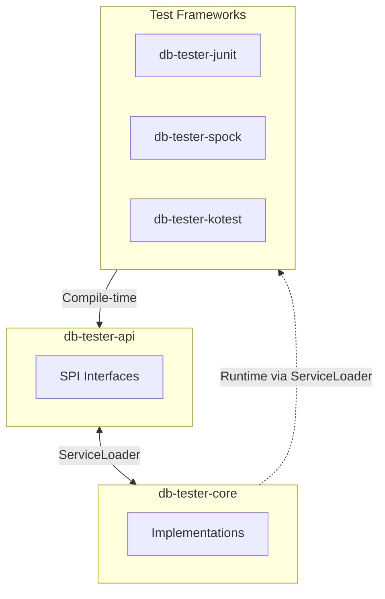
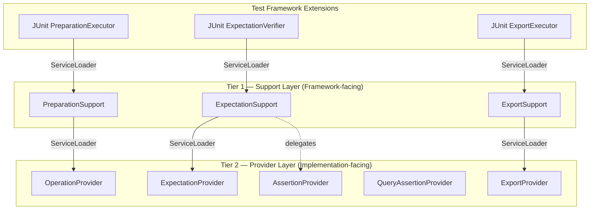

# DB Tester Specification - Service Provider Interface (SPI)

## SPI Architecture

The framework uses Java ServiceLoader to decouple modules:



### Design Principles

1. **API Independence**: Test framework modules depend only on `db-tester-api`.
2. **Runtime Discovery**: ServiceLoader loads core implementations at runtime.
3. **Extensibility**: Custom implementations replace defaults when registered.

### Two-Tier SPI Architecture

The framework uses a two-tier SPI architecture to separate framework-facing concerns
from implementation details:



**Tier 1 -- Support Layer**: High-level lifecycle SPIs loaded by test framework extensions
(JUnit, Spock, Kotest). Each Support interface encapsulates one test lifecycle phase
(preparation, verification, export) and accepts annotation and context parameters.

**Tier 2 -- Provider Layer**: Low-level operation SPIs loaded by Support implementations
in `db-tester-core`. Provider interfaces define fine-grained database operations
(execute SQL, compare datasets, export files).

**Standalone SPIs**: These SPIs do not participate in the two-tier pattern:
- `DataSetLoaderProvider` -- loaded by `Configuration.defaults()` to provide the default dataset loader
- `ScenarioNameResolver` -- loaded by the core scenario resolution infrastructure
- `TypeHandler` -- loaded by `TypeHandlerRegistry` for custom database type handling
- `FormatProvider` -- internal SPI loaded by `FormatRegistry` for file format parsing

## Support Layer

### PreparationSupport

Executes database preparation operations during the test lifecycle.

**Location**: `io.github.seijikohara.dbtester.api.spi.PreparationSupport`

**Interface**:

```java
public interface PreparationSupport {
    void execute(TestContext context, DataSet dataSet);
}
```

**Default Implementation**: `DefaultPreparationSupport` in `db-tester-core`

**Loaded by**: Test framework extensions (`PreparationExecutor` in JUnit,
`DatabaseTestInterceptor` in Spock, `DatabaseTestExtension` in Kotest)

**Internally uses**: `OperationProvider` (Tier 2) via ServiceLoader

**Parameters**:

| Parameter | Type | Description |
|-----------|------|-------------|
| `context` | `TestContext` | Test context containing configuration, registry, and test metadata |
| `dataSet` | `DataSet` | The `@DataSet` annotation containing preparation settings |

### ExpectationSupport

Executes database expectation verification during the test lifecycle.

**Location**: `io.github.seijikohara.dbtester.api.spi.ExpectationSupport`

**Interface**:

```java
public interface ExpectationSupport {
    void verify(TestContext context, ExpectedDataSet expectedDataSet);
}
```

**Default Implementation**: `DefaultExpectationSupport` in `db-tester-core`

**Loaded by**: Test framework extensions (`ExpectationVerifier` in JUnit,
`DatabaseTestInterceptor` in Spock, `DatabaseTestExtension` in Kotest)

**Internally uses**: `ExpectationProvider` and `AssertionProvider` (Tier 2)

**Parameters**:

| Parameter | Type | Description |
|-----------|------|-------------|
| `context` | `TestContext` | Test context containing configuration, registry, and test metadata |
| `expectedDataSet` | `ExpectedDataSet` | The `@ExpectedDataSet` annotation containing verification settings |

**Throws**: `ValidationException` if verification fails after all configured retries.

### ExportSupport

Executes database state export after test execution.

**Location**: `io.github.seijikohara.dbtester.api.spi.ExportSupport`

**Interface**:

```java
public interface ExportSupport {
    void export(TestContext context, ExportDataSet exportDataSet);
}
```

**Default Implementation**: `DefaultExportSupport` in `db-tester-core`

**Loaded by**: Test framework extensions (`ExportExecutor` in JUnit,
`DatabaseTestInterceptor` in Spock, `DatabaseTestExtension` in Kotest)

**Internally uses**: `ExportProvider` (Tier 2) via `DataSetExporter`

**Parameters**:

| Parameter | Type | Description |
|-----------|------|-------------|
| `context` | `TestContext` | Test context containing configuration, registry, and test metadata |
| `exportDataSet` | `ExportDataSet` | The `@ExportDataSet` annotation containing export settings |

## SPI Reference Pages

| Page | Description |
|------|-------------|
| [SPI Providers](spi-providers) | Provider Layer interfaces: OperationProvider, AssertionProvider, ExpectationProvider, ExportProvider, TypeHandler, and more |
| [SPI Registration](spi-registration) | ServiceLoader registration, JPMS module declarations, and custom implementations |

## Related Specifications

- [Overview](overview) - Framework purpose and key concepts
- [Architecture](architecture) - Module structure
- [Configuration](configuration) - Configuration classes
- [Test Frameworks](test-frameworks) - Framework integration
