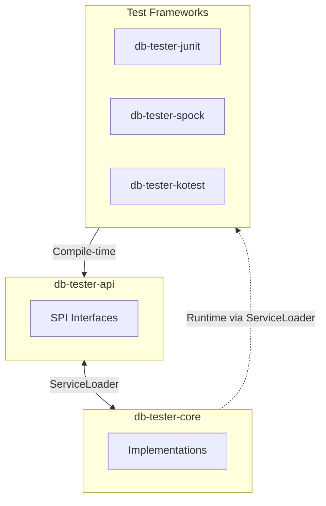
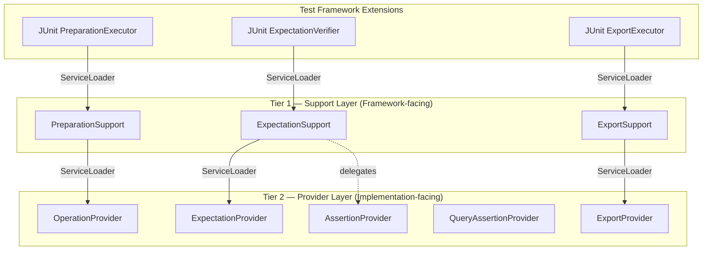

# DB Tester Specification - Service Provider Interface (SPI)

## SPI Overview

The framework uses Java ServiceLoader to decouple modules:



### Design Principles

1. **API Independence**: Test framework modules depend only on `db-tester-api`.
2. **Runtime Discovery**: ServiceLoader loads core implementations at runtime.
3. **Extensibility**: Custom implementations replace defaults when registered.


### Two-Tier SPI Architecture

The framework uses a two-tier SPI architecture to separate framework-facing concerns from implementation details:



**Tier 1 — Support Layer**: High-level lifecycle SPIs loaded by test framework extensions (JUnit, Spock, Kotest). Each Support interface encapsulates one test lifecycle phase (preparation, verification, export) and accepts annotation and context parameters.

**Tier 2 — Provider Layer**: Low-level operation SPIs loaded by Support implementations in `db-tester-core`. Provider interfaces define fine-grained database operations (execute SQL, compare datasets, export files).

**Standalone SPIs**: Some SPIs do not participate in the two-tier pattern:
- `DataSetLoaderProvider` — loaded by `Configuration.defaults()` to provide the default dataset loader
- `ScenarioNameResolver` — loaded by the core scenario resolution infrastructure
- `TypeHandler` — loaded by `TypeHandlerRegistry` for custom database type handling
- `FormatProvider` — internal SPI loaded by `FormatRegistry` for file format parsing


## API Module SPIs — Support Layer

### PreparationSupport

Executes database preparation operations during the test lifecycle.

**Location**: `io.github.seijikohara.dbtester.api.spi.PreparationSupport`

**Interface**:

```java
public interface PreparationSupport {
    void execute(TestContext context, DataSet dataSet);
}
```

**Default Implementation**: `DefaultPreparationSupport` in `db-tester-core`

**Loaded by**: Test framework extensions (`PreparationExecutor` in JUnit, `DatabaseTestInterceptor` in Spock, `DatabaseTestExtension` in Kotest)

**Internally uses**: `OperationProvider` (Tier 2) via ServiceLoader

**Parameters**:

| Parameter | Type | Description |
|-----------|------|-------------|
| `context` | `TestContext` | Test context containing configuration, registry, and test metadata |
| `dataSet` | `DataSet` | The `@DataSet` annotation containing preparation settings |


### ExpectationSupport

Executes database expectation verification during the test lifecycle.

**Location**: `io.github.seijikohara.dbtester.api.spi.ExpectationSupport`

**Interface**:

```java
public interface ExpectationSupport {
    void verify(TestContext context, ExpectedDataSet expectedDataSet);
}
```

**Default Implementation**: `DefaultExpectationSupport` in `db-tester-core`

**Loaded by**: Test framework extensions (`ExpectationVerifier` in JUnit, `DatabaseTestInterceptor` in Spock, `DatabaseTestExtension` in Kotest)

**Internally uses**: `ExpectationProvider` and `AssertionProvider` (Tier 2)

**Parameters**:

| Parameter | Type | Description |
|-----------|------|-------------|
| `context` | `TestContext` | Test context containing configuration, registry, and test metadata |
| `expectedDataSet` | `ExpectedDataSet` | The `@ExpectedDataSet` annotation containing verification settings |

**Throws**: `ValidationException` if verification fails after all configured retries.


### ExportSupport

Executes database state export after test execution.

**Location**: `io.github.seijikohara.dbtester.api.spi.ExportSupport`

**Interface**:

```java
public interface ExportSupport {
    void export(TestContext context, ExportDataSet exportDataSet);
}
```

**Default Implementation**: `DefaultExportSupport` in `db-tester-core`

**Loaded by**: Test framework extensions (`ExportExecutor` in JUnit, `DatabaseTestInterceptor` in Spock, `DatabaseTestExtension` in Kotest)

**Internally uses**: `ExportProvider` (Tier 2) via `DataSetExporter`

**Parameters**:

| Parameter | Type | Description |
|-----------|------|-------------|
| `context` | `TestContext` | Test context containing configuration, registry, and test metadata |
| `exportDataSet` | `ExportDataSet` | The `@ExportDataSet` annotation containing export settings |


## API Module SPIs — Provider Layer

### DataSetLoaderProvider

Provides the default `DataSetLoader` implementation.

**Location**: `io.github.seijikohara.dbtester.api.spi.DataSetLoaderProvider`

**Interface**:

```java
public interface DataSetLoaderProvider {
    DataSetLoader getLoader();
}
```

**Default Implementation**: `DefaultDataSetLoaderProvider` in `db-tester-core`

**Usage**: `Configuration.defaults()` calls this provider to obtain the loader.


### OperationProvider

Executes database operations on datasets.

**Location**: `io.github.seijikohara.dbtester.api.spi.OperationProvider`

**Interface**:

```java
public interface OperationProvider {
    void execute(
        Operation operation,
        TableSet tableSet,
        DataSource dataSource,
        TableOrderingStrategy tableOrderingStrategy,
        TransactionMode transactionMode,
        @Nullable Duration queryTimeout);

    // With batch size control (default delegates to base execute)
    default void execute(
        Operation operation,
        TableSet tableSet,
        DataSource dataSource,
        TableOrderingStrategy tableOrderingStrategy,
        TransactionMode transactionMode,
        @Nullable Duration queryTimeout,
        int batchSize);
}
```

**Default Implementation**: `DefaultOperationProvider` in `db-tester-core`

**Parameters**:

| Parameter | Type | Description |
|-----------|------|-------------|
| `operation` | `Operation` | The database operation to execute |
| `tableSet` | `TableSet` | The table set containing tables and rows |
| `dataSource` | `DataSource` | The JDBC data source for connections |
| `tableOrderingStrategy` | `TableOrderingStrategy` | Strategy for table processing order |
| `transactionMode` | `TransactionMode` | Transaction behavior mode |
| `queryTimeout` | `@Nullable Duration` | Query timeout, or null for no timeout |
| `batchSize` | `int` | Rows per INSERT batch (0 = single batch), used by the batch overload |

**Operations**:

| Operation | Description |
|-----------|-------------|
| `NONE` | No operation |
| `INSERT` | Insert rows |
| `UPDATE` | Update by primary key |
| `DELETE` | Delete by primary key |
| `DELETE_ALL` | Delete all rows |
| `UPSERT` | Upsert (insert or update) |
| `TRUNCATE_TABLE` | Truncate tables |
| `CLEAN_INSERT` | Delete all then insert |
| `TRUNCATE_INSERT` | Truncate then insert |


### AssertionProvider

Performs database assertions for expectation verification.

**Location**: `io.github.seijikohara.dbtester.api.spi.AssertionProvider`

**Interface**:

```java
public interface AssertionProvider {
    // Core comparison methods
    void assertEquals(TableSet expected, TableSet actual);
    void assertEquals(TableSet expected, TableSet actual, AssertionFailureHandler failureHandler);
    void assertEquals(Table expected, Table actual);
    void assertEquals(Table expected, Table actual, Collection<String> additionalColumnNames);
    void assertEquals(Table expected, Table actual, AssertionFailureHandler failureHandler);

    // Comparison with column exclusion
    void assertEqualsIgnoreColumns(TableSet expected, TableSet actual, String tableName,
                                   Collection<String> ignoreColumnNames);
    void assertEqualsIgnoreColumns(Table expected, Table actual,
                                   Collection<String> ignoreColumnNames);

    // Comparison with column strategies
    void assertEqualsWithStrategies(Table expected, Table actual,
                                    Collection<ColumnStrategyMapping> columnStrategies);
}
```

**Default Implementation**: `DefaultAssertionProvider` in `db-tester-core`

**Key Methods**:

| Method | Description |
|--------|-------------|
| `assertEquals(TableSet, TableSet)` | Compare two table sets |
| `assertEquals(Table, Table)` | Compare two tables |
| `assertEqualsIgnoreColumns(...)` | Compare while ignoring specific columns |
| `assertEqualsWithStrategies(...)` | Compare with column-specific comparison strategies |

**Behavior**:
1. The provider compares expected and actual datasets or tables.
2. The provider applies comparison strategies per column (STRICT, IGNORE, NUMERIC, and others).
3. The provider collects all differences without fail-fast behavior.
4. The provider outputs a human-readable summary with YAML details on mismatch.

See [Error Handling - Validation Errors](error-handling#validation-errors) for output format details.


### ExpectationProvider

Verifies database state against expected datasets.

**Location**: `io.github.seijikohara.dbtester.api.spi.ExpectationProvider`

**Interface**:

```java
public interface ExpectationProvider {
    // Basic verification (abstract)
    void verifyExpectation(TableSet expectedTableSet, DataSource dataSource);

    // With ExpectationContext parameter object (default)
    default void verifyExpectation(TableSet expectedTableSet, DataSource dataSource,
                                   ExpectationContext context);
}
```

**Default Implementation**: `DefaultExpectationProvider` in `db-tester-core`

**Methods**:

| Method | Description |
|--------|-------------|
| `verifyExpectation(TableSet, DataSource)` | Basic database state verification |
| `verifyExpectation(TableSet, DataSource, ExpectationContext)` | Verify with full context (exclusions, strategies, ordering, defaults) |

**ExpectationContext** (`io.github.seijikohara.dbtester.api.config.ExpectationContext`):

A parameter object that encapsulates all optional verification parameters:

| Field | Type | Description |
|-------|------|-------------|
| `excludeColumns` | `Set<String>` | Column names to exclude from comparison (case-insensitive) |
| `columnStrategies` | `Map<String, ColumnStrategyMapping>` | Column comparison strategies keyed by column name |
| `rowOrdering` | `RowOrdering` | Row comparison strategy (ORDERED or UNORDERED) |
| `operationDefaults` | `OperationDefaults` | Operation defaults containing comparison settings (e.g., floating-point epsilon) |
| `tableOrdering` | `TableOrderingStrategy` | Table processing order (`AUTO` or `FOREIGN_KEY`). |

```java
// Default context (no exclusions, ordered, standard defaults, AUTO table ordering)
var context = ExpectationContext.defaults();

// Custom context using with*() copy methods
var context = ExpectationContext.defaults()
    .withExcludeColumns(Set.of("CREATED_AT", "UPDATED_AT"))
    .withRowOrdering(RowOrdering.UNORDERED)
    .withTableOrdering(TableOrderingStrategy.FOREIGN_KEY);

// Factory method with 4 parameters (table ordering defaults to AUTO)
var context = ExpectationContext.of(
    excludeColumns, columnStrategies, rowOrdering, operationDefaults);

// Factory method with 5 parameters (explicit table ordering)
var context = ExpectationContext.of(
    excludeColumns, columnStrategies, rowOrdering, operationDefaults,
    TableOrderingStrategy.FOREIGN_KEY);
```

**Deprecated Methods** (removed in 2.0):

The previous telescoping overloads are deprecated in favor of `ExpectationContext`:
- `verifyExpectation(TableSet, DataSource, Collection<String>)`
- `verifyExpectation(TableSet, DataSource, Collection<String>, Map<String, ColumnStrategyMapping>)`
- `verifyExpectation(TableSet, DataSource, Collection<String>, Map<String, ColumnStrategyMapping>, RowOrdering)`
- `verifyExpectation(TableSet, DataSource, Collection<String>, Map<String, ColumnStrategyMapping>, RowOrdering, OperationDefaults)`

**Process**:
1. The provider iterates each table in the expected dataset and fetches actual data from the database.
2. The provider filters actual data to include only columns present in the expected table.
3. The provider applies column exclusions and comparison strategies from the context.
4. The provider compares filtered actual data against expected data.
5. The provider throws `ValidationException` (wrapping `AssertionError`) if verification fails.


### ScenarioNameResolver

Resolves scenario names from test method context.

**Location**: `io.github.seijikohara.dbtester.api.scenario.ScenarioNameResolver`

**Interface**:

```java
public interface ScenarioNameResolver {
    int DEFAULT_PRIORITY = 0;

    ScenarioName resolve(Method testMethod);

    default boolean canResolve(Method testMethod) {
        return true;
    }

    default int priority() {
        return DEFAULT_PRIORITY;
    }
}
```

**Methods**:

| Method | Return Type | Default | Description |
|--------|-------------|---------|-------------|
| `resolve(Method)` | `ScenarioName` | - | Resolves scenario name from test method |
| `canResolve(Method)` | `boolean` | `true` | Returns whether this resolver can handle the method |
| `priority()` | `int` | `0` | Returns priority for resolver selection (higher = preferred) |

**Implementations**:

| Implementation | Module | Description |
|----------------|--------|-------------|
| `JUnitScenarioNameResolver` | `db-tester-junit` | Resolves from JUnit method name |
| `SpockScenarioNameResolver` | `db-tester-spock` | Resolves from Spock feature name |
| `KotestScenarioNameResolver` | `db-tester-kotest` | Resolves from Kotest test case name |

**Resolution Logic**:
1. The framework sorts all registered resolvers by `priority()` in descending order.
2. The framework queries each resolver via `canResolve()`.
3. The framework selects the first resolver that returns `true`.
4. The framework calls `resolve()` to obtain the scenario name.


### ExportProvider

Exports database content to files in specific formats.

**Location**: `io.github.seijikohara.dbtester.api.spi.ExportProvider`

**Interface**:

```java
public interface ExportProvider {
    DataFormat supportedFormat();
    void export(DataSource dataSource, List<String> tableNames,
                Path outputDirectory, ExportConfiguration config);
    void exportQuery(DataSource dataSource, String query, String tableName,
                     Path outputDirectory, ExportConfiguration config);
}
```

**Methods**:

| Method | Description |
|--------|-------------|
| `supportedFormat()` | Returns the data format this provider handles |
| `export(...)` | Exports specified tables to files in the output directory |
| `exportQuery(...)` | Exports a SQL query result to a file |

**Selection**: The framework selects the provider whose `supportedFormat()` matches the configured `DataFormat`.


### QueryAssertionProvider

Executes SQL queries and compares results with expected datasets.

**Location**: `io.github.seijikohara.dbtester.api.spi.QueryAssertionProvider`

**Interface**:

```java
public interface QueryAssertionProvider {
    void assertEqualsByQuery(TableSet expected, DataSource dataSource,
                             String tableName, String sqlQuery,
                             Collection<String> ignoreColumnNames);
    void assertEqualsByQuery(Table expected, DataSource dataSource,
                             String tableName, String sqlQuery,
                             Collection<String> ignoreColumnNames);
}
```

**Default Implementation**: `DefaultQueryAssertionProvider` in `db-tester-core`

**Loaded by**: `DatabaseQueryAssertion` facade class

**Difference from `AssertionProvider`**: `AssertionProvider` compares in-memory datasets. `QueryAssertionProvider` executes SQL queries against the database and then compares the results.


### TypeHandler

Handles custom database type conversion for reading, writing, and formatting values.

**Location**: `io.github.seijikohara.dbtester.api.spi.TypeHandler`

**Interface**:

```java
public interface TypeHandler<T> {
    Class<T> getJavaType();
    List<Integer> getSqlTypes();
    default List<String> getSupportedDatabases();
    default int getPriority();
    T read(ResultSet resultSet, int columnIndex) throws SQLException;
    void write(PreparedStatement ps, int parameterIndex, T value) throws SQLException;
    String format(T value);
    T parse(String value);
}
```

**Methods**:

| Method | Description |
|--------|-------------|
| `getJavaType()` | Returns the Java type this handler produces |
| `getSqlTypes()` | Returns SQL type codes (`java.sql.Types`) this handler supports |
| `getSupportedDatabases()` | Returns database product names, or empty list for all databases |
| `getPriority()` | Priority for handler selection (higher = preferred); default 0 |
| `read(...)` | Reads a value from a `ResultSet` |
| `write(...)` | Writes a value to a `PreparedStatement` |
| `format(...)` | Converts a value to string for export |
| `parse(...)` | Parses a string value from import |

**Selection**: When multiple handlers support the same SQL type, the handler with the highest `getPriority()` is selected. Database-specific handlers (non-empty `getSupportedDatabases()`) take precedence over generic handlers when the database product name matches.


## Core Module SPIs

### FormatProvider

Parses dataset files in specific formats.

**Location**: `io.github.seijikohara.dbtester.internal.format.spi.FormatProvider`

**Interface**:

```java
public interface FormatProvider {
    FileExtension supportedFileExtension();
    DataSet parse(Path directory);
}
```

**Methods**:

| Method | Return Type | Description |
|--------|-------------|-------------|
| `supportedFileExtension()` | `FileExtension` | Returns the file extension without leading dot (for example, "csv") |
| `parse(Path)` | `TableSet` | Parses all files in directory into a TableSet |

**Implementations**:

| Implementation | Extension | Delimiter |
|----------------|-----------|-----------|
| `CsvFormatProvider` | `.csv` | Comma |
| `TsvFormatProvider` | `.tsv` | Tab |
| `JsonFormatProvider` | `.json` | JSON structure |
| `YamlFormatProvider` | `.yaml` | YAML structure |

This internal SPI is not part of the public API contract and may change without notice.


## ServiceLoader Registration

### META-INF/services Files

**db-tester-core**:

```
# Tier 2 — Provider Layer
# META-INF/services/io.github.seijikohara.dbtester.api.spi.OperationProvider
io.github.seijikohara.dbtester.internal.spi.DefaultOperationProvider

# META-INF/services/io.github.seijikohara.dbtester.api.spi.AssertionProvider
io.github.seijikohara.dbtester.internal.spi.DefaultAssertionProvider

# META-INF/services/io.github.seijikohara.dbtester.api.spi.ExpectationProvider
io.github.seijikohara.dbtester.internal.spi.DefaultExpectationProvider

# META-INF/services/io.github.seijikohara.dbtester.api.spi.QueryAssertionProvider
io.github.seijikohara.dbtester.internal.spi.DefaultQueryAssertionProvider

# META-INF/services/io.github.seijikohara.dbtester.api.spi.ExportProvider
io.github.seijikohara.dbtester.internal.export.csv.CsvExportProvider
io.github.seijikohara.dbtester.internal.export.tsv.TsvExportProvider
io.github.seijikohara.dbtester.internal.export.json.JsonExportProvider
io.github.seijikohara.dbtester.internal.export.yaml.YamlExportProvider

# Tier 1 — Support Layer
# META-INF/services/io.github.seijikohara.dbtester.api.spi.PreparationSupport
io.github.seijikohara.dbtester.internal.lifecycle.DefaultPreparationSupport

# META-INF/services/io.github.seijikohara.dbtester.api.spi.ExpectationSupport
io.github.seijikohara.dbtester.internal.lifecycle.DefaultExpectationSupport

# META-INF/services/io.github.seijikohara.dbtester.api.spi.ExportSupport
io.github.seijikohara.dbtester.internal.lifecycle.DefaultExportSupport

# Standalone SPIs
# META-INF/services/io.github.seijikohara.dbtester.api.spi.DataSetLoaderProvider
io.github.seijikohara.dbtester.internal.loader.DefaultDataSetLoaderProvider

# META-INF/services/io.github.seijikohara.dbtester.internal.format.spi.FormatProvider
io.github.seijikohara.dbtester.internal.format.csv.CsvFormatProvider
io.github.seijikohara.dbtester.internal.format.tsv.TsvFormatProvider
io.github.seijikohara.dbtester.internal.format.json.JsonFormatProvider
io.github.seijikohara.dbtester.internal.format.yaml.YamlFormatProvider
```

**db-tester-junit**:

```
# META-INF/services/io.github.seijikohara.dbtester.api.scenario.ScenarioNameResolver
io.github.seijikohara.dbtester.junit.jupiter.spi.JUnitScenarioNameResolver
```

**db-tester-spock**:

```
# META-INF/services/io.github.seijikohara.dbtester.api.scenario.ScenarioNameResolver
io.github.seijikohara.dbtester.spock.spi.SpockScenarioNameResolver
```

**db-tester-kotest**:

```
# META-INF/services/io.github.seijikohara.dbtester.api.scenario.ScenarioNameResolver
io.github.seijikohara.dbtester.kotest.spi.KotestScenarioNameResolver
```

### JPMS Module Declarations

**db-tester-api module-info.java**:

```java
module io.github.seijikohara.dbtester.api {
    // Standalone SPIs
    uses io.github.seijikohara.dbtester.api.spi.DataSetLoaderProvider;
    uses io.github.seijikohara.dbtester.api.scenario.ScenarioNameResolver;

    // Provider Layer (Tier 2)
    uses io.github.seijikohara.dbtester.api.spi.OperationProvider;
    uses io.github.seijikohara.dbtester.api.spi.AssertionProvider;
    uses io.github.seijikohara.dbtester.api.spi.ExpectationProvider;
    uses io.github.seijikohara.dbtester.api.spi.QueryAssertionProvider;
    uses io.github.seijikohara.dbtester.api.spi.ExportProvider;
    uses io.github.seijikohara.dbtester.api.spi.TypeHandler;
}
```

**db-tester-junit module-info.java**:

```java
module io.github.seijikohara.dbtester.junit {
    // Support Layer (Tier 1)
    uses io.github.seijikohara.dbtester.api.spi.PreparationSupport;
    uses io.github.seijikohara.dbtester.api.spi.ExpectationSupport;
    uses io.github.seijikohara.dbtester.api.spi.ExportSupport;
}
```

**db-tester-core module-info.java**:

```java
module io.github.seijikohara.dbtester.core {
    provides io.github.seijikohara.dbtester.api.spi.DataSetLoaderProvider
        with io.github.seijikohara.dbtester.internal.loader.DefaultDataSetLoaderProvider;
    provides io.github.seijikohara.dbtester.api.spi.OperationProvider
        with io.github.seijikohara.dbtester.internal.spi.DefaultOperationProvider;
    // ... other providers
}
```


## Custom Implementations

### Custom DataSetLoader

To provide a custom dataset loader:

1. Implement the `DataSetLoader` interface:

```java
public class CustomDataSetLoader implements DataSetLoader {
    @Override
    public List<TableSet> loadPreparationDataSets(TestContext context) {
        // Custom loading logic
    }

    @Override
    public List<TableSet> loadExpectationDataSets(TestContext context) {
        // Custom loading logic
    }
}
```

2. Register via `Configuration`:

```java
var config = Configuration.builder()
    .loader(new CustomDataSetLoader())
    .build();
DatabaseTestExtension.setConfiguration(context, config);
```

### Custom ScenarioNameResolver

To provide a custom scenario resolver:

1. Implement `ScenarioNameResolver`:

```java
public class CustomScenarioNameResolver implements ScenarioNameResolver {
    private static final int HIGH_PRIORITY = 100;

    @Override
    public ScenarioName resolve(Method testMethod) {
        // Extract scenario name from method
    }

    @Override
    public boolean canResolve(Method testMethod) {
        // Return true for supported methods
    }

    @Override
    public int priority() {
        return HIGH_PRIORITY;  // Higher priority than default resolvers
    }
}
```

2. Register via ServiceLoader:

```
# META-INF/services/io.github.seijikohara.dbtester.api.scenario.ScenarioNameResolver
com.example.CustomScenarioNameResolver
```

### Custom FormatProvider

::: warning
FormatProvider is an internal SPI. The interface is not part of the public API contract and may change without notice. Custom implementations depend on internal packages.
:::

To support additional file formats:

1. Implement `FormatProvider`:

```java
public class XmlFormatProvider implements FormatProvider {
    @Override
    public FileExtension supportedFileExtension() {
        return new FileExtension("xml");
    }

    @Override
    public TableSet parse(Path directory) {
        // Parse all XML files in directory
    }
}
```

2. Register via ServiceLoader:

```
# META-INF/services/io.github.seijikohara.dbtester.internal.format.spi.FormatProvider
com.example.XmlFormatProvider
```

### Provider Priority

The framework selects providers as follows when multiple providers exist:

**Support Layer (Tier 1)**:

| SPI | Selection |
|-----|-----------|
| `PreparationSupport` | First found |
| `ExpectationSupport` | First found |
| `ExportSupport` | First found |

**Provider Layer (Tier 2)**:

| SPI | Selection |
|-----|-----------|
| `OperationProvider` | First found |
| `AssertionProvider` | First found |
| `ExpectationProvider` | First found |
| `QueryAssertionProvider` | First found |
| `ExportProvider` | First matching `supportedFormat()` |

**Standalone SPIs**:

| SPI | Selection |
|-----|-----------|
| `DataSetLoaderProvider` | First found |
| `ScenarioNameResolver` | Sorted by `priority()`, first that `canResolve()` returns true |
| `TypeHandler` | By SQL type, then `getPriority()` (highest wins); database-specific match preferred |
| `FormatProvider` | First matching `supportedFileExtension()` |


## Related Specifications

- [Overview](overview) - Framework purpose and key concepts
- [Architecture](architecture) - Module structure
- [Configuration](configuration) - Configuration classes
- [Test Frameworks](test-frameworks) - Framework integration
